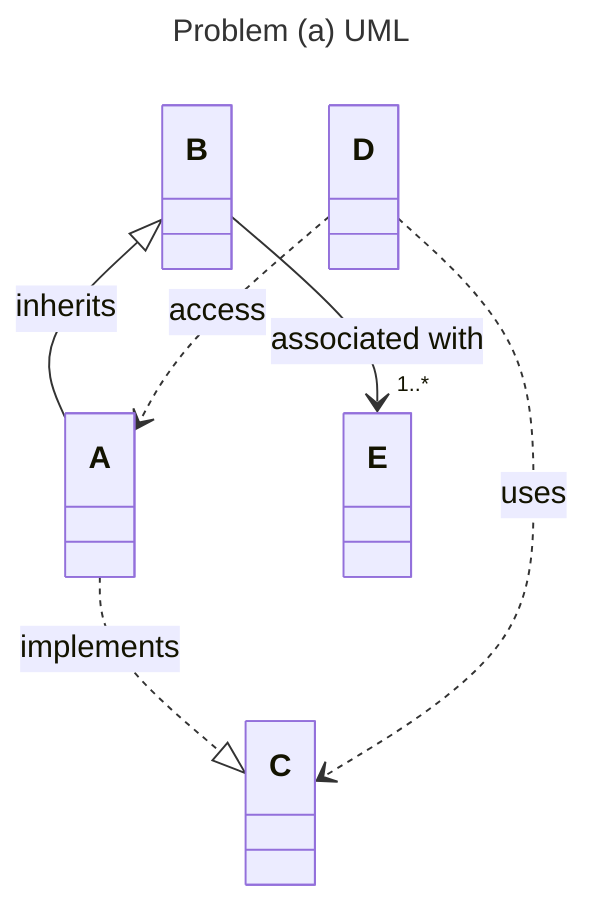
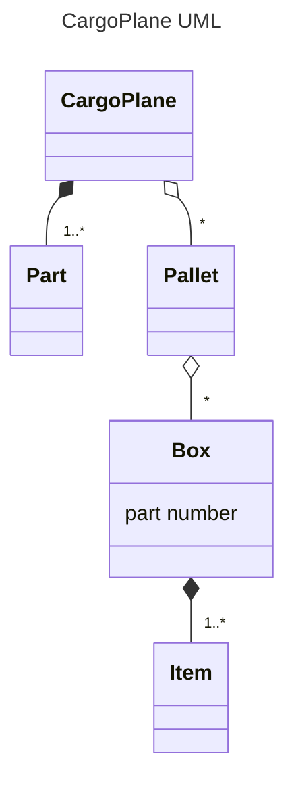
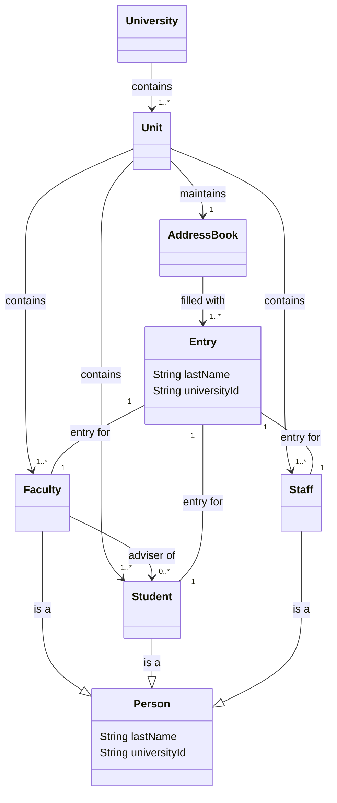
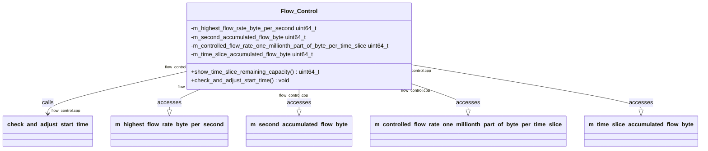
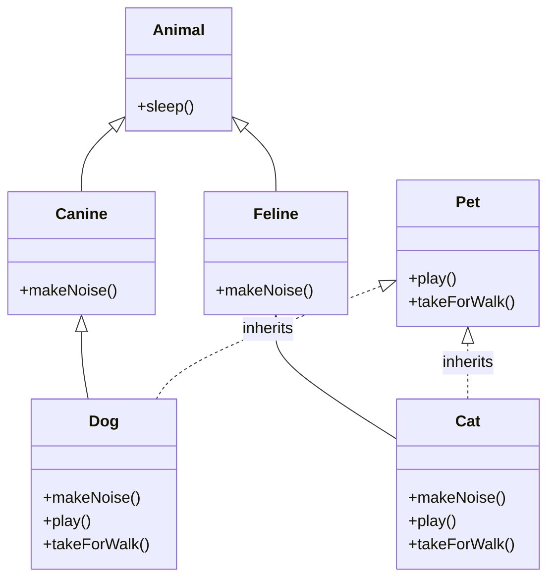

# 物件導向分析與設計 HW02
#### 組員: 
- 林昕鋭 41047035S
- 王關平 41047041S
- 陳威豪 NTUST_m11103607 
- 陳昱亨 40847030S

## 1. Draw a UML class diagram that models the following statements.

### (a) (15 points) A is a subclass of B. A implements an interface C which is used by D to access A. B is associated with one or more Es.



#### Example Code
```python3=
from abc import ABC, abstractmethod
from typing import List

class C(ABC):
    @abstractmethod
    def method_in_c(self):
        """Abstract method to be implemented by subclasses."""
        pass

class B:
    def __init__(self, es: List['E']):
        """Initialize an instance of B, associated with one or more instances of E."""
        self.es = es  # Association between B and one or more Es

    def print_info(self):
        """Prints information about B and its associated Es."""
        print(f"B is associated with {len(self.es)} instances of E.")

class A(B, C):
    def method_in_c(self):
        """Implement the abstract method from interface C."""
        print("Implementing method from interface C")
    
    def print_info(self):
        """Prints information about A's role and its associations."""
        super().print_info()
        print("A is a subclass of B and implements interface C.")

class D:
    def __init__(self, c_instance: C):
        """Initialize an instance of D, which uses an instance of C to access A."""
        self.c_instance = c_instance
    
    def use_a_through_c(self):
        """Use the instance of C (in practice, A) to invoke the method defined in C."""
        self.c_instance.method_in_c()  # Accessing an instance of A through interface C
    
    def print_info(self):
        """Prints information about D's usage of C to access A."""
        print("D uses an instance of C to access A.")

class E:
    """A simple class E that can be associated with B."""
    
    def print_info(self):
        """Prints information about E."""
        print("E is associated with B.")

# Example usage
e_instances = [E(), E()]  # Creating one or more instances of E
a_instance = A(es=e_instances)  # Creating an instance of A, associated with instances of E
d_instance = D(c_instance=a_instance)  # D uses an instance of C (here, A) to access A

# Now, to print information about these instances and their relationships:
a_instance.print_info()
d_instance.print_info()
for e_instance in e_instances:
    e_instance.print_info()

# The print_info methods provide a simple way to output details about each class instance
# and their relationships, helping to understand the structure and interactions within this example.
```

#### Output
```
B is associated with 2 instances of E.
A is a subclass of B and implements interface C.
D uses an instance of C to access A.
E is associated with B.
E is associated with B.
```

### (b) (15 points) A CargoPlane aggregates zero or more Pallets. Each Pallet aggregates zero or more Boxes. A CargoPlane is composed of one or more Parts. Each Box contain one or more Items that are accessed by part numbers.



#### Example Code
```python3=
from typing import List

class Item:
    def __init__(self, part_number: str):
        self.part_number = part_number
    
    def print_info(self):
        print(f"Item Part Number: {self.part_number}")

class Box:
    def __init__(self, items: List[Item]):
        self.items = items

    def print_info(self):
        print("Box contains the following items:")
        for item in self.items:
            item.print_info()

class Pallet:
    def __init__(self, boxes: List[Box]):
        self.boxes = boxes if boxes else []

    def print_info(self):
        print("Pallet contains the following boxes:")
        for box in self.boxes:
            box.print_info()

class Part:
    def __init__(self, part_id: str):
        self.part_id = part_id

    def print_info(self):
        print(f"Part ID: {self.part_id}")

class CargoPlane:
    def __init__(self, parts: List[Part], pallets: List[Pallet] = None):
        self.parts = parts
        self.pallets = pallets if pallets else []

    def print_info(self):
        print("CargoPlane consists of the following parts:")
        for part in self.parts:
            part.print_info()
        print("CargoPlane contains the following pallets:")
        for pallet in self.pallets:
            pallet.print_info()

# Example Usage:
item1 = Item("1234")
item2 = Item("5678")

box = Box(items=[item1, item2])

pallet = Pallet(boxes=[box])

part1 = Part("PartA")
part2 = Part("PartB")

cargo_plane = CargoPlane(parts=[part1, part2], pallets=[pallet])

# Now, to print information about the cargo plane, its parts, pallets, boxes, and items:
cargo_plane.print_info()

# This code will go through the entire structure of the CargoPlane and print out details about each part,
# pallet, box, and item it contains.
```

#### Output
```
CargoPlane consists of the following parts:
Part ID: PartA
Part ID: PartB
CargoPlane contains the following pallets:
Pallet contains the following boxes:
Box contains the following items:
Item Part Number: 1234
Item Part Number: 5678
```

    
### (c\) (15 points) A University is composed of one or more Units, such as Colleges and Schools. Each Unit contains Faculty, Students, and Staff. A Unit maintains an AddressBook filled with Entries, and one Entry for each type of Person contained in that Unit. An Entry can be located in the AddressBook by supplying their last Name or their UniversityId. Faculty members can be the adviser of zero or more Students.



#### Example Code
```python3=
from typing import List, Dict

class Person:
    def __init__(self, first_name: str, last_name: str, university_id: str):
        self.first_name = first_name
        self.last_name = last_name
        self.university_id = university_id

class Faculty(Person):
    def __init__(self, first_name: str, last_name: str, university_id: str):
        super().__init__(first_name, last_name, university_id)
        self.advisees = []  # Students advised by the faculty

    def add_advisee(self, student):
        self.advisees.append(student)

class Student(Person):
    pass

class Staff(Person):
    pass

class Entry:
    def __init__(self, person: Person):
        self.person = person

class AddressBook:
    def __init__(self):
        self.entries = {}  # key: university_id, value: Entry

    def add_entry(self, entry: Entry):
        self.entries[entry.person.university_id] = entry

    def find_by_last_name(self, last_name: str):
        return [entry for entry in self.entries.values() if entry.person.last_name == last_name]

    def find_by_university_id(self, university_id: str):
        return self.entries.get(university_id, None)

class Unit:
    def __init__(self, name: str):
        self.name = name
        self.faculty = []
        self.students = []
        self.staff = []
        self.address_book = AddressBook()

    def add_person(self, person: Person):
        if isinstance(person, Faculty):
            self.faculty.append(person)
        elif isinstance(person, Student):
            self.students.append(person)
        elif isinstance(person, Staff):
            self.staff.append(person)
        self.address_book.add_entry(Entry(person))

    def print_info(self):
        print(f"Unit: {self.name}")
        print("Faculty Members:")
        for person in self.faculty:
            print(f"  {person.first_name} {person.last_name}")
        print("Students:")
        for person in self.students:
            print(f"  {person.first_name} {person.last_name}")
        print("Staff Members:")
        for person in self.staff:
            print(f"  {person.first_name} {person.last_name}")

class University:
    def __init__(self, name: str):
        self.name = name
        self.units = []

    def add_unit(self, unit: Unit):
        self.units.append(unit)

    def print_info(self):
        print(f"University: {self.name}")
        for unit in self.units:
            unit.print_info()

# Example Usage
university = University("Example University")

# Creating units
college_of_engineering = Unit("College of Engineering")
school_of_arts = Unit("School of Arts")

# Adding units to the university
university.add_unit(college_of_engineering)
university.add_unit(school_of_arts)

# Creating people
faculty_member = Faculty("John", "Doe", "F001")
student = Student("Jane", "Doe", "S001")
staff_member = Staff("James", "Smith", "ST001")

# Adding people to units
college_of_engineering.add_person(faculty_member)
college_of_engineering.add_person(student)
school_of_arts.add_person(staff_member)

# Printing information
university.print_info()
```

#### Output
```
University: Example University
Unit: College of Engineering
Faculty Members:
  John Doe
Students:
  Jane Doe
Staff Members:
Unit: School of Arts
Faculty Members:
Students:
Staff Members:
  James Smith
```

## 2. (15 points) Imagine we have a system that has a class called Shape and three subclassesSquare, Circle, and Triangle each developed by a different software engineer. The system uses the classes to create randomly generated visualizations that balance various constraints concerning the area and perimeter of each individual shape along with the total area and total perimeter of all shapes on the screen. An example of such a con- straint might be that the total area of all shapes must always be twice as large as the total perimeters. One engineer, feeling capricious, decides to implement the getArea() method of the Square subclass by having it return the perimeter of the Square instead. What design heuristic has this engineer violated and what repercussions will it have in the overall system?





### Answer

This engineer violate the following principle , and we will explain how they violate the principle in the part of 'SOLID'
- Single-responsibility principle (SRP) : 
    - Not violate  
    
- Open–closed principle (OCP) : 
    - Not violate 

- Liskov Substitution Principle(LSP) : 
    - Violate(referred to the demo code above~) 
    Reason :
        - Shape class: This is a base class that defines two methods, getArea() and getPerimeter(). These methods are not implemented in the Shape class, as they are intended to be implemented by the subclasses according to the specific shape.

        - Square class: This is a subclass of Shape that represents a square. It has a constructor __init__(self, side) that takes the length of the square's side as a parameter. However, in its getArea() method, it incorrectly returns 4 * side, which is actually the perimeter of the square, instead of the expected area calculation, which should be side * side.

        - Violation of the Liskov Substitution Principle (LSP): The LSP states that objects of a superclass should be replaceable with objects of a subclass without altering the correctness of the program. In this scenario, the Square class's getArea() method alters the expected behavior by returning the perimeter instead of the area. This means if we replace a Shape object with a Square object in a context where the area calculation is critical, we will end up with incorrect results because we expect the getArea() method to return the area, not the perimeter.

        -    To put it simple ,  if this engineer have a parent class, they should be able to replace it with any of its subclasses without messing up the program. Each subclass should act the same way as the parent class does. but this programmer made the Square class's getArea() method return the perimeter instead of the area, breaking the Liskov Substitution Principle. This is because the Square no longer acts in a way that matches what the Shape class expected for the getArea() method.
    
    
- Interface Segregation(ISP) : 
    - Not violate 

- Dependency Inversion Principle(DIP) : 
    - Not violate 


- **Repercussions in the Overall System**
    -    Incorrect Calculations: Since the Square's getArea() method returns the perimeter instead, any calculations depending on the area will be incorrect. This could lead to the system failing to balance constraints concerning area and perimeter.
    -    System Inconsistency: Different behaviors for the same method across subclasses can lead to inconsistencies, making the system harder to debug, test, and maintain.
    -    Violation of Expectations: Other parts of the system (or developers working on it) that rely on the Shape interface will have their expectations violated when using a Square object, leading to potential errors and unforeseen behavior.

#### Example Code 
```python3=
class Shape:
    def getArea(self):
        pass

    def getPerimeter(self):
        pass

class Square(Shape):
    def __init__(self, side):
        self.side = side

    # Corrected implementation
    def getArea(self):
        return self.side * self.side

    def getPerimeter(self):
        return 4 * self.side

class Circle(Shape):
    def __init__(self, radius):
        self.radius = radius

    def getArea(self):
        return 3.14 * self.radius ** 2

    def getPerimeter(self):
        return 2 * 3.14 * self.radius

class Triangle(Shape):
    def __init__(self, side):
        self.side = side

    def getArea(self):
        return (3**0.5 / 4) * self.side ** 2

    def getPerimeter(self):
        return 3 * self.side

# Example usage and information printing
square = Square(4)
circle = Circle(5)
triangle = Triangle(3)

shapes = [square, circle, triangle]

for shape in shapes:
    print(f"{shape.__class__.__name__} Area: {shape.getArea()}")
    print(f"{shape.__class__.__name__} Perimeter: {shape.getPerimeter()}")
```

#### Output
```
Square Area: 16
Square Perimeter: 16
Circle Area: 78.5
Circle Perimeter: 31.400000000000002
Triangle Area: 3.8971143170299736
Triangle Perimeter: 9
```

## 3. Study the following UML class diagram in Figure 1. Consider to modify the Animal hierarchy to provide pet-related operations, play() and takeForWalk(), to the Dog andCat classes. For the following approaches, draw the UML class diagram and describe the design trade-off.


### (a) (20 points) Add pet-related methods to the Animal class.


Easy to be done, but this also makes classes other than Dog and Cat also have pet-related methods.

#### Example Code
```python3=
from abc import ABC, abstractmethod

class Animal(ABC):
    @abstractmethod
    def sleep(self):
        pass

    # Assuming all animals have a roam behavior as well.
    @abstractmethod
    def roam(self):
        pass

class Canine(Animal):
    def roam(self):
        print("The canine is roaming.")

class Feline(Animal):
    def roam(self):
        print("The feline is roaming.")

class Pachyderm(Animal):
    def roam(self):
        print("The pachyderm is roaming.")

# Assuming Rhino, Hippo, Elephant, Tiger, Lion, and Wolf have their own implementations of sleep and makeNoise,
# they would be defined here, each with their specific behaviors.

class Pet(ABC):
    @abstractmethod
    def play(self):
        pass

    @abstractmethod
    def takeForWalk(self):
        pass

class Dog(Canine, Pet):
    def sleep(self):
        print("The dog is sleeping.")

    def makeNoise(self):
        print("Woof!")

    def play(self):
        print("The dog is playing with a ball.")

    def takeForWalk(self):
        print("Taking the dog for a walk.")

class Cat(Feline, Pet):
    def sleep(self):
        print("The cat is sleeping.")

    def makeNoise(self):
        print("Meow!")

    def play(self):
        print("The cat is playing with a yarn ball.")

    def takeForWalk(self):
        print("Taking the cat for a walk, on a leash.")

# Example Usage
dog = Dog()
cat = Cat()

# Each pet doing their things
dog.sleep()
dog.roam()
dog.makeNoise()
dog.play()
dog.takeForWalk()

cat.sleep()
cat.roam()
cat.makeNoise()
cat.play()
cat.takeForWalk()

# This code introduces a Pet interface which contains play() and takeForWalk() methods.
# Only the Dog and Cat classes implement the Pet interface, adding pet-specific behaviors to these animals.
```

#### Output
```
The dog is sleeping.
The canine is roaming.
Woof!
The dog is playing with a ball.
Taking the dog for a walk.
The cat is sleeping.
The feline is roaming.
Meow!
The cat is playing with a yarn ball.
Taking the cat for a walk, on a leash.
```

### (b) (20 points) Make a Pet interface which contains the play() and takeForWalk() methods, and only the Dog and Cat classes implement it.



#### Example Code
```python3=
from abc import ABC, abstractmethod

# Define the Animal base class with an abstract sleep method
class Animal(ABC):
    @abstractmethod
    def sleep(self):
        print("The animal is sleeping.")

# Define a Pet interface with abstract play and takeForWalk methods
class Pet(ABC):
    @abstractmethod
    def play(self):
        pass

    @abstractmethod
    def takeForWalk(self):
        pass

# Define the Canine subclass of Animal
class Canine(Animal):
    def makeNoise(self):
        print("The canine makes a noise.")

# Define the Feline subclass of Animal
class Feline(Animal):
    def makeNoise(self):
        print("The feline makes a noise.")

# Define the Dog class that inherits from Canine and implements Pet
class Dog(Canine, Pet):
    def sleep(self):
        print("The dog is sleeping.")

    def makeNoise(self):
        print("Woof!")

    def play(self):
        print("The dog is playing with a ball.")

    def takeForWalk(self):
        print("Taking the dog for a walk.")

# Define the Cat class that inherits from Feline and implements Pet
class Cat(Feline, Pet):
    def sleep(self):
        print("The cat is sleeping.")

    def makeNoise(self):
        print("Meow!")

    def play(self):
        print("The cat is playing with a yarn ball.")

    def takeForWalk(self):
        print("Taking the cat for a walk, on a leash.")

# Example usage
dog = Dog()
cat = Cat()

print("Dog:")
dog.sleep()
dog.makeNoise()
dog.play()
dog.takeForWalk()

print("\nCat:")
cat.sleep()
cat.makeNoise()
cat.play()
cat.takeForWalk()

# This code models the given class diagram and provides functionality for each class.
# The Dog and Cat classes can now perform general animal behaviors as well as specific pet behaviors.
```


#### Output
```
Dog:
The dog is sleeping.
Woof!
The dog is playing with a ball.
Taking the dog for a walk.

Cat:
The cat is sleeping.
Meow!
The cat is playing with a yarn ball.
Taking the cat for a walk, on a leash.
```
