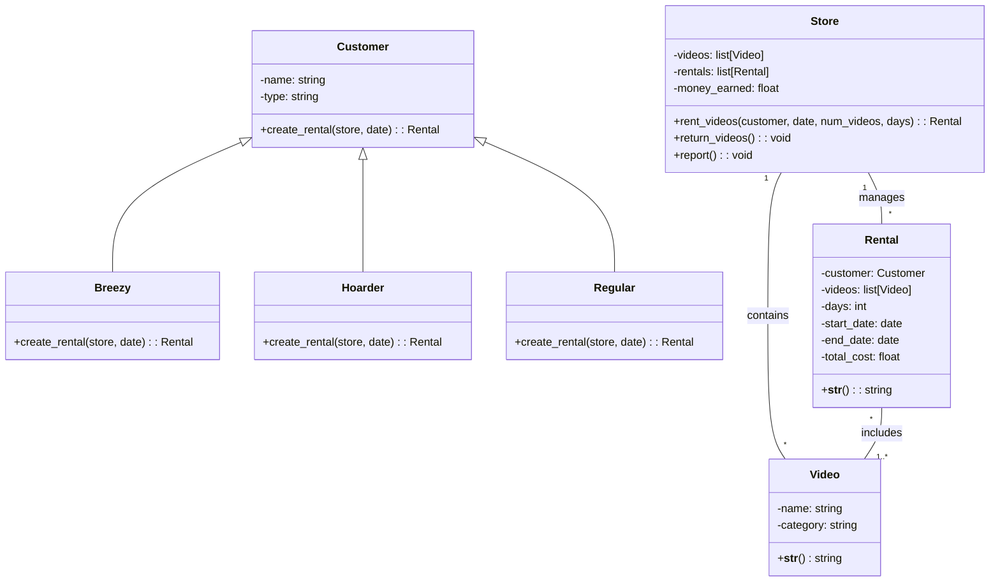

# 物件導向分析與設計 HW03
#### 組員: 
- 林昕鋭 41047035S
- 王關平 41047041S
- 陳威豪 NTUST_m11103607 
- 陳昱亨 40847030S


## (a) (60 points) The code of your program.
### Source Code
```python=
import random  # 匯入 random 模組
from datetime import timedelta, date  # 從 datetime 模組中匯入 timedelta 和 date 類別

# 影片類別和價格的常數
CATEGORIES = {
    "New Release": 5,
    "Drama": 4,
    "Comedy": 3,
    "Romance": 2,
    "Horror": 1
}

# 影片類別
class Video:
    def __init__(self, name, category):
        self.name = name  # 設置影片名稱
        self.category = category  # 設置影片類別

    def __str__(self):
        return f"{self.name} ({self.category})"  # 回傳影片名稱和類別的字串表示

# 顧客類別及其不同類型的子類別
class Customer:
    def __init__(self, name, type):
        self.name = name  # 設置顧客名稱
        self.type = type  # 設置顧客類型

    def create_rental(self, store, date):
        raise NotImplementedError("This method should be implemented by subclasses.")  # 未實作的方法，由子類別實作

class Breezy(Customer):
    def create_rental(self, store, date):
        return store.rent_videos(self, date, random.randint(1, 2), random.randint(1, 2))  # 以隨機數量租借影片

class Hoarder(Customer):
    def create_rental(self, store, date):
        return store.rent_videos(self, date, 3, 7)  # 租借固定數量影片並保留較長時間

class Regular(Customer):
    def create_rental(self, store, date):
        return store.rent_videos(self, date, random.randint(1, 3), random.randint(3, 5))  # 以隨機數量租借影片，租借較長時間

# 租借類別
class Rental:
    def __init__(self, customer, videos, days, start_date):
        self.customer = customer  # 設置租借的顧客
        self.videos = videos  # 設置租借的影片清單
        self.days = days  # 設置租借的天數
        self.start_date = start_date  # 設置租借開始日期
        self.end_date = start_date + timedelta(days=days)  # 設置租借結束日期
        self.total_cost = sum(CATEGORIES[video.category] * days for video in videos)  # 計算總花費

    def __str__(self):
        video_names = ", ".join([video.name for video in self.videos])  # 取得租借的影片名稱列表
        return f"{self.customer.name} rented {video_names} for {self.days} days (${self.total_cost})"  # 回傳租借資訊的字串表示

# 商店類別
class Store:
    def __init__(self):
        self.videos = [Video(f"Video {i+1}", random.choice(list(CATEGORIES.keys()))) for i in range(20)]  # 初始化影片清單
        self.rentals = []  # 初始化租借清單
        self.money_earned = 0  # 初始化收入

    def rent_videos(self, customer, date, num_videos, days):
        if len(self.videos) < num_videos:  # 如果影片清單中的影片數量不足以滿足租借需求
            return None
        selected_videos = random.sample(self.videos, num_videos)  # 從影片清單中隨機選擇影片
        rental = Rental(customer, selected_videos, days, date)  # 建立租借物件
        self.rentals.append(rental)  # 將租借加入租借清單
        self.money_earned += rental.total_cost  # 更新收入
        for video in selected_videos:
            self.videos.remove(video)  # 從影片清單中移除已租借的影片
        return rental  # 回傳租借物件

    def return_videos(self):
        today = date.today()  # 取得今天日期
        for rental in list(self.rentals):
            if rental.end_date <= today:  # 如果租借結束日期早於或等於今天
                self.videos.extend(rental.videos)  # 將影片加回影片清單
                self.rentals.remove(rental)  # 從租借清單中移除該租借

    def report(self):
        print("Current Inventory:")  # 印出目前庫存
        for video in self.videos:
            print(video)
        print(f"Total Money Earned: ${self.money_earned}")  # 印出總收入
        print("Completed Rentals:")  # 印出已完成租借清單
        for rental in self.rentals:
            print(rental)

# 模擬商店運作 35 天  
def simulate():
    store = Store()  # 建立商店物件
    customers = [Breezy(f"Customer {i}", "Breezy") for i in range(3)] + \
                [Hoarder(f"Customer {i+3}", "Hoarder") for i in range(3)] + \
                [Regular(f"Customer {i+6}", "Regular") for i in range(4)]  # 建立顧客清單

    today = date.today()  # 取得今天日期
    for day in range(35):  # 進行 35 天的模擬
        store.return_videos()  # 檢查是否有影片應該歸還
        print(f"Day {day+1}:")  # 印出目前模擬的天數
        if store.videos:  # 如果商店有影片庫存
            num_customers = random.randint(1, min(3, len(store.videos)))  # 隨機決定租借影片的顧客數量
            for _ in range(num_customers):  # 依照顧客數量進行租借
                customer = random.choice(customers)  # 隨機選擇一位顧客
                store.rent_videos(customer, today + timedelta(days=day), random.randint(1, min(3, len(store.videos))), random.randint(1, 7))  # 租借影片
        store.report()  # 印出商店報告

simulate()  # 執行模擬

```

### Output
```
Day 1:
Current Inventory:
Video 1 (Drama)
Video 2 (New Release)
Video 3 (Horror)
Video 4 (New Release)
Video 5 (New Release)
Video 7 (Horror)
Video 8 (New Release)
Video 9 (Romance)
Video 10 (Romance)
Video 11 (Comedy)
Video 13 (Romance)
Video 15 (Comedy)
Video 16 (Drama)
Video 17 (New Release)
Video 18 (New Release)
Video 19 (Horror)
Video 20 (Horror)
Total Money Earned: $49
Completed Rentals:
Customer 5 rented Video 6, Video 12, Video 14 for 7 days ($49)
Day 2:
Current Inventory:
Video 1 (Drama)
Video 3 (Horror)
Video 4 (New Release)
Video 5 (New Release)
Video 7 (Horror)
Video 8 (New Release)
Video 10 (Romance)
Video 11 (Comedy)
Video 13 (Romance)
Video 15 (Comedy)
Video 16 (Drama)
Video 17 (New Release)
Video 18 (New Release)
Video 19 (Horror)
Video 20 (Horror)
Total Money Earned: $70
Completed Rentals:
Customer 5 rented Video 6, Video 12, Video 14 for 7 days ($49)
Customer 9 rented Video 9, Video 2 for 3 days ($21)
Day 3:
Current Inventory:
Video 1 (Drama)
Video 3 (Horror)
Video 4 (New Release)
Video 5 (New Release)
Video 8 (New Release)
Video 11 (Comedy)
Video 15 (Comedy)
Video 17 (New Release)
Video 18 (New Release)
Video 20 (Horror)
Total Money Earned: $111
Completed Rentals:
Customer 5 rented Video 6, Video 12, Video 14 for 7 days ($49)
Customer 9 rented Video 9, Video 2 for 3 days ($21)
Customer 4 rented Video 19 for 2 days ($2)
Customer 9 rented Video 13, Video 7 for 3 days ($9)
Customer 6 rented Video 10, Video 16 for 5 days ($30)
Day 4:
Current Inventory:
Video 1 (Drama)
Video 3 (Horror)
Video 4 (New Release)
Video 8 (New Release)
Video 11 (Comedy)
Video 15 (Comedy)
Video 17 (New Release)
Video 20 (Horror)
Total Money Earned: $121
Completed Rentals:
Customer 5 rented Video 6, Video 12, Video 14 for 7 days ($49)
Customer 9 rented Video 9, Video 2 for 3 days ($21)
Customer 4 rented Video 19 for 2 days ($2)
Customer 9 rented Video 13, Video 7 for 3 days ($9)
Customer 6 rented Video 10, Video 16 for 5 days ($30)
Customer 0 rented Video 5, Video 18 for 1 days ($10)
Day 5:
Current Inventory:
Video 3 (Horror)
Video 20 (Horror)
Total Money Earned: $245
Completed Rentals:
Customer 5 rented Video 6, Video 12, Video 14 for 7 days ($49)
Customer 9 rented Video 9, Video 2 for 3 days ($21)
Customer 4 rented Video 19 for 2 days ($2)
Customer 9 rented Video 13, Video 7 for 3 days ($9)
Customer 6 rented Video 10, Video 16 for 5 days ($30)
Customer 0 rented Video 5, Video 18 for 1 days ($10)
Customer 1 rented Video 4, Video 17 for 4 days ($40)
Customer 9 rented Video 8, Video 1, Video 15 for 6 days ($72)
Customer 6 rented Video 11 for 4 days ($12)
Day 6:
Current Inventory:
Total Money Earned: $253
Completed Rentals:
Customer 5 rented Video 6, Video 12, Video 14 for 7 days ($49)
Customer 9 rented Video 9, Video 2 for 3 days ($21)
Customer 4 rented Video 19 for 2 days ($2)
Customer 9 rented Video 13, Video 7 for 3 days ($9)
Customer 6 rented Video 10, Video 16 for 5 days ($30)
Customer 0 rented Video 5, Video 18 for 1 days ($10)
Customer 1 rented Video 4, Video 17 for 4 days ($40)
Customer 9 rented Video 8, Video 1, Video 15 for 6 days ($72)
Customer 6 rented Video 11 for 4 days ($12)
Customer 9 rented Video 20, Video 3 for 4 days ($8)
Day 7:
Current Inventory:
Total Money Earned: $253
Completed Rentals:
Customer 5 rented Video 6, Video 12, Video 14 for 7 days ($49)
Customer 9 rented Video 9, Video 2 for 3 days ($21)
Customer 4 rented Video 19 for 2 days ($2)
Customer 9 rented Video 13, Video 7 for 3 days ($9)
Customer 6 rented Video 10, Video 16 for 5 days ($30)
Customer 0 rented Video 5, Video 18 for 1 days ($10)
Customer 1 rented Video 4, Video 17 for 4 days ($40)
Customer 9 rented Video 8, Video 1, Video 15 for 6 days ($72)
Customer 6 rented Video 11 for 4 days ($12)
Customer 9 rented Video 20, Video 3 for 4 days ($8)
Day 8:
Current Inventory:
Total Money Earned: $253
Completed Rentals:
Customer 5 rented Video 6, Video 12, Video 14 for 7 days ($49)
Customer 9 rented Video 9, Video 2 for 3 days ($21)
Customer 4 rented Video 19 for 2 days ($2)
Customer 9 rented Video 13, Video 7 for 3 days ($9)
Customer 6 rented Video 10, Video 16 for 5 days ($30)
Customer 0 rented Video 5, Video 18 for 1 days ($10)
Customer 1 rented Video 4, Video 17 for 4 days ($40)
Customer 9 rented Video 8, Video 1, Video 15 for 6 days ($72)
Customer 6 rented Video 11 for 4 days ($12)
Customer 9 rented Video 20, Video 3 for 4 days ($8)
Day 9:
Current Inventory:
Total Money Earned: $253
Completed Rentals:
Customer 5 rented Video 6, Video 12, Video 14 for 7 days ($49)
Customer 9 rented Video 9, Video 2 for 3 days ($21)
Customer 4 rented Video 19 for 2 days ($2)
Customer 9 rented Video 13, Video 7 for 3 days ($9)
Customer 6 rented Video 10, Video 16 for 5 days ($30)
Customer 0 rented Video 5, Video 18 for 1 days ($10)
Customer 1 rented Video 4, Video 17 for 4 days ($40)
Customer 9 rented Video 8, Video 1, Video 15 for 6 days ($72)
Customer 6 rented Video 11 for 4 days ($12)
Customer 9 rented Video 20, Video 3 for 4 days ($8)
Day 10:
Current Inventory:
Total Money Earned: $253
Completed Rentals:
Customer 5 rented Video 6, Video 12, Video 14 for 7 days ($49)
Customer 9 rented Video 9, Video 2 for 3 days ($21)
Customer 4 rented Video 19 for 2 days ($2)
Customer 9 rented Video 13, Video 7 for 3 days ($9)
Customer 6 rented Video 10, Video 16 for 5 days ($30)
Customer 0 rented Video 5, Video 18 for 1 days ($10)
Customer 1 rented Video 4, Video 17 for 4 days ($40)
Customer 9 rented Video 8, Video 1, Video 15 for 6 days ($72)
Customer 6 rented Video 11 for 4 days ($12)
Customer 9 rented Video 20, Video 3 for 4 days ($8)
Day 11:
Current Inventory:
Total Money Earned: $253
Completed Rentals:
Customer 5 rented Video 6, Video 12, Video 14 for 7 days ($49)
Customer 9 rented Video 9, Video 2 for 3 days ($21)
Customer 4 rented Video 19 for 2 days ($2)
Customer 9 rented Video 13, Video 7 for 3 days ($9)
Customer 6 rented Video 10, Video 16 for 5 days ($30)
Customer 0 rented Video 5, Video 18 for 1 days ($10)
Customer 1 rented Video 4, Video 17 for 4 days ($40)
Customer 9 rented Video 8, Video 1, Video 15 for 6 days ($72)
Customer 6 rented Video 11 for 4 days ($12)
Customer 9 rented Video 20, Video 3 for 4 days ($8)
Day 12:
Current Inventory:
Total Money Earned: $253
Completed Rentals:
Customer 5 rented Video 6, Video 12, Video 14 for 7 days ($49)
Customer 9 rented Video 9, Video 2 for 3 days ($21)
Customer 4 rented Video 19 for 2 days ($2)
Customer 9 rented Video 13, Video 7 for 3 days ($9)
Customer 6 rented Video 10, Video 16 for 5 days ($30)
Customer 0 rented Video 5, Video 18 for 1 days ($10)
Customer 1 rented Video 4, Video 17 for 4 days ($40)
Customer 9 rented Video 8, Video 1, Video 15 for 6 days ($72)
Customer 6 rented Video 11 for 4 days ($12)
Customer 9 rented Video 20, Video 3 for 4 days ($8)
Day 13:
Current Inventory:
Total Money Earned: $253
Completed Rentals:
Customer 5 rented Video 6, Video 12, Video 14 for 7 days ($49)
Customer 9 rented Video 9, Video 2 for 3 days ($21)
Customer 4 rented Video 19 for 2 days ($2)
Customer 9 rented Video 13, Video 7 for 3 days ($9)
Customer 6 rented Video 10, Video 16 for 5 days ($30)
Customer 0 rented Video 5, Video 18 for 1 days ($10)
Customer 1 rented Video 4, Video 17 for 4 days ($40)
Customer 9 rented Video 8, Video 1, Video 15 for 6 days ($72)
Customer 6 rented Video 11 for 4 days ($12)
Customer 9 rented Video 20, Video 3 for 4 days ($8)
Day 14:
Current Inventory:
Total Money Earned: $253
Completed Rentals:
Customer 5 rented Video 6, Video 12, Video 14 for 7 days ($49)
Customer 9 rented Video 9, Video 2 for 3 days ($21)
Customer 4 rented Video 19 for 2 days ($2)
Customer 9 rented Video 13, Video 7 for 3 days ($9)
Customer 6 rented Video 10, Video 16 for 5 days ($30)
Customer 0 rented Video 5, Video 18 for 1 days ($10)
Customer 1 rented Video 4, Video 17 for 4 days ($40)
Customer 9 rented Video 8, Video 1, Video 15 for 6 days ($72)
Customer 6 rented Video 11 for 4 days ($12)
Customer 9 rented Video 20, Video 3 for 4 days ($8)
Day 15:
Current Inventory:
Total Money Earned: $253
Completed Rentals:
Customer 5 rented Video 6, Video 12, Video 14 for 7 days ($49)
Customer 9 rented Video 9, Video 2 for 3 days ($21)
Customer 4 rented Video 19 for 2 days ($2)
Customer 9 rented Video 13, Video 7 for 3 days ($9)
Customer 6 rented Video 10, Video 16 for 5 days ($30)
Customer 0 rented Video 5, Video 18 for 1 days ($10)
Customer 1 rented Video 4, Video 17 for 4 days ($40)
Customer 9 rented Video 8, Video 1, Video 15 for 6 days ($72)
Customer 6 rented Video 11 for 4 days ($12)
Customer 9 rented Video 20, Video 3 for 4 days ($8)
Day 16:
Current Inventory:
Total Money Earned: $253
Completed Rentals:
Customer 5 rented Video 6, Video 12, Video 14 for 7 days ($49)
Customer 9 rented Video 9, Video 2 for 3 days ($21)
Customer 4 rented Video 19 for 2 days ($2)
Customer 9 rented Video 13, Video 7 for 3 days ($9)
Customer 6 rented Video 10, Video 16 for 5 days ($30)
Customer 0 rented Video 5, Video 18 for 1 days ($10)
Customer 1 rented Video 4, Video 17 for 4 days ($40)
Customer 9 rented Video 8, Video 1, Video 15 for 6 days ($72)
Customer 6 rented Video 11 for 4 days ($12)
Customer 9 rented Video 20, Video 3 for 4 days ($8)
Day 17:
Current Inventory:
Total Money Earned: $253
Completed Rentals:
Customer 5 rented Video 6, Video 12, Video 14 for 7 days ($49)
Customer 9 rented Video 9, Video 2 for 3 days ($21)
Customer 4 rented Video 19 for 2 days ($2)
Customer 9 rented Video 13, Video 7 for 3 days ($9)
Customer 6 rented Video 10, Video 16 for 5 days ($30)
Customer 0 rented Video 5, Video 18 for 1 days ($10)
Customer 1 rented Video 4, Video 17 for 4 days ($40)
Customer 9 rented Video 8, Video 1, Video 15 for 6 days ($72)
Customer 6 rented Video 11 for 4 days ($12)
Customer 9 rented Video 20, Video 3 for 4 days ($8)
Day 18:
Current Inventory:
Total Money Earned: $253
Completed Rentals:
Customer 5 rented Video 6, Video 12, Video 14 for 7 days ($49)
Customer 9 rented Video 9, Video 2 for 3 days ($21)
Customer 4 rented Video 19 for 2 days ($2)
Customer 9 rented Video 13, Video 7 for 3 days ($9)
Customer 6 rented Video 10, Video 16 for 5 days ($30)
Customer 0 rented Video 5, Video 18 for 1 days ($10)
Customer 1 rented Video 4, Video 17 for 4 days ($40)
Customer 9 rented Video 8, Video 1, Video 15 for 6 days ($72)
Customer 6 rented Video 11 for 4 days ($12)
Customer 9 rented Video 20, Video 3 for 4 days ($8)
Day 19:
Current Inventory:
Total Money Earned: $253
Completed Rentals:
Customer 5 rented Video 6, Video 12, Video 14 for 7 days ($49)
Customer 9 rented Video 9, Video 2 for 3 days ($21)
Customer 4 rented Video 19 for 2 days ($2)
Customer 9 rented Video 13, Video 7 for 3 days ($9)
Customer 6 rented Video 10, Video 16 for 5 days ($30)
Customer 0 rented Video 5, Video 18 for 1 days ($10)
Customer 1 rented Video 4, Video 17 for 4 days ($40)
Customer 9 rented Video 8, Video 1, Video 15 for 6 days ($72)
Customer 6 rented Video 11 for 4 days ($12)
Customer 9 rented Video 20, Video 3 for 4 days ($8)
Day 20:
Current Inventory:
Total Money Earned: $253
Completed Rentals:
Customer 5 rented Video 6, Video 12, Video 14 for 7 days ($49)
Customer 9 rented Video 9, Video 2 for 3 days ($21)
Customer 4 rented Video 19 for 2 days ($2)
Customer 9 rented Video 13, Video 7 for 3 days ($9)
Customer 6 rented Video 10, Video 16 for 5 days ($30)
Customer 0 rented Video 5, Video 18 for 1 days ($10)
Customer 1 rented Video 4, Video 17 for 4 days ($40)
Customer 9 rented Video 8, Video 1, Video 15 for 6 days ($72)
Customer 6 rented Video 11 for 4 days ($12)
Customer 9 rented Video 20, Video 3 for 4 days ($8)
Day 21:
Current Inventory:
Total Money Earned: $253
Completed Rentals:
Customer 5 rented Video 6, Video 12, Video 14 for 7 days ($49)
Customer 9 rented Video 9, Video 2 for 3 days ($21)
Customer 4 rented Video 19 for 2 days ($2)
Customer 9 rented Video 13, Video 7 for 3 days ($9)
Customer 6 rented Video 10, Video 16 for 5 days ($30)
Customer 0 rented Video 5, Video 18 for 1 days ($10)
Customer 1 rented Video 4, Video 17 for 4 days ($40)
Customer 9 rented Video 8, Video 1, Video 15 for 6 days ($72)
Customer 6 rented Video 11 for 4 days ($12)
Customer 9 rented Video 20, Video 3 for 4 days ($8)
Day 22:
Current Inventory:
Total Money Earned: $253
Completed Rentals:
Customer 5 rented Video 6, Video 12, Video 14 for 7 days ($49)
Customer 9 rented Video 9, Video 2 for 3 days ($21)
Customer 4 rented Video 19 for 2 days ($2)
Customer 9 rented Video 13, Video 7 for 3 days ($9)
Customer 6 rented Video 10, Video 16 for 5 days ($30)
Customer 0 rented Video 5, Video 18 for 1 days ($10)
Customer 1 rented Video 4, Video 17 for 4 days ($40)
Customer 9 rented Video 8, Video 1, Video 15 for 6 days ($72)
Customer 6 rented Video 11 for 4 days ($12)
Customer 9 rented Video 20, Video 3 for 4 days ($8)
Day 23:
Current Inventory:
Total Money Earned: $253
Completed Rentals:
Customer 5 rented Video 6, Video 12, Video 14 for 7 days ($49)
Customer 9 rented Video 9, Video 2 for 3 days ($21)
Customer 4 rented Video 19 for 2 days ($2)
Customer 9 rented Video 13, Video 7 for 3 days ($9)
Customer 6 rented Video 10, Video 16 for 5 days ($30)
Customer 0 rented Video 5, Video 18 for 1 days ($10)
Customer 1 rented Video 4, Video 17 for 4 days ($40)
Customer 9 rented Video 8, Video 1, Video 15 for 6 days ($72)
Customer 6 rented Video 11 for 4 days ($12)
Customer 9 rented Video 20, Video 3 for 4 days ($8)
Day 24:
Current Inventory:
Total Money Earned: $253
Completed Rentals:
Customer 5 rented Video 6, Video 12, Video 14 for 7 days ($49)
Customer 9 rented Video 9, Video 2 for 3 days ($21)
Customer 4 rented Video 19 for 2 days ($2)
Customer 9 rented Video 13, Video 7 for 3 days ($9)
Customer 6 rented Video 10, Video 16 for 5 days ($30)
Customer 0 rented Video 5, Video 18 for 1 days ($10)
Customer 1 rented Video 4, Video 17 for 4 days ($40)
Customer 9 rented Video 8, Video 1, Video 15 for 6 days ($72)
Customer 6 rented Video 11 for 4 days ($12)
Customer 9 rented Video 20, Video 3 for 4 days ($8)
Day 25:
Current Inventory:
Total Money Earned: $253
Completed Rentals:
Customer 5 rented Video 6, Video 12, Video 14 for 7 days ($49)
Customer 9 rented Video 9, Video 2 for 3 days ($21)
Customer 4 rented Video 19 for 2 days ($2)
Customer 9 rented Video 13, Video 7 for 3 days ($9)
Customer 6 rented Video 10, Video 16 for 5 days ($30)
Customer 0 rented Video 5, Video 18 for 1 days ($10)
Customer 1 rented Video 4, Video 17 for 4 days ($40)
Customer 9 rented Video 8, Video 1, Video 15 for 6 days ($72)
Customer 6 rented Video 11 for 4 days ($12)
Customer 9 rented Video 20, Video 3 for 4 days ($8)
Day 26:
Current Inventory:
Total Money Earned: $253
Completed Rentals:
Customer 5 rented Video 6, Video 12, Video 14 for 7 days ($49)
Customer 9 rented Video 9, Video 2 for 3 days ($21)
Customer 4 rented Video 19 for 2 days ($2)
Customer 9 rented Video 13, Video 7 for 3 days ($9)
Customer 6 rented Video 10, Video 16 for 5 days ($30)
Customer 0 rented Video 5, Video 18 for 1 days ($10)
Customer 1 rented Video 4, Video 17 for 4 days ($40)
Customer 9 rented Video 8, Video 1, Video 15 for 6 days ($72)
Customer 6 rented Video 11 for 4 days ($12)
Customer 9 rented Video 20, Video 3 for 4 days ($8)
Day 27:
Current Inventory:
Total Money Earned: $253
Completed Rentals:
Customer 5 rented Video 6, Video 12, Video 14 for 7 days ($49)
Customer 9 rented Video 9, Video 2 for 3 days ($21)
Customer 4 rented Video 19 for 2 days ($2)
Customer 9 rented Video 13, Video 7 for 3 days ($9)
Customer 6 rented Video 10, Video 16 for 5 days ($30)
Customer 0 rented Video 5, Video 18 for 1 days ($10)
Customer 1 rented Video 4, Video 17 for 4 days ($40)
Customer 9 rented Video 8, Video 1, Video 15 for 6 days ($72)
Customer 6 rented Video 11 for 4 days ($12)
Customer 9 rented Video 20, Video 3 for 4 days ($8)
Day 28:
Current Inventory:
Total Money Earned: $253
Completed Rentals:
Customer 5 rented Video 6, Video 12, Video 14 for 7 days ($49)
Customer 9 rented Video 9, Video 2 for 3 days ($21)
Customer 4 rented Video 19 for 2 days ($2)
Customer 9 rented Video 13, Video 7 for 3 days ($9)
Customer 6 rented Video 10, Video 16 for 5 days ($30)
Customer 0 rented Video 5, Video 18 for 1 days ($10)
Customer 1 rented Video 4, Video 17 for 4 days ($40)
Customer 9 rented Video 8, Video 1, Video 15 for 6 days ($72)
Customer 6 rented Video 11 for 4 days ($12)
Customer 9 rented Video 20, Video 3 for 4 days ($8)
Day 29:
Current Inventory:
Total Money Earned: $253
Completed Rentals:
Customer 5 rented Video 6, Video 12, Video 14 for 7 days ($49)
Customer 9 rented Video 9, Video 2 for 3 days ($21)
Customer 4 rented Video 19 for 2 days ($2)
Customer 9 rented Video 13, Video 7 for 3 days ($9)
Customer 6 rented Video 10, Video 16 for 5 days ($30)
Customer 0 rented Video 5, Video 18 for 1 days ($10)
Customer 1 rented Video 4, Video 17 for 4 days ($40)
Customer 9 rented Video 8, Video 1, Video 15 for 6 days ($72)
Customer 6 rented Video 11 for 4 days ($12)
Customer 9 rented Video 20, Video 3 for 4 days ($8)
Day 30:
Current Inventory:
Total Money Earned: $253
Completed Rentals:
Customer 5 rented Video 6, Video 12, Video 14 for 7 days ($49)
Customer 9 rented Video 9, Video 2 for 3 days ($21)
Customer 4 rented Video 19 for 2 days ($2)
Customer 9 rented Video 13, Video 7 for 3 days ($9)
Customer 6 rented Video 10, Video 16 for 5 days ($30)
Customer 0 rented Video 5, Video 18 for 1 days ($10)
Customer 1 rented Video 4, Video 17 for 4 days ($40)
Customer 9 rented Video 8, Video 1, Video 15 for 6 days ($72)
Customer 6 rented Video 11 for 4 days ($12)
Customer 9 rented Video 20, Video 3 for 4 days ($8)
Day 31:
Current Inventory:
Total Money Earned: $253
Completed Rentals:
Customer 5 rented Video 6, Video 12, Video 14 for 7 days ($49)
Customer 9 rented Video 9, Video 2 for 3 days ($21)
Customer 4 rented Video 19 for 2 days ($2)
Customer 9 rented Video 13, Video 7 for 3 days ($9)
Customer 6 rented Video 10, Video 16 for 5 days ($30)
Customer 0 rented Video 5, Video 18 for 1 days ($10)
Customer 1 rented Video 4, Video 17 for 4 days ($40)
Customer 9 rented Video 8, Video 1, Video 15 for 6 days ($72)
Customer 6 rented Video 11 for 4 days ($12)
Customer 9 rented Video 20, Video 3 for 4 days ($8)
Day 32:
Current Inventory:
Total Money Earned: $253
Completed Rentals:
Customer 5 rented Video 6, Video 12, Video 14 for 7 days ($49)
Customer 9 rented Video 9, Video 2 for 3 days ($21)
Customer 4 rented Video 19 for 2 days ($2)
Customer 9 rented Video 13, Video 7 for 3 days ($9)
Customer 6 rented Video 10, Video 16 for 5 days ($30)
Customer 0 rented Video 5, Video 18 for 1 days ($10)
Customer 1 rented Video 4, Video 17 for 4 days ($40)
Customer 9 rented Video 8, Video 1, Video 15 for 6 days ($72)
Customer 6 rented Video 11 for 4 days ($12)
Customer 9 rented Video 20, Video 3 for 4 days ($8)
Day 33:
Current Inventory:
Total Money Earned: $253
Completed Rentals:
Customer 5 rented Video 6, Video 12, Video 14 for 7 days ($49)
Customer 9 rented Video 9, Video 2 for 3 days ($21)
Customer 4 rented Video 19 for 2 days ($2)
Customer 9 rented Video 13, Video 7 for 3 days ($9)
Customer 6 rented Video 10, Video 16 for 5 days ($30)
Customer 0 rented Video 5, Video 18 for 1 days ($10)
Customer 1 rented Video 4, Video 17 for 4 days ($40)
Customer 9 rented Video 8, Video 1, Video 15 for 6 days ($72)
Customer 6 rented Video 11 for 4 days ($12)
Customer 9 rented Video 20, Video 3 for 4 days ($8)
Day 34:
Current Inventory:
Total Money Earned: $253
Completed Rentals:
Customer 5 rented Video 6, Video 12, Video 14 for 7 days ($49)
Customer 9 rented Video 9, Video 2 for 3 days ($21)
Customer 4 rented Video 19 for 2 days ($2)
Customer 9 rented Video 13, Video 7 for 3 days ($9)
Customer 6 rented Video 10, Video 16 for 5 days ($30)
Customer 0 rented Video 5, Video 18 for 1 days ($10)
Customer 1 rented Video 4, Video 17 for 4 days ($40)
Customer 9 rented Video 8, Video 1, Video 15 for 6 days ($72)
Customer 6 rented Video 11 for 4 days ($12)
Customer 9 rented Video 20, Video 3 for 4 days ($8)
Day 35:
Current Inventory:
Total Money Earned: $253
Completed Rentals:
Customer 5 rented Video 6, Video 12, Video 14 for 7 days ($49)
Customer 9 rented Video 9, Video 2 for 3 days ($21)
Customer 4 rented Video 19 for 2 days ($2)
Customer 9 rented Video 13, Video 7 for 3 days ($9)
Customer 6 rented Video 10, Video 16 for 5 days ($30)
Customer 0 rented Video 5, Video 18 for 1 days ($10)
Customer 1 rented Video 4, Video 17 for 4 days ($40)
Customer 9 rented Video 8, Video 1, Video 15 for 6 days ($72)
Customer 6 rented Video 11 for 4 days ($12)
Customer 9 rented Video 20, Video 3 for 4 days ($8)
```

## (b) (40 points) A report that describes your program and its design, and provides instructions on how to compile it and run it. The report also has to contain a UML class diagram that shows the classes that make up your program and the relation ships that exist between them.

### Describes your program

程式模擬了一家影片租賃店在 35 天內的營運情況。該店處理不同租賃行為的顧客，管理多種類別的影片庫存，並追蹤租賃和財務交易。

### Design

程序使用物件導向程式設計 (OOP) 原則有效地模擬了業務領域。以下是主要類別及其角色：

- **Video**：代表店內的影片，具有名稱和類別。
- **Customer**（及子類 **Breezy**、**Hoarder**、**Regular**）：代表具有不同租賃行為的顧客。每種類型的顧客都有獨特的租賃創建方式。
- **Rental**：代表店與顧客之間的租賃協議，詳細說明租賃的影片、租賃夜數和總成本。
- **Store**：管理影片庫存、顧客租賃和財務交易。

### How to Compile it and Run it.

這一個 Python 程式，按照以下步驟運行程序：

1. 確保系統已安裝 Python 3。
2. 將程式保存為文件，例如 video_rental_simulation.py。
3. 打開終端機或命令提示字元。
4. cd 到文件保存的目錄。
5. 使用 Python 運行程式，輸入 python video_rental_simulation.py。

### UML Class Diagram



此 UML 圖捕捉了程序設計的關鍵元素，顯示了顧客類型之間的繼承和連接影片與租賃以及商店的關聯。關係表明一家店管理多個影片和租賃，而一個租賃包括一個或多個影片。每個 `Customer` 的子類都實現了自己的租賃創建邏輯，展示了在系統中的多型性。
