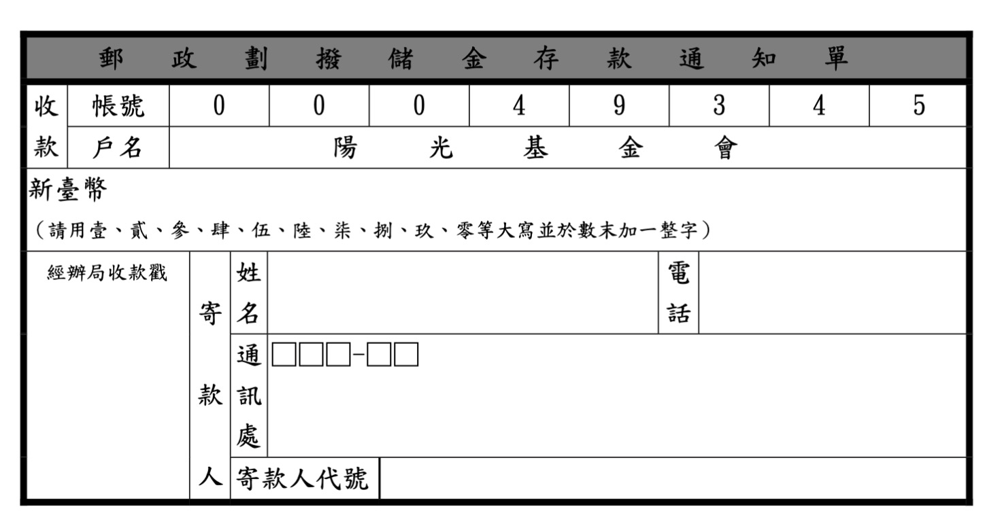
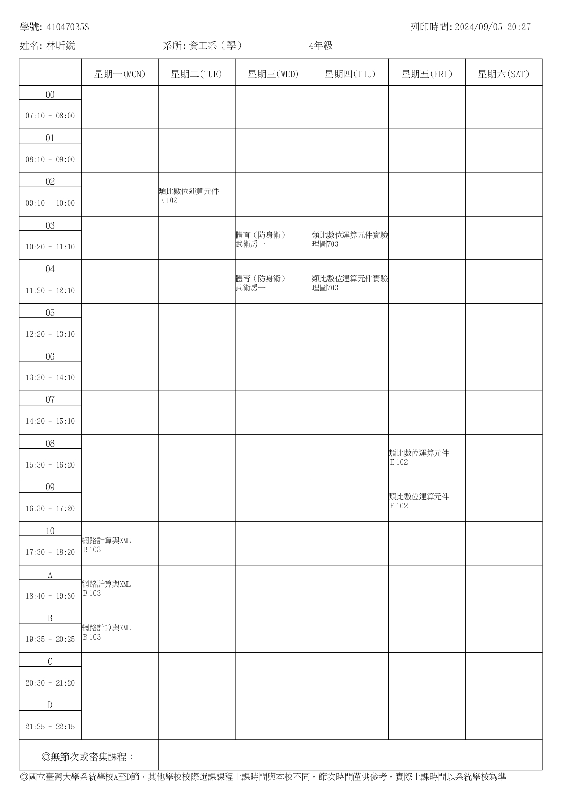

# Homework 1
  


# A. 設計XML文件

## 項目三：郵政劃撥單



```xml
<PostalRemittanceNotice>
    <Header>
        <Title>郵政劃撥儲金存款通知單</Title>
    </Header>
    <AccountInfo>
        <AccountNumber>00049345</AccountNumber>
        <AccountHolder>陽光基金會</AccountHolder>
    </AccountInfo>
    <Amount>
        <Currency>新臺幣（請用壹、貳、參、肆、伍、陸、柒、捌、玖、零等大寫於數末加一整字）</Currency>
    </Amount>
    <Agent>
        <Name>姓名</Name>
        <Contact>通訊處</Contact>
        <Phone>電話</Phone>
        <ID>捐款人代號</ID>
    </Agent>
    <OfficeReceipt>
        <Stamp>經辦局收款戳</Stamp>
    </OfficeReceipt>
</PostalRemittanceNotice>
```

> 其中最內部的標籤都皆為範例，並非真實資料，請取代為真實資料即可。

## 項目四：課表



```xml
<Schedule>
    <StudentInfo>
        <StudentID>41047035S</StudentID>
        <Name>林昕鋭</Name>
        <Department>資工系（學）</Department>
        <Year>4</Year>
    </StudentInfo>
    <WeeklySchedule>
        <Day name="Monday">
            <Period time="17:30 - 18:20">
                <Course>網路計算與 XML</Course>
                <Location>B103</Location>
            </Period>
            <Period time="18:40 - 19:30">
                <Course>網路計算與 XML</Course>
                <Location>B103</Location>
            </Period>
            <Period time="19:35 - 20:25">
                <Course>網路計算與 XML</Course>
                <Location>B103</Location>
            </Period>
        </Day>
        <Day name="Tuesday">
            <Period time="09:10 - 10:00">
                <Course>類比數位邏輯元件</Course>
                <Location>E102</Location>
            </Period>
        </Day>
        <Day name="Wednesday">
            <Period time="10:20 - 11:10">
                <Course>體育（防身術）</Course>
                <Location>武術房一</Location>
            </Period>
            <Period time="11:20 - 12:10">
                <Course>體育（防身術）</Course>
                <Location>武術房一</Location>
            </Period>
        </Day>
        <Day name="Thursday">
            <Period time="10:20 - 11:10">
                <Course>類比數位邏輯元件實驗</Course>
                <Location>理圖703</Location>
            </Period>
            <Period time="11:20 - 12:10">
                <Course>類比數位邏輯元件實驗</Course>
                <Location>理圖703</Location>
            </Period>
        </Day>
        <Day name="Friday">
            <Period time="15:30 - 16:20">
                <Course>類比數位邏輯元件</Course>
                <Location>E102</Location>
            </Period>
            <Period time="16:30 - 17:20">
                <Course>類比數位邏輯元件</Course>
                <Location>E102</Location>
            </Period>
        </Day>
    </WeeklySchedule>
    <Others>
        <PrintTime>2024/09/05 20:27</PrintTime>
    </Others>
</Schedule>
```

# B. XML文件轉換為JSON格式
## 項目三：郵政劃撥單

```json
{
  "PostalRemittanceNotice": {
    "Header": {
      "Title": "郵政劃撥儲金存款通知單"
    },
    "AccountInfo": {
      "AccountNumber": "00049345",
      "AccountHolder": "陽光基金會"
    },
    "Amount": {
      "Currency": "新臺幣（請用壹、貳、參、肆、伍、陸、柒、捌、玖、零等大寫於數末加一整字）"
    },
    "Agent": {
      "Name": "姓名",
      "Contact": "通訊處",
      "Phone": "電話",
      "ID": "捐款人代號"
    },
    "OfficeReceipt": {
      "Stamp": "經辦局收款戳"
    }
  }
}
```