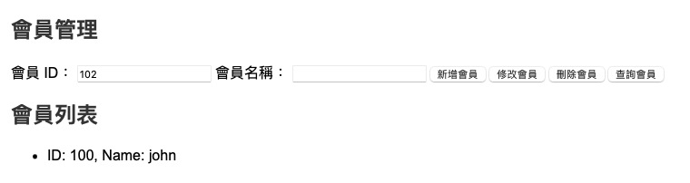

# Homework 3
  


> 請打開這個連結 https://qkmj0mpmrq8svyt035ie9a.on.drv.tw/web2/ 以瀏覽我的網站（可能會因為伺服器過載而無法連線或速度過慢，如出現此現象請稍後換個時間再試，或是下載整個資料夾後在本地端開啟，謝謝請見諒！）

# 作業需求
- XML Viewer 動態網頁情境
- Data Island: XML 與 XSL 動態結合
- 網站至少包括兩個 XML 動態網頁
    - 會員書籍檢視系統網頁
    - 會員書籍管理系統網頁
- XML 文件來扮演資料庫的角色
    - 設計出一個小型的資料庫管理系統
    - 利用程式語言提供的 DOM API 來做 XML 元素的新增、修改、刪除、查詢、排序和列印等操作
    - 使用 XML Template 檔來產生 XML 文件

----
# 實作說明

## 網站資料夾結構
```plaintext
web2/
├── index.html          // XML Viewer 頁面含 Data Island 功能
├── member.html         // 會員與書籍管理頁面
├── scripts/            // JavaScript 檔案
│   ├── viewer.js       // XML Viewer 的功能
│   ├── member.js       // 會員與書籍管理功能
│   ├── validate.js     // XML Schema 驗證邏輯
├── styles/             // CSS 檔案
│   └── styles.css      // 主樣式表
├── assets/             // 靜態資源
│   ├── sample.xml      // 範例 XML 文件
│   ├── sample.xsd      // XML Schema (XSD)
│   ├── sample.xsl      // 範例 XSL 文件
|   └── error.xml       // 錯誤的 XML 文件
```

### **1. XML Viewer 動態網頁情境**
#### **實作說明**
- **功能**：
  - 提供 XML 文件的上傳、展示和驗證功能。
  - 使用 Data Island 技術將 XML 與 XSL 動態結合，實現 XML 文件的結構化展示。
- **實作**：
  - 在 `index.html` 中設計「XML Viewer with Data Island」頁面，允許用戶上傳 XML 文件並展示其內容。
  - 使用 `<iframe>` 加載 Data Island 結果，結合 XML 和 XSLT 動態生成結果。

---

### **2. Data Island: XML 與 XSL 動態結合**
#### **實作說明**
- **功能**：
  - 結合 XML 和 XSL 動態生成結構化的資料視圖（例如，將 XML 會員資料渲染成表格）。
- **實作**：
  - 使用 XSL 檔案定義轉換規則。
  - JavaScript 中利用 DOM API 執行 XSLT 處理並將結果展示在頁面中。
  - 示例代碼：
    ```javascript
    function applyXSLT(xmlContent, xslContent) {
        const parser = new DOMParser();
        const xmlDoc = parser.parseFromString(xmlContent, "application/xml");
        const xslDoc = parser.parseFromString(xslContent, "application/xml");
        const xsltProcessor = new XSLTProcessor();
        xsltProcessor.importStylesheet(xslDoc);
        const resultDocument = xsltProcessor.transformToFragment(xmlDoc, document);
        document.getElementById("data-island-view").contentDocument.body.innerHTML = '';
        document.getElementById("data-island-view").contentDocument.body.appendChild(resultDocument);
    }
    ```

---

### **3. 網站至少包括兩個 XML 動態網頁**
#### **實作說明**
- **第一頁：會員書籍檢視系統網頁（`index.html`）**
  - 功能：用於上傳 XML 文件，展示 XML 結果並結合 XSL 轉換資料視圖。
  - 關鍵功能：
    - **XML 文件上傳**：用戶可以上傳 XML 文件。
    - **XSLT 結合**：結合 XSL 動態轉換成結構化資料。
    - **XML Schema 驗證**：檢查 XML 是否符合結構需求。

- **第二頁：會員書籍管理系統網頁（`member.html`）**
  - 功能：提供 XML 元素的新增、修改、刪除、查詢、排序和列印功能。
  - 關鍵功能：
    - **新增會員或書籍**：用戶可以新增會員和書籍。
    - **修改會員或書籍**：用戶可以編輯現有的會員和書籍資訊。
    - **刪除會員或書籍**：用戶可以刪除特定的會員或書籍。
    - **查詢功能**：用戶可以根據 ID 查詢會員或書籍。
    - **下載功能**：將管理後的資料導出為 XML 文件。

---

### **4. XML 文件來扮演資料庫的角色**
#### **實作說明**
- **功能**：
  - XML 文件儲存會員和書籍的資料，扮演小型資料庫的角色。
  - 允許對 XML 資料進行 CRUD 操作（新增、修改、刪除、查詢）。
- **實作**：
  - `sample.xml` 內容：
    ```xml
    <data>
        <members>
            <member id="001">
                <name>王小明</name>
            </member>
            <member id="002">
                <name>李小花</name>
            </member>
        </members>
        <books>
            <book id="101">
                <title>XML 入門</title>
                <author>王小華</author>
                <price>500</price>
            </book>
            <book id="102">
                <title>Java 基礎</title>
                <author>李小明</author>
                <price>400</price>
            </book>
        </books>
    </data>
    ```
  - 使用 DOM API 處理 XML，例如：
    ```javascript
    const parser = new DOMParser();
    const xmlDoc = parser.parseFromString(xmlContent, "application/xml");
    const members = xmlDoc.getElementsByTagName("member");
    ```

---

### **5. 設計出一個小型的資料庫管理系統**
#### **實作說明**
- **功能**：
  - 提供新增、修改、刪除、查詢、排序和列印 XML 元素的功能。
- **實作**：
  - 使用 JavaScript 處理 XML 文件的 DOM 結構，並更新 DOM 以實現資料管理。
  - 例：新增會員或書籍：
    ```javascript
    function addMember(xmlDoc, id, name) {
        const member = xmlDoc.createElement("member");
        member.setAttribute("id", id);
        const nameElement = xmlDoc.createElement("name");
        nameElement.textContent = name;
        member.appendChild(nameElement);
        xmlDoc.getElementsByTagName("members")[0].appendChild(member);
    }
    ```

---

### **6. 利用程式語言提供的 DOM API**
#### **實作說明**
- **功能**：
  - 使用 DOM API 操作 XML 元素，支持以下操作：
    - **新增元素**：`appendChild` 將新節點添加到 XML 文件中。
    - **修改元素**：修改節點屬性或內容，例如 `setAttribute` 和 `textContent`。
    - **刪除元素**：使用 `removeChild` 刪除節點。
    - **查詢元素**：使用 `getElementsByTagName` 查詢節點。

---

### **7. 使用 XML Template 檔來產生 XML 文件**
#### **實作說明**
- **功能**：
  - 提供一個預設的 XML Template 檔案，允許用戶快速生成新 XML 文件。
- **實作**：
  - 預設的 Template 檔案：
    ```xml
    <data>
        <members></members>
        <books></books>
    </data>
    ```
  - 下載新 XML 文件：
    ```javascript
    function downloadXML(xmlDoc) {
        const serializer = new XMLSerializer();
        const xmlString = serializer.serializeToString(xmlDoc);
        const blob = new Blob([xmlString], { type: "application/xml" });
        const a = document.createElement("a");
        a.href = URL.createObjectURL(blob);
        a.download = "new-data.xml";
        a.click();
    }
    ```
----
# 實作畫面

以下是實作的畫面截圖，展示了網站的功能和效果：

### **1. 網站首頁**
> source: `index.html`
- 提供 XML Viewer 功能，允許用戶上傳 XML 文件並展示結果，支援 XML Schema 驗證，並且可以透過連結前往會員書籍管理系統。


- 上傳 XML 文件後，會自動進行轉換，展示結構化的資料視圖。(可以使用 `web2/assets/sample.xml` 進行測試)


- 上傳 XSD 文件按下 `驗證 XML` 按鈕後會進行驗證，檢查 XML 是否符合結構需求。(可以使用 `web2/assets/sample.xsd` 進行測試)


- 測試如果上傳不符合 XSD 的 XML 檔案，會顯示錯誤訊息。(可以使用 `web2/assets/error.xml` 進行測試)


### **2. 會員書籍管理系統**
> source: `member.html`
- 提供會員和書籍的管理功能，包括新增、修改、刪除、查詢、排序和列印 XML 元素，並且可以透過連結返回首頁。


- 新增會員，填寫 ID 和名稱後按下 `新增` 按鈕即可。


- 修改會員，填寫 ID 和新名稱後按下 `修改` 按鈕即可。


- 刪除會員，填寫 ID 後按下 `刪除` 按鈕即可。




- 查詢會員，填寫 ID 後按下 `查詢` 按鈕即可。


- 新增書籍與修改書籍的操作方式與會員相同。下載 XML，按下 `下載 XML` 按鈕即可將管理後的資料導出為 XML 文件。


```xml
<?xml version="1.0" encoding="UTF-8"?>
<data>
<members>
  <member id="100">
    <name>john</name>
  </member>
  <member id="102">
    <name>aaa</name>
  </member>
  <member id="111">
    <name>bbb</name>
  </member>
  <member id="222">
    <name>bbbaaa</name>
  </member>
</members>
<books>
  <book id="12232">
    <title>apple</title>
    <author>banana</author>
    <price>100</price>
  </book>
  <book id="555">
    <title>moon</title>
    <author>sun</author>
    <price>50</price>
  </book>
</books>
</data>
```

- 上傳剛剛下載的 XML 檔案並且按下 `加載 XML` 按鈕，可以看到剛剛新增的會員和書籍資料，整個頁面就宛如一個小型的資料庫管理系統。


### **3. 返回首頁並且測試剛剛下載的 XML 檔案**

- 回到首頁後，上傳剛剛下載的 XML 檔案，可以看到剛剛新增的會員和書籍資料。


- 透過 XSD 驗證，可以看到剛剛下載的 XML 檔案符合結構需求。


----
# 討論

這次作業的核心目標是利用 XML 技術搭建一個包含數據檢視和管理功能的小型系統，並充分利用 XML 的標準化特性和 DOM API 的操作能力來完成動態網頁開發。在這份作業中，我做了 XML Viewer、會員與書籍管理系統兩大頁面，並透過 Data Island 技術結合 XSL，進一步展現了 XML 文件的靈活性與實用性。

在 **XML Viewer** 首頁頁面中，我做了了 XML 文件的展示、驗證和結構化數據的動態轉換功能。這部分的亮點在於使用了 XSL技術，能夠將 XML 文件內容轉換成易於理解的 HTML 結構，例如表格形式的會員與書籍資料。同時，透過結合 XML Schema (XSD)，對 XML 文件進行格式驗證，確保其符合指定的結構要求，這對於提高數據的準確性和可靠性具有重要意義。

在 **會員與書籍管理系統** 中，XML 文件被用作小型數據庫，支援新增、修改、刪除、查詢等基本 CRUD 操作，並提供了下載 XML 文件的功能。整體操作過程簡單直觀，體現了 XML 文件作為資料存儲介質的靈活性。值得注意的是，這部分的實現充分使用了 JavaScript 的 DOM API，例如 `createElement`、`appendChild`、`setAttribute` 等，直接操作 XML 文件的節點結構。這樣的方式不僅符合 XML 的標準操作，也展現了 JavaScript 操作 DOM 的強大能力。

我覺得這次有滿足作業要求，也進一步探討了 XML 文件在前端開發中的多種應用場景。通過將 XML 應用於 Viewer 和管理系統，對其結構化數據的處理能力有了更深入的認識。未來我覺得這技術可以進一步應用於更大型的應用場景，例如跨平台數據交換或配置文件管理。這次作業的驗證過程也看出了 XML 文件易於出現格式錯誤的問題，未來可以考慮優化錯誤提示機制，使系統對於用戶的反饋更為友好。 

這次作業讓我學到並且熟悉了 XML 與 DOM API 的應用，並且對資料的動態處理與展示有了更深入的體會，為日後開發更複雜的應用系統奠定了基礎，我感到收穫滿滿。