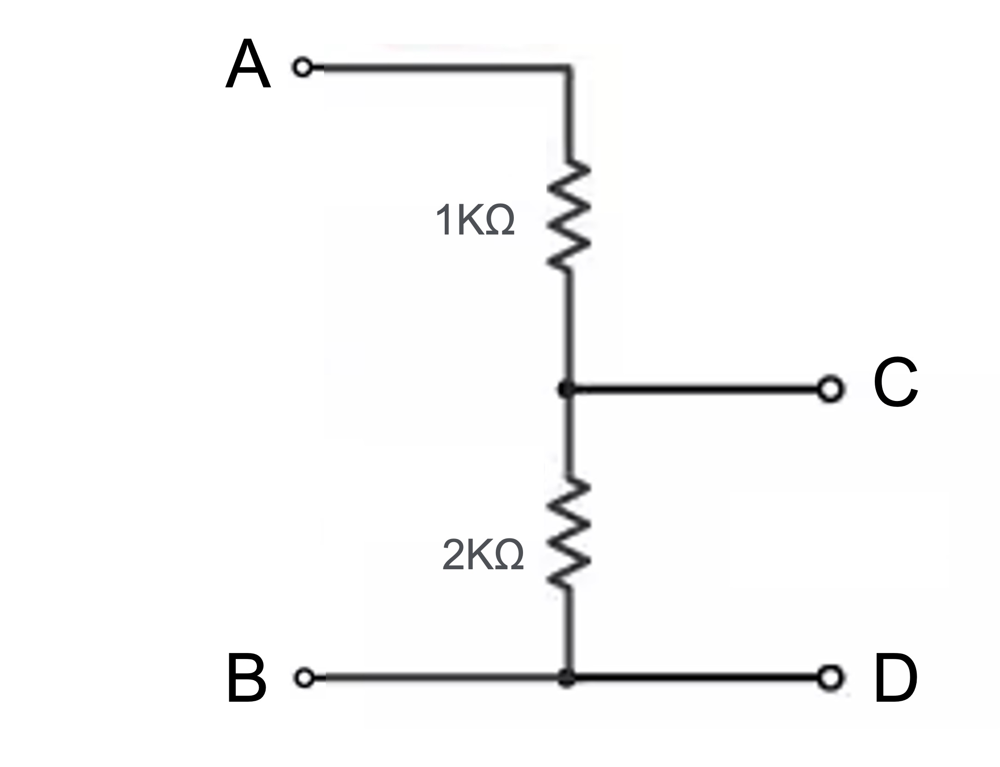
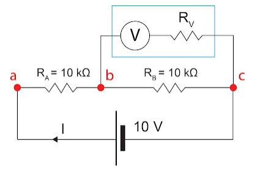

# Homework 1
  


## Problem 1
### (1)
```math
R_{AB} = \frac{(4+2+2) \cdot 3}{(4+2+2)+3} = \frac{24}{11}K \Omega
```

### (2)
```math
R_{AC} = \frac{(4+2) \cdot (3+2)}{(4+2)+(3+2)} = \frac{30}{11}K \Omega
```

## Problem 2

```math
R = \frac{6 \cdot 8}{6+8} + 2 + 6  = \frac{160}{14}K \Omega  
```

```math
I = \frac{12}{\frac{160}{14}} = \frac{21}{20}mA
```

```math
v_x = 2 \cdot \frac{21}{20} = \frac{21}{10}V
```

```math
i_x = \frac{21}{20} \cdot \frac{6}{6+8} = \frac{9}{20}A
```

## Problem 3



Assume that $V_{AB}$ is $12V$:

```math
V_{CD} = V_{AB} \cdot \frac{2k}{1k+2k} = 4V
```

```math
V_{CD} = \frac{2}{3} \cdot V_{AB} = 4V
```

## Problem 4

#### 1.

```math
V_x = 8_{mA} \cdot 2K \Omega = 16V
```

#### 2.

```math
V_C = 3 mA \cdot 2KΩ = 6V
```

```math
i_1 =  \frac{6V - 24V}{2KΩ} = -9mA
```

```math
I = i_x + i_1 = 3mA + (-9mA) = -6mA
```

## Problem 5

#### 1.



圖上框起來為三用電錶與其內阻 $R_v$，計算還沒接上三用電錶的實際 $V_{bc}$ 的值:

```math
R = 20 kΩ
```
```math
I = 0.5 mA
```
```math
V_{bc} = 0.5 mA \cdot 10 kΩ = 5 V
```

- (1)：設三用電錶內阻 $R_V = 10 kΩ$
    - $R = R_A + (R_V // R_B) = 10 kΩ + (10 kΩ // 10 kΩ) = 10 kΩ + 5 kΩ = 15 kΩ$
    - $I = 10 V / R = 10 V / 15 kΩ ≈ 0.667 mA$
    - $V_{bc} = I x (R_V // R_B) = 0.667 mA \cdot 5 kΩ ≈ 3.3 V$
    - 與實際 $V_{bc}$ 誤差率 = $(5 V - 3.3 V) / 5 V \cdot 100\% = 34%$

- (2)：設三用電錶內阻 $R_V = 1 MΩ$
    - $R = R_A + (R_V // R_B) = 10 kΩ + (1 MΩ // 10 kΩ) ≈ 10 kΩ + 9.90099 kΩ = 19.90099 kΩ$
    - $I = 10 V / R = 10 V / 19.90099 kΩ ≈ 0.502 mA$
    - $V_{bc} = I \cdot (R_V // R_B) = 0.502 mA \cdot 9.90099 kΩ ≈ 4.97 V$
    - 與實際 $V_{bc}$ 誤差率 = $(5 V - 4.97 V) / 5 V \cdot 100\% = 0.6\%$

從以上計算結果得知當電壓錶內阻愈高，所量的電壓值愈準確

> Reference: [萬用電錶之小盒內的秘密](http://elec-mischief.blogspot.com/2018/03/blog-post.html)


#### 2.
當我們想要測量待測設備（DUT）的支路電壓時，我們需要將萬用表（在電壓測量模式下）並聯接到DUT上。這樣做的原因是為了測量DUT兩端的電壓差。然而，將萬用表接入電路後，會對原電路產生影響，這與萬用表的內部電阻有關。

**等效電阻的影響：**

萬用表在電壓測量模式下具有一定的內部電阻（\( R_m \)），當它並聯到DUT（電阻為\( R_{\text{DUT}} \)）時，兩者形成並聯電路。並聯電阻的等效電阻（\( R_{\text{eq}} \)）可由以下公式計算：

\[
\frac{1}{R_{\text{eq}}} = \frac{1}{R_{\text{DUT}}} + \frac{1}{R_m}
\]

如果萬用表的內部電阻較小，則\( R_{\text{eq}} \)會明顯小於\( R_{\text{DUT}} \)。這意味著接入萬用表後，DUT所在支路的總電阻下降了，從而改變了電路的電流分布。

**電流分配的影響：**

根據電流分配定律，在並聯電路中，電流會按照各支路的導電能力（即電導，電阻的倒數）進行分配。電阻較小的支路會分配到更多的電流。

假設原電路的總電流為\( I_{\text{total}} \)，接入萬用表後，部分電流會流經萬用表，導致流過DUT的電流減少。這種變化會影響DUT兩端的電壓，從而使得我們測量到的電壓不再是原本未受干擾時的真實電壓。

**為何需要高內部電阻：**

為了最小化對原電路的干擾，萬用表應該設計成具有非常高的內部電阻。當\( R_m \)遠大於\( R_{\text{DUT}} \)時：

1. **等效電阻幾乎不變：** 因為\( R_m \)非常大，\( \frac{1}{R_m} \)接近於零，故\( R_{\text{eq}} \approx R_{\text{DUT}} \)。這意味著接入萬用表後，電路的總電阻幾乎沒有變化。

2. **電流分配影響極小：** 由於萬用表的電阻極大，流經萬用表的電流\( I_m \)極小，可近似視為零。絕大部分電流仍流經DUT，故DUT兩端的電壓基本維持不變。

**結論：**

透過等效電阻和電流分配的概念，可以理解為什麼萬用表在電壓測量模式下必須具有高內部電阻。高內部電阻確保了萬用表對原電路的影響最小，從而能夠準確地測量DUT兩端的真實電壓。


#### 3.
我覺得在我參考的資料後的想法，因為有舉例所以更能理解為什麼要用高內阻，而 ChatGPT 的回答因為沒有舉例也沒有圖片，只有文字描述，雖然回答上是正確的，但是我覺得缺少了一些東西，所以我會選擇我參考的資料加上自己想法說明會更好。