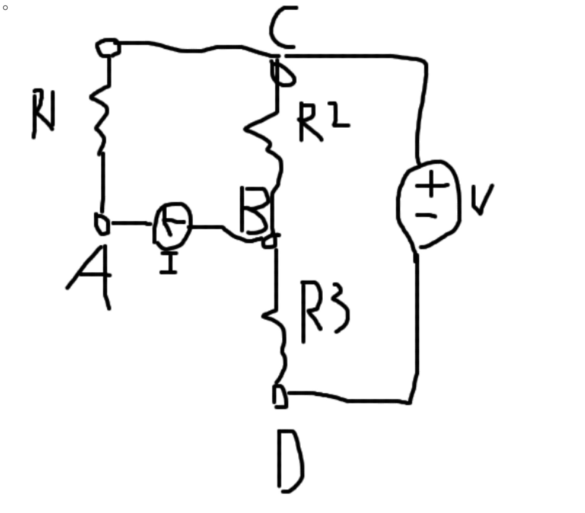
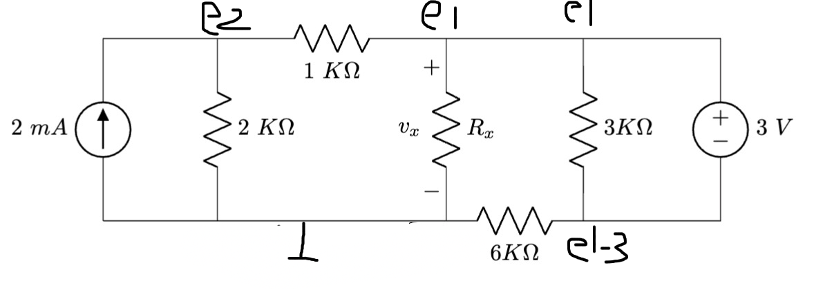

# Homework 2
  


## Problem 1
- Question: 所以直接算電路圖跟用 Thévenin 等效電路有什麼差別？
- Answer: 在算正確答案時是沒有差的，但是簡化電路後更較為直觀，針對要計算的東西電壓源取代電流源後做計算會很方便

## Problem 2
Reconstruct the circuit:



將電流源與電阻移除。

### (1)
A -> B -> D 移除電流源與 R3 電阻

### (2)
B -> D 移除 R3 電阻

## Problem 3



KCL at $e_2$:
```math
\frac{e_1-e_2}{1k \Omega} + \frac{0-e_2}{2k \Omega} + 2 = 0
```
```math
2e_2 - 2e_1 - e_2 + 4 = 0
```
```math
-2e_1 + e_2 = -4
```

KCL at $ground$:
```math
\frac{e_2-0}{2k \Omega} + \frac{e_1-0}{R_x} + \frac{(e_1-3)-0}{6k \Omega} - 2 = 0
```
```math
3e_2 + \frac{6e_1}{R_x} + e_1-3 - 12 = 0
```
```math
e_1+ \frac{6e_1}{R_x} + 3e_2 = 15
```

### (1) When $R_x = 2k \Omega$
```math
-2e_1 + e_2 = -4
```
```math
4e_1 + 3e_2 = 15
```

Solve the equations:
```math
e_1 = 2.7 V, \quad
e_2 = 1.4 V
```

> solved equations by [this](https://www.99cankao.com/algebra/twovar.php)

```math
v_x = e_1 - 0 = 2.7 V
```

### (2) When $R_x = 4k \Omega$
```math
-2e_1 + e_2 = -4
```
```math
5e_1 + 6e_2 = 30
```

Solve the equations:
```math
e_1 = 3.1764 V, \quad
e_2 = 2.3529 V
```

> solved equations by [this](https://www.99cankao.com/algebra/twovar.php)

```math
v_x = e_1 - 0 = 3.1764 V
```

### (3) When $R_x = 6k \Omega$
```math
-2e_1 + e_2 = -4
```
```math
2e_1 + 3e_2 = 15
```

Solve the equations:
```math
e_1 = 3.375 V, \quad
e_2 = 2.75 V
```

> solved equations by [this](https://www.99cankao.com/algebra/twovar.php)

```math
v_x = e_1 - 0 = 3.375 V
```
## Problem 4

$v_A$ 的電壓 (視為電壓加總):
```math
v_A = i_1 R_1 + i_2 R_2
```
```math
i_1 = \frac{v_1}{R_1}, \quad i_2 = \frac{v_2}{R_2}
```
```math
v_A = v_1 \left( \frac{1}{R_1} \right) + v_2 \left( \frac{1}{R_2} \right)
```

將以上式子視為 weighted-sum function:
```math
v_A = w_1 v_1 + w_2 v_2
```
> 其中權重 $w_1 = \frac{1}{R_1}, w_2 = \frac{1}{R_2}$

根據題目的條件 $0 < w_1 \leq 1, 0 < w_2 \leq$，所以:
```math
R_1 \geq 1, \quad R_2 \geq 1
```
可以讓 $w_1, w_2$ 在範圍內 $(0, 1]$，因此得證。
