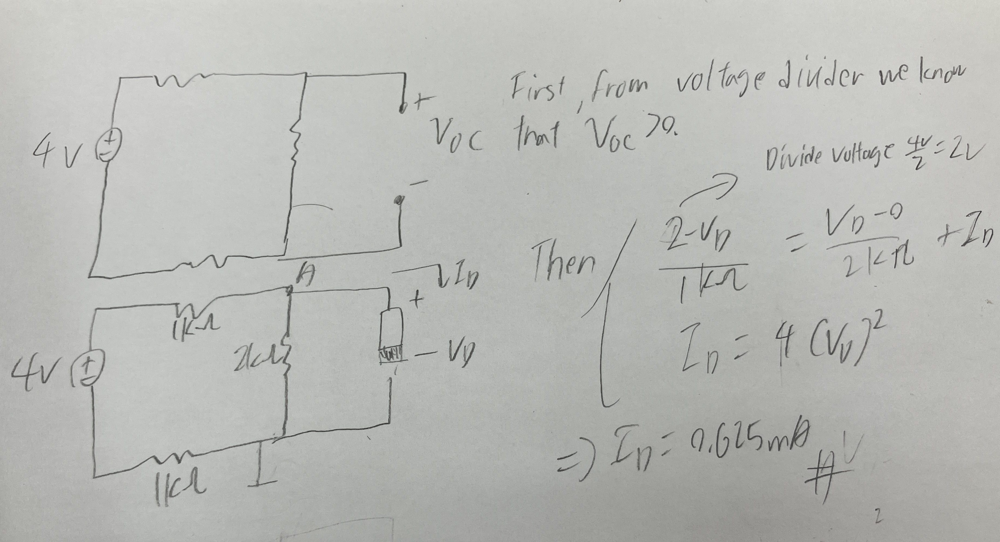

# Homework 3
  


## Problem 1


## Problem 2
It's not compatible. Because as problem shows  that for the input side, voltage between $0V$ and $3.3V$ as logical 0. But $V_{IL} = 3.5 V$ by specification showed. Like if input voltage is $3.4V$, it will cause be unpredictable and not stable. So it's not compatible.

## Problem 3
1. \( V_{OH} \):
   - According to the specification, \( V_{OH} \) should be 3.7V, which means that the output voltage corresponding to a low input voltage (i.e., when \( V_{in} \) is near 0V) should reach at least 3.7V.
   - From the graph, for \( V_{in} \approx 0 \, V \), \( V_{out} \) appears to be very close to 4V, which is above 3.7V. Therefore, the circuit satisfies the \( V_{OH} \) specification.

2. \( V_{OL} \):
   - The specification for \( V_{OL} \) is 1.0V, meaning that the output voltage should be 1.0V or lower when \( V_{in} \) is high.
   - From the graph, for \( V_{in} > 2.5 \, V \), the output voltage \( V_{out} \) appears to be around 0.5V, which is below the required \( V_{OL} \) of 1.0V. Thus, the circuit satisfies the \( V_{OL} \) requirement.

3. \( V_{IH} \):
   - The specification for \( V_{IH} \) is 2.0V, meaning that any input voltage greater than 2.0V should be interpreted as a logical high, corresponding to the output being low.
   - From the graph, as \( V_{in} \) exceeds 2.0V, the output voltage \( V_{out} \) starts to drop significantly, reaching low levels. Therefore, the circuit satisfies the \( V_{IH} \) requirement.

4. \( V_{IL} \):
   - The specification for \( V_{IL} \) is 0.5V, meaning that any input voltage below 0.5V should be interpreted as a logical low, corresponding to the output being high.
   - From the graph, when \( V_{in} < 0.5V \), the output voltage \( V_{out} \) is still high and close to the \( V_{OH} \) level. Hence, the circuit satisfies the \( V_{IL} \) requirement.

## Problem 4
When the MOSFET is turned "on," it creates a voltage divider between \( R_{ON} \) (the on-resistance of the MOSFET) and \( R_L \) (the load resistor). The output voltage \( V_{out} \) at this point is determined by the voltage division between these two resistors:

\[
V_{out} = V_S \cdot \frac{R_{ON}}{R_L + R_{ON}}
\]

This voltage represents the logical "0" level when the MOSFET is on. In order to meet the static discipline, the output voltage when the MOSFET is on must be less than or equal to \( V_{OL} \), the maximum allowed voltage for a logical "0."

If the output voltage exceeds \( V_{OL} \), the inverter would fail to meet the required logic levels, and the circuit could misinterpret the logic state. This would violate the static discipline, which requires that the output voltage for a logical "0" stay within a specified range.

To satisfy the inequality and ensure that the inverter outputs a correct logical "0," the resistance \( R_{ON} \) must be small relative to \( R_L \). If \( R_{ON} \) becomes too large, the output voltage will increase, possibly exceeding \( V_{OL} \), which would invalidate the static discipline. Therefore, the inequality ensures that the voltage division is such that the logical "0" voltage stays within the acceptable range.

## Problem 5
```math
C = \bar{A}B + A\bar{B}
```