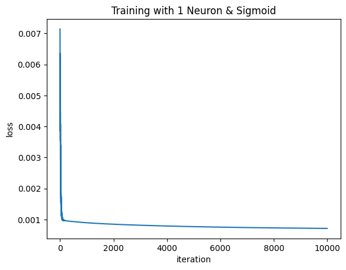
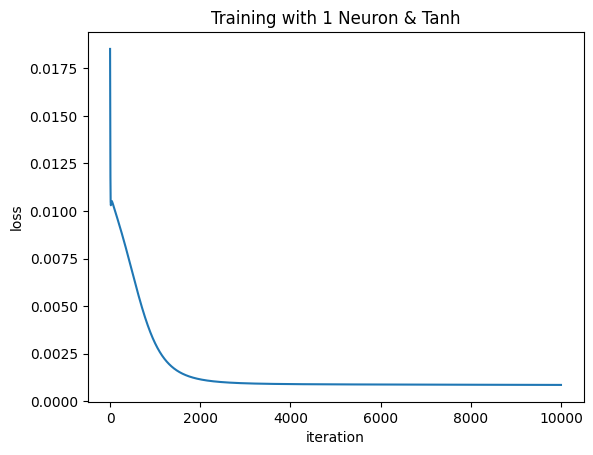
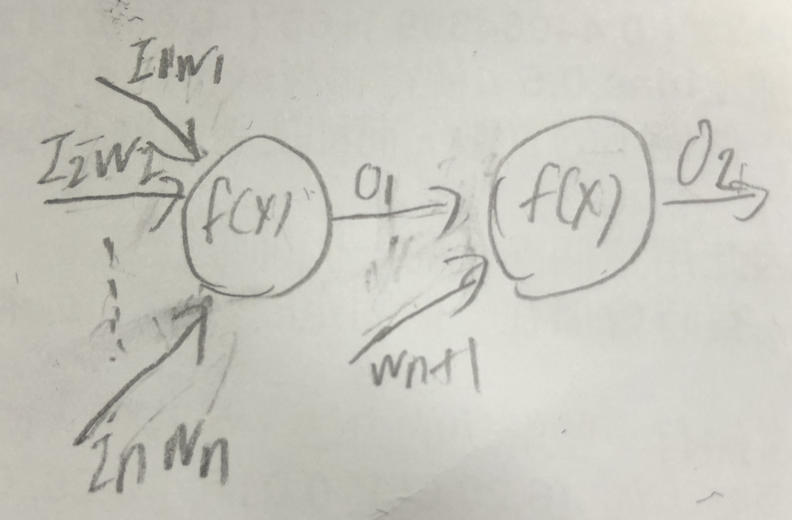
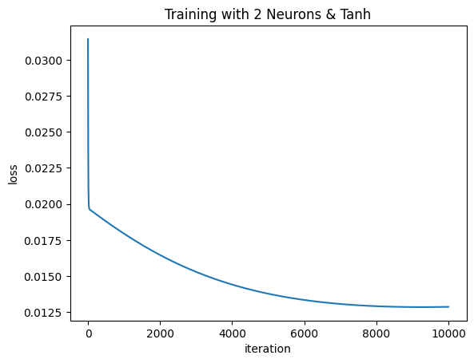
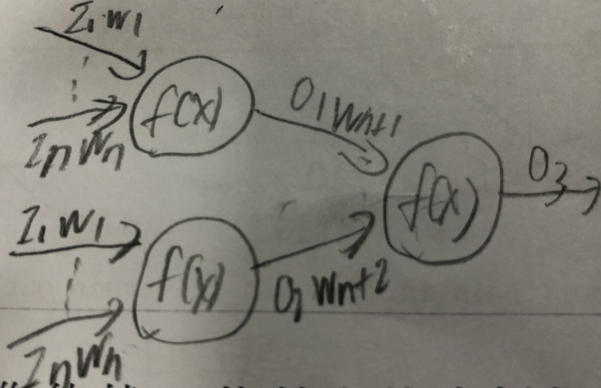
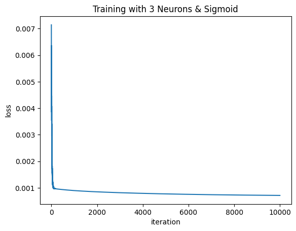

# Homework 1

- Student ID: 41047035S
- Name: 林昕鋭
- Instructor: 林順喜
- Due: 2023-03-14

## Q1
- Hardware & System
    - Model: MacBook Air (M1, 2020), 16 GB ram
    - System: MacOS (Darwin root:xnu-8020.240.14~1/RELEASE_ARM64_T8101 arm64)

- Input：總共為14筆資料並且將總成績欄位移除，並將資料壓縮至0到1之間
- Output：預測的總成績
- Train/Test data：
    - Case1: 將train data and test data 以80%和20%做分割處理
    - Case2: 全部的data當作train data，test data 為手動輸入

> From data.xlsx

## Q2
- Neuron number: 1
- Activation Function: Sigmoid
- Loss Function: MSELoss
- Iteration: 10000

| Data  | 94   | 89   | 79   | 85   | 95   | 96   | 75   | 75   | 85   | 91   | 76   | 73   | 44   | 57   |
|---------|------|------|------|------|------|------|------|------|------|------|------|------|------|------|
| Predict | 91.6 | 90.2 | 82.4 | 89.4 | 89.8 | 91.9 | 76.9 | 74.5 | 84.5 | 90.2 | 77.1 | 72.1 | 42.9 | 57.7 |

Loss Value: 0.000712264467602495

## Q3
- Neuron number: 1
- Activation Function: Tanh
- Loss Function: MSELoss
- Learning Rate: 0.01 (如果沒設定learning rate將訓練不起來)
- Iteration: 10000

Tanh
| Data  | 94   | 89   | 79   | 85   | 95   | 96   | 75   | 75   | 85   | 91   | 76   | 73   | 44   | 57   |
|---------|------|------|------|------|------|------|------|------|------|------|------|------|------|------|
| Predict | 91.1 | 88.8 | 82.2 | 89.3 | 91.0 | 92.8 | 80.5 | 78.1 | 86.3 | 90.5 | 74.3 | 71.2 | 41.1 | 56.6 |

Loss Value: 0.000850229128168857

## Q4
- Neuron number: 2
- Activation Function: Sigmoid
- Loss Function: MSELoss
- Iteration: 10000

> 兩顆神經元連接示意圖

## Q5
承Q4配置

| Data  | 94   | 89   | 79   | 85   | 95   | 96   | 75   | 75   | 85   | 91   | 76   | 73   | 44   | 57   |
|---------|------|------|------|------|------|------|------|------|------|------|------|------|------|------|
| Predict | 93.8 | 90.4 | 80.2 | 87.9 | 94.7 | 95.1 | 78.5 | 79.2 | 88.0 | 92.8 | 76.6 | 75.2 | 45.9 | 57.0 |

Loss Value: 0.0004073804470783716

## Q6
- Neuron number: 2
- Activation Function: Tanh
- Loss Function: MSELoss
- Learning Rate: 0.01
- Iteration: 10000

| Data  | 94   | 89   | 79   | 85   | 95   | 96   | 75   | 75   | 85   | 91   | 76   | 73   | 44   | 57   |
|---------|------|------|------|------|------|------|------|------|------|------|------|------|------|------|
| Predict | 81.3 | 81.3 | 81.3 | 81.3 | 81.3 | 81.3 | 81.3 | 81.3 | 81.3 | 81.3 | 81.3 | 81.3 | 63.1 | 79.6 |

Loss Value: 0.012870014317118622

使用Tanh函數做兩顆神經元的訓練效果意外的不是很好，猜測在尋找最低點時模型可能卡在函數中的某一點動彈不得，其loss value比起其他訓練成效差了百倍以上

## Q7
- Neuron number: 3
- Activation Function: Sigmoid
- Loss Function: MSELoss
- Iteration: 10000

> 三顆神經元連接示意圖

## Q8
承Q7配置

| Data  | 94   | 89   | 79   | 85   | 95   | 96   | 75   | 75   | 85   | 91   | 76   | 73   | 44   | 57   |
|---------|------|------|------|------|------|------|------|------|------|------|------|------|------|------|
| Predict | 92.5 | 88.7 | 78.1 | 86.2 | 93.5 | 94.0 | 76.5 | 77.2 | 86.3 | 91.5 | 74.4 | 73.0 | 44.7 | 55.2 |

Loss Value: 0.0001845941585867999

## Q9
- A: 一半一半吧，問他程式相關的問題都還不錯，但講笑話似乎有點冷
- B: 問他遊戲裡的內容，他會看起來很有邏輯的亂回答
- C: 他的資料目前只有2021年之前的資料，所以他似乎並不知道最近烏俄戰爭開始了
- D: 問他機率論的問題，看起來非常的正確，但根本就在亂答，但讓他做報告或問他專有名詞（像是神經網路權重）的解釋都還不錯
- E: 有算式類的數學題目似乎都答的正確，但如果是證明題的話有些就在亂回答了

## Q10
第一次去真正實作了神經網路背後原理與公式，之前有機器學習與深度學習的經驗，但是都只是套套模組而已，也不知道裡面做了什麼事，做了這次作業遇到的困難就是了解背後數學的原理，有些沒聽過的專有名詞要特地查一下，這部分花了算蠻多時間的，配合範例程式碼也大概明白是在做什麼了

## Q11
- ChatGPT: https://chat.openai.com/chat/
- MSE function 程式碼參考: https://blog.csdn.net/WANGYONGZIXUE/article/details/110294482
- 常見Activation Function: https://www.v7labs.com/blog/neural-networks-activation-functions
- 常見Activation Function微分: https://medium.com/@adea820616/activation-functions-sigmoid-relu-tahn-20e3ae726ae
- Building a neural network FROM SCRATCH (no Tensorflow/Pytorch, just numpy & math): https://www.youtube.com/watch?v=w8yWXqWQYmU
