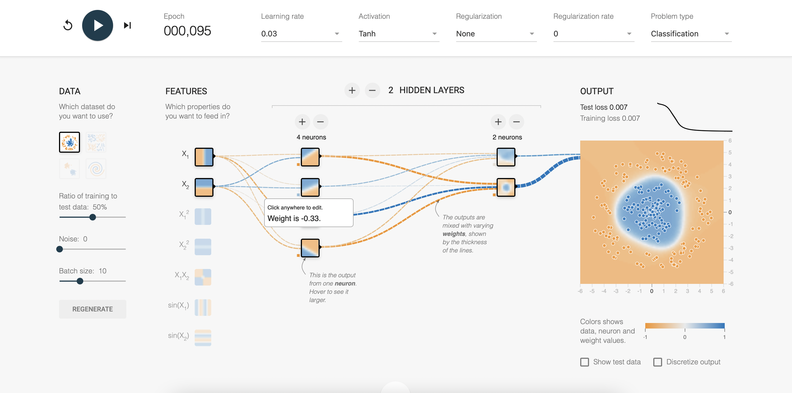
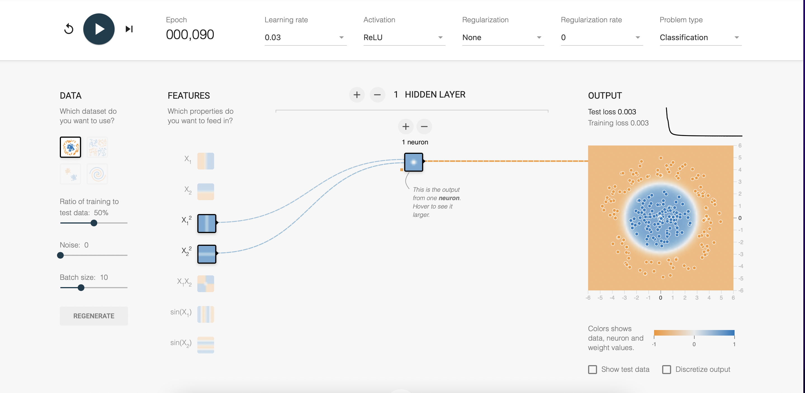
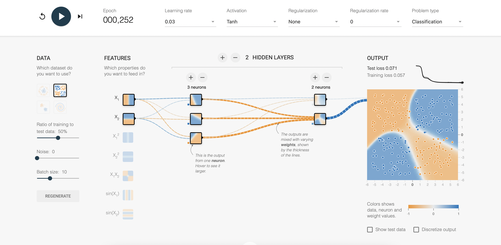
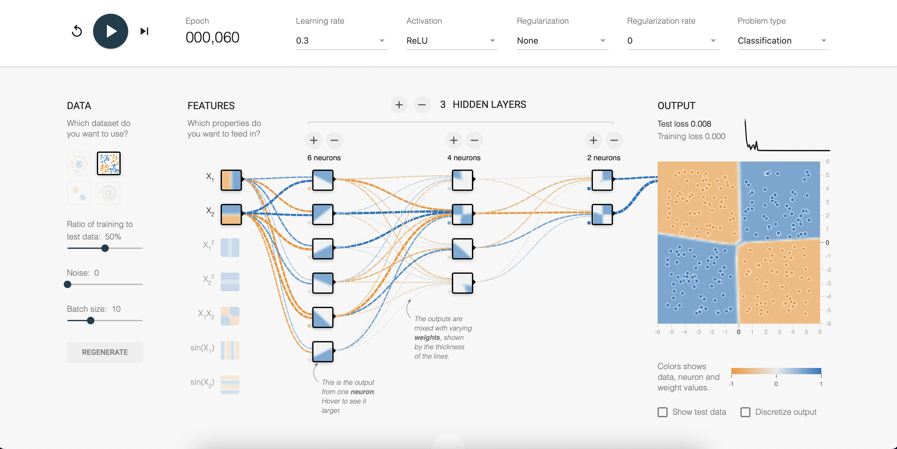
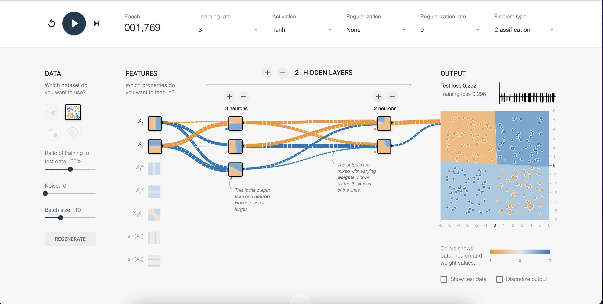
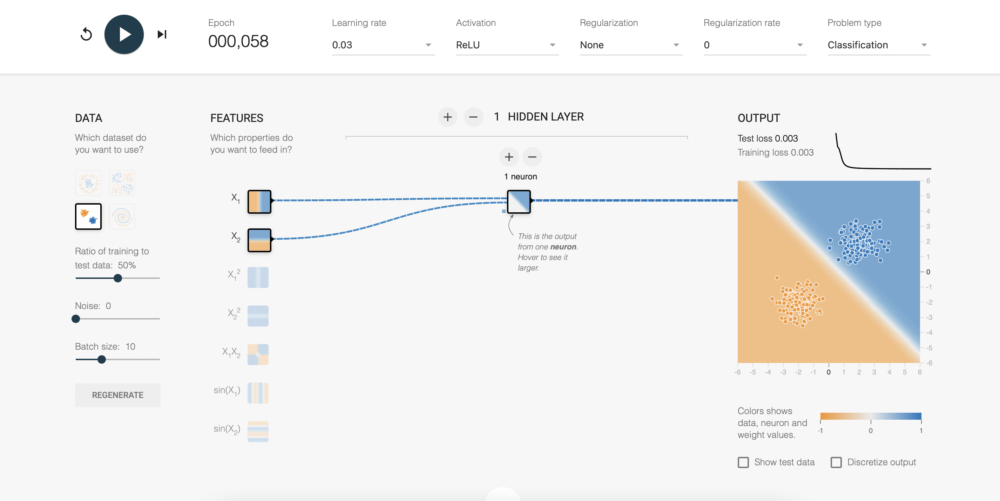
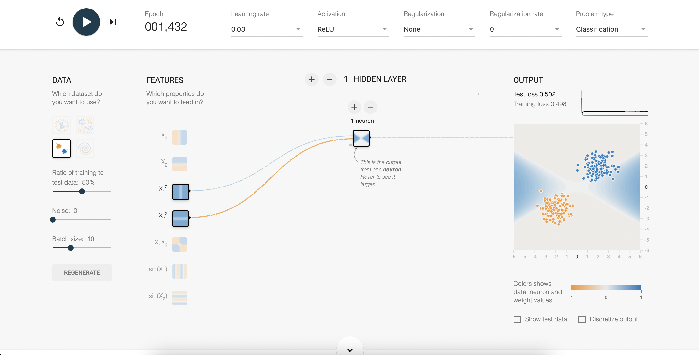
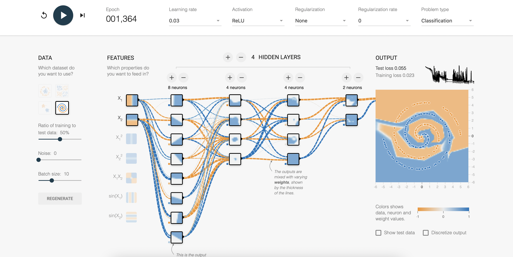
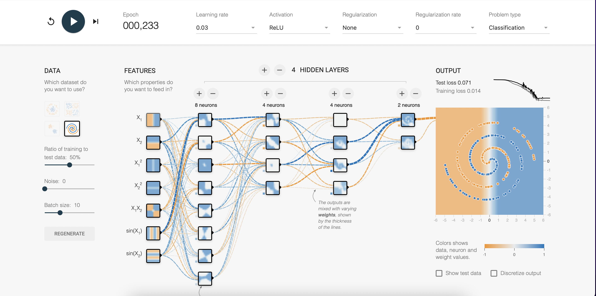

# Homework 4

- Student ID: 41047035S
- Name: 林昕鋭
- Instructor: 林順喜
- Due: 2023-05-31

[Tensorflow Playground](https://playground.tensorflow.org)

## (A) Circle data set

### Raw input feature with X1, X2 data:

Training loss: 0.007  
Test loss: 0.007

### $X1^2$, $X2^2$ data:

Training loss: 0.003  
Test loss: 0.003

> Activate function 使用 Relu 函式比起原本的 Tanh 函式會表現得更好，並且也僅使用一個神經元即可達到 loss < 0.1 的效果

## (B) Exclisove-Or data set

### Learning rate 0.03:

Training loss: 0.057  
Test loss: 0.071

### Learning rate 0.3:

Training loss: 0.000  
Test loss: 0.008

### Learning rate 3:

Training loss: 0.296  
Test loss: 0.292

> 明顯的看出來 learning rate 在 0.3 時表現得最好，而 learning rate 設為 3 時因為在梯度下降時強烈抖動不穩定導致學習不好，而 learning rate 設為 0.03 時因為在梯度下降過度緩慢學習稍微差些

## (C) Gaussian data set

### Raw input feature with X1, X2 data:

Training loss: 0.003  
Test loss: 0.003  
Neuron: 1

### $X1^2$, $X2^2$ data:

Training loss: 0.502  
Test loss: 0.498  
Neuron: 1

> 可以看到在一顆神經元處理 X1, X2 資料時學習的很好，但是面對 $X1^2$, $X2^2$ 資料時表現得相當的差，資料的多維會影響學習的成效

## (D) Spiral data set

### Raw input feature with X1, X2 data:

Training loss: 0.023  
Test loss: 0.055 

### All types of input feature data:

Training loss: 0.014  
Test loss: 0.071 

> Spiral data set 較為複雜且難學習，因此我用了逐漸收斂神經元的架構嘗試訓練，在訓練多個回合後也達到不錯的成果，也可以看到如果將所有類型的 X1, Y1 放進訓練後，在短短幾個回合就可收斂至很好的學習效果，證明訓練資料的多種類型會影響學習的效果

## (E) L1 regulation
一種用於控制模型複雜度和避免過擬合的正則化技術。它在損失函數中引入了 L1 懲罰項，以限制模型權重的大小和稀疏性。
> L1 regulation = $λ * ∑|w|$

## (F) L2 regulation
一種用於控制模型複雜度和防止過擬合的正則化技術。它在損失函數中引入了 L2 懲罰項，以限制模型權重的大小和促進權重的平滑性。
> L2 regulation = $λ * ∑(w^2)$

## (G) Regulation rate
一個衡量模型中正則化（regularization）程度的參數。正則化是一種常用的技術，用於控制模型的複雜度，以防止過度擬合（overfitting）

## (H) Noise
數據中的隨機或無意義的變動或干擾。這些干擾可能是由數據收集過程中的各種因素引入的，例如傳感器誤差、環境變化、數據標記錯誤等

## (I) Batch size 
訓練過程中每個迭代步驟中所使用的訓練樣本數量。深度學習模型通常需要大量的數據來進行訓練，而批次大小就是指定每次訓練時從訓練數據集中選取的樣本數量
