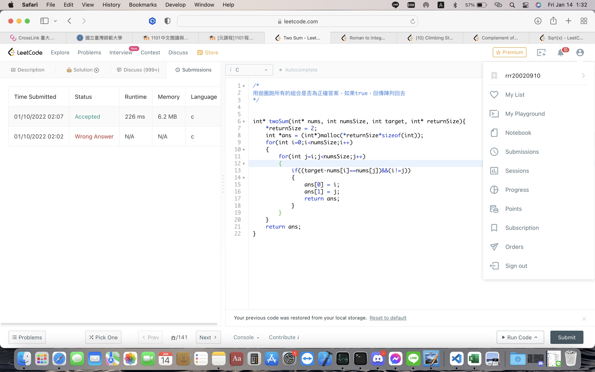
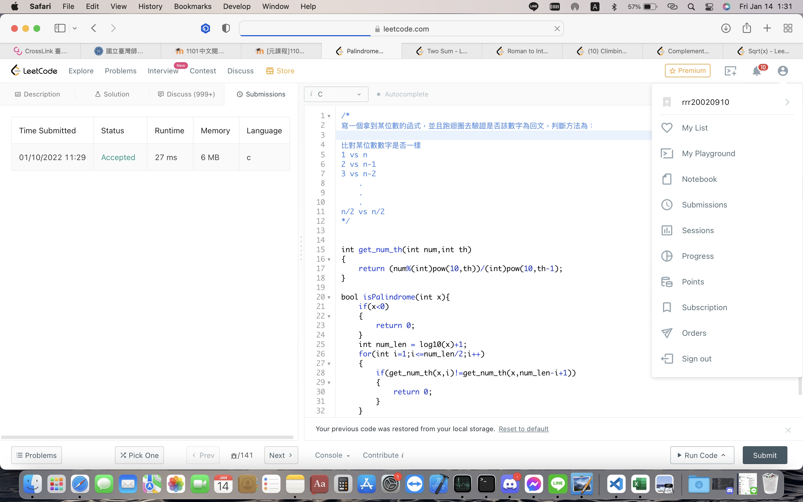
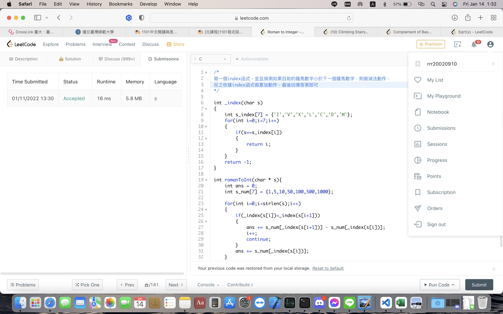
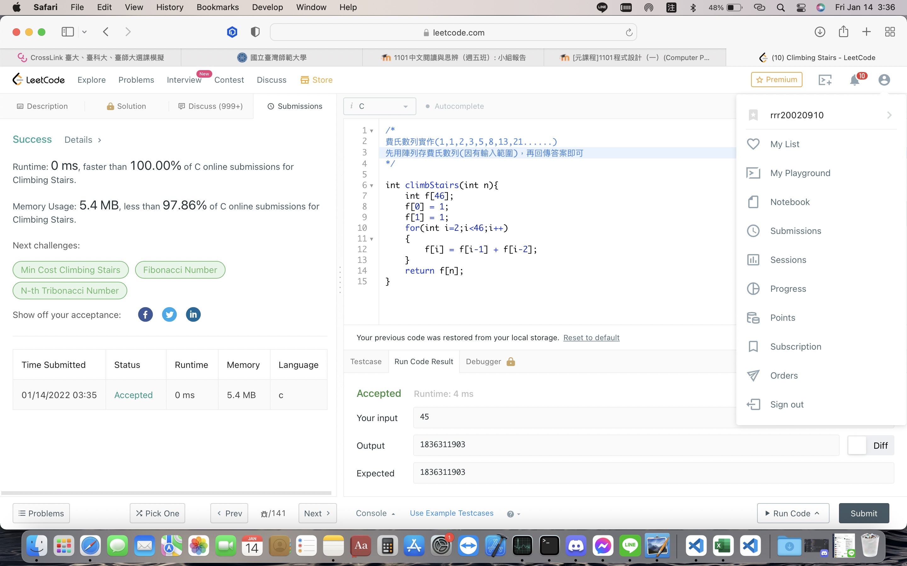
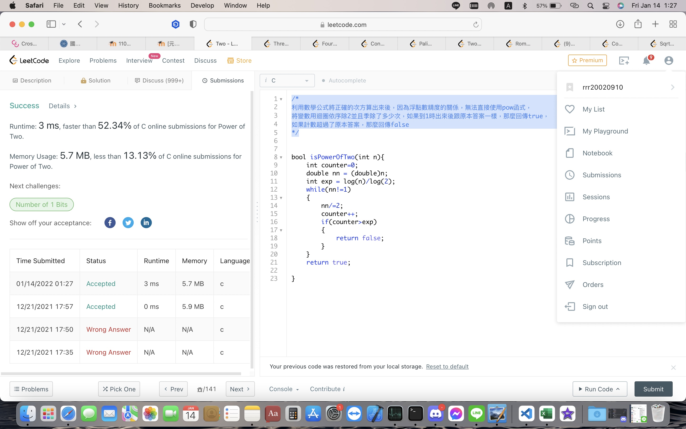
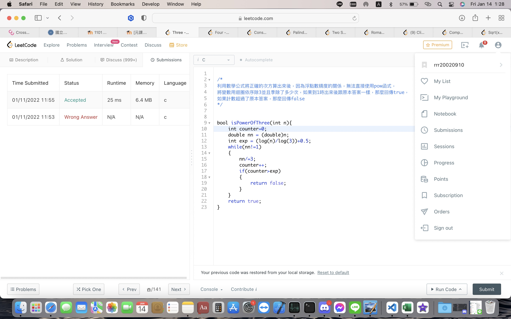
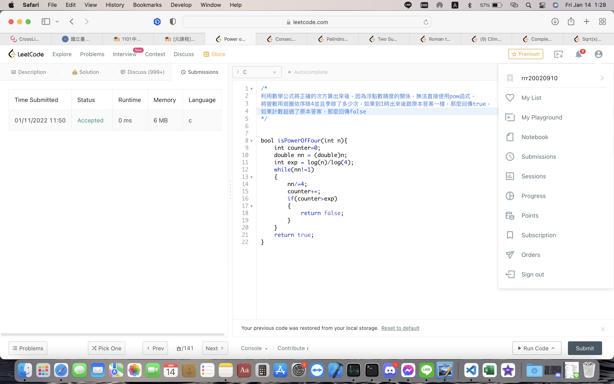
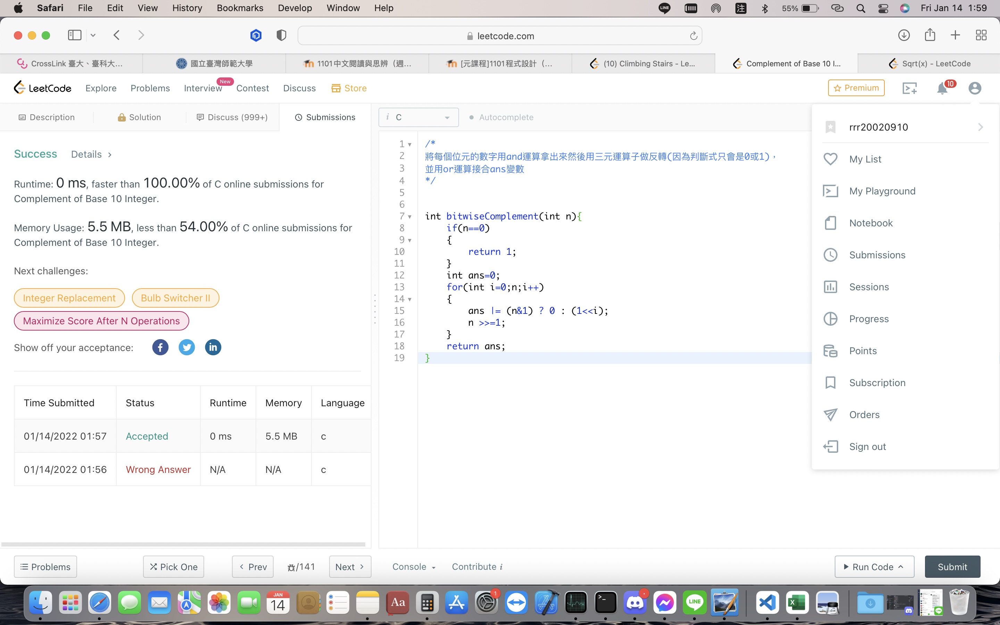
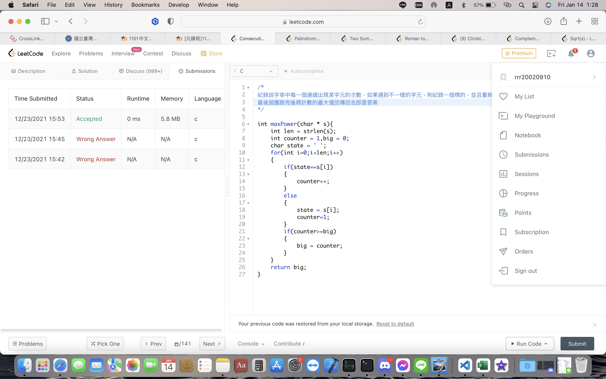

- Student ID: 41047035S     
- Student Name: 林昕鋭
- Teacher Name: 紀博文
- Finish Date: 2022/01/14
> 程式碼、LeetCode證明、詳細說明都在截圖裡

## 1. Two Sum

## 9. Palindrome Number

## 13. Roman to Integer

## 69. Sqrt(x)
.jpg)

## 70. Climbing Stairs

## 231. Power of Two

## 326. Power of Three

## 342. Power of Four

## 1009. Complement of Base 10 Integer

## 1446. Consecutive Characters
