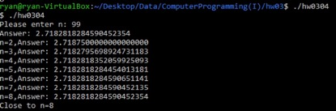

## hw0304

> Q: Describe that how to find n-value to verify the closest e constant

> A: Run loop until n-value is calculated in program which is closest e constant.
Then, when n-value is 8,the answer is closest e constant.



```
Student ID: 41047035S
Student Name: 林昕鋭
Teacher Name: 紀博文
Finish Date: 2021/11/15
```