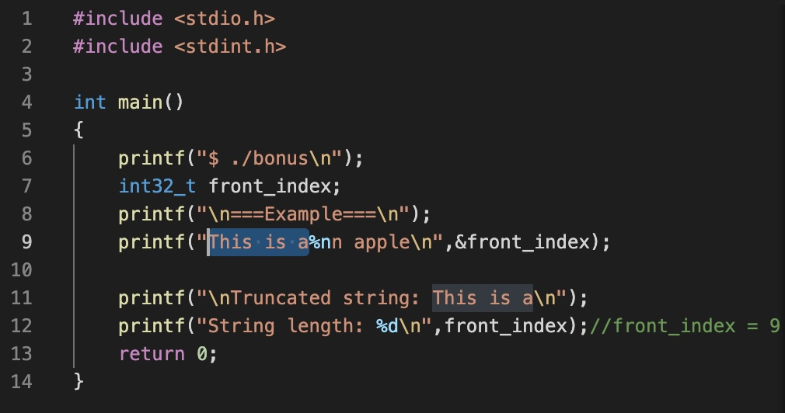
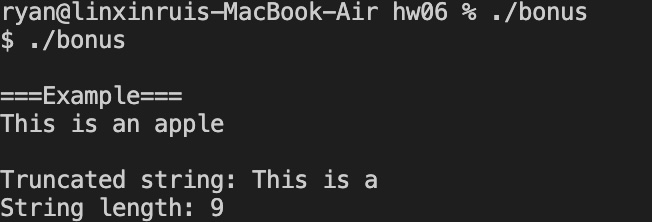

## bonus

> Q:What is "%n" meaning in printf-func of C?

> A:Retrieve the string before the %n position, the length of the string will be stored in the variable that you declared. Example code is bonus.c,and execute file is bonus

#### Code


### Result


```
Student ID: 41047035S
Student Name: 林昕鋭
Teacher Name: 紀博文
Finish Date: 2022/01/04
```