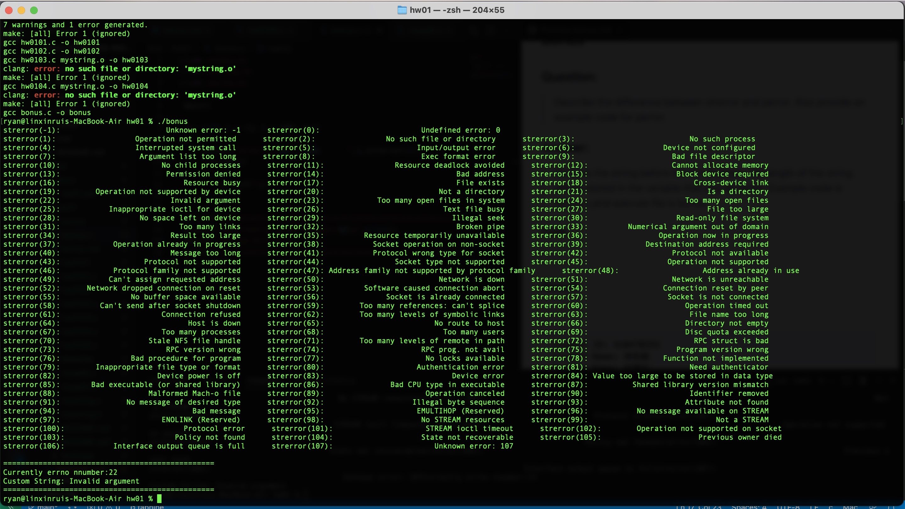

> **Student ID: 41047035S**  
> **Student Name: 林昕鋭**  
> **Teacher Name: 紀博文**  
> **Finish Date: 2022/03/08**

## bonus
### Question:  
> Describe the difference between strerror and perror. Also provide an example code for perror.
### Answer:  
> The "strerror()" function, give in a parameter as errno  number (int type), then it will return the string that mapped to corresponding errno number.

> The "perror()" function give in a parameter as custom string, then it will print format of string below:  
[parameter]: [string that mapped to corresponding errno number]

### Code:
```
#include <stdio.h>
#include <string.h>
#include <errno.h>

int main()
{
    for (int i = -1; i < 108; i++)
    {
        printf("strerror(%d): %40s      ",i,strerror(i));
        if(!(i%3))
        {
            printf("\n");
        }
    }
    printf("\n\n================================================");
    printf("\nCurrently errno nnumber:%d\n",errno);
    perror("Custom String");
    printf("================================================\n");
    return 0;
}
```

### Result:
