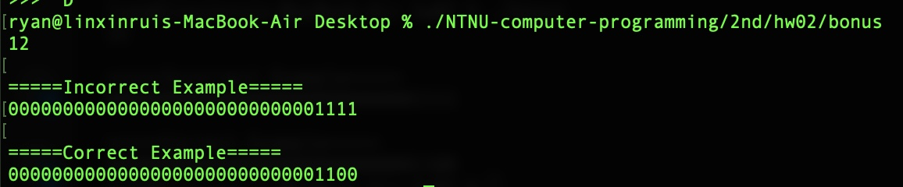

> **Student ID: 41047035S**  
> **Student Name: 林昕鋭**  
> **Teacher Name: 紀博文**  
> **Finish Date: 2022/03/18**

## bonus
### Question:  
> This code has some problem. 
```c
#include <stdio.h> 
#include <stdint.h>

int main() 
{
    int32_t number = 0; 
    scanf( "%d", & number );
    int32_t bit = 1; 
    bit = bit << 31;
    for( int i = 0 ; i < 32 ; i++ ) 
    {
        if( bit & number )
            printf( "1" ); 
        else
            printf( "0" ); 
        bit = bit >> 1;
    }
    return 0;
}
```
> Please explain the reason of the problem of this code and show how to fix it. 

### Answer:  
> ``` int32_t bit = 1;``` change to ``` uint32_t bit = 1;```  
Because scope postive number of of int32_t in hex-formate is   
0x00000000 ~ 0x7fffffff  
However, 1<<31(0x80000000) is the minimum negative number of int32_t.   
So the program would be get problem.

> And scope postive number of of uint32_t in hex-formate is   
0x00000000 ~ 0xffffffff  
As you see, (1<<31)0x80000000 is in scope postive number of of uint32_t.

> **So the answer is to replace int32_t with uint32_t**
### Code:
```c
#include <stdio.h> 
#include <stdint.h>

void Incorrect_print_binary(int32_t number)
{
    printf("\n=====Incorrect Example=====\n");
    int32_t bit = 1;
    bit = bit << 31;
    for( int i = 0 ; i < 32 ; i++ ) 
    {
        if( bit & number )
            printf( "1" ); 
        else
            printf( "0" ); 
        bit = bit >> 1;
    }
    printf("\n");
}

void correct_print_binary(int32_t number)
{
    printf("\n=====Correct Example=====\n");
    uint32_t bit = 1;
    bit = bit << 31;
    for( int i = 0 ; i < 32 ; i++ ) 
    {
        if( bit & number )
            printf( "1" ); 
        else
            printf( "0" ); 
        bit = bit >> 1;
    }
    printf("\n");
}

int main() 
{
    int32_t number = 0; 
    scanf( "%d", & number );
    Incorrect_print_binary(number);
    correct_print_binary(number);
    return 0;
}
```

### Result:
