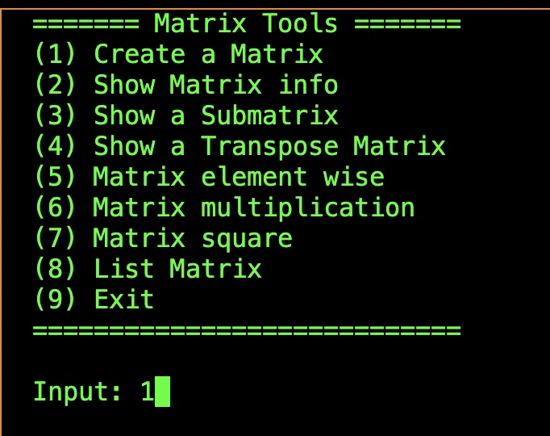
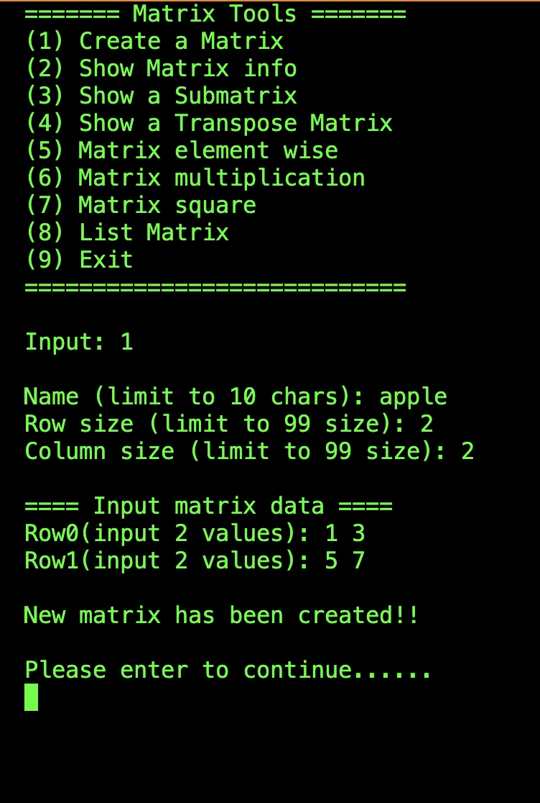
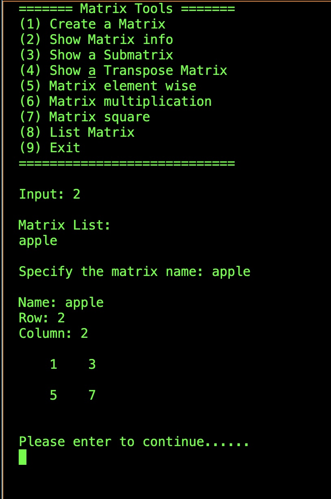

> **Student ID: 41047035S**  
> **Student Name: 林昕鋭**  
> **Teacher Name: 柯佳伶**  
> **Finish Date: 2022/10/16**

# Matrix Tools

To build it, please run:
```
make
```

To run the program after building:
```
./main
```

## How to use it?

### The Starting menu


There are nine options you can choose. Please input a number to operate.

### Create a Matrix



By input name, row, column and value to create a matrix.

### Show Matrix information


By specify the matrix of name that you create, it will show all info. And enter to continue operating.

> note: All of the input value be a int type, and the output is so on. 

## Procedure info

> All of the functions define in matrix.h file

```c
// Show main menu
int32_t main_menu();

// Specify matrix menu
int32_t choose_matrix_menu(Matrix **m_list,int32_t list_length);

// Show list of matrix
void list_matrix(Matrix **m_list,int32_t list_length);

// Create a matrix by given name, row, column and value
Matrix *init(Matrix *m);

// Show matrix info
void info(Matrix *m);

// Get a submatrix
Matrix *submatrix(Matrix *m,int32_t row,int32_t col);

// Get a transpose matrix
Matrix *transpose(Matrix *m);

// Get a element wise matrix
Matrix *element_wise(Matrix *m1,Matrix *m2);

// Get a multiplication matrix
Matrix *multiplication(Matrix *m1,Matrix *m2);

// Get a square matrix
Matrix *square(Matrix *m,int32_t exp);
```