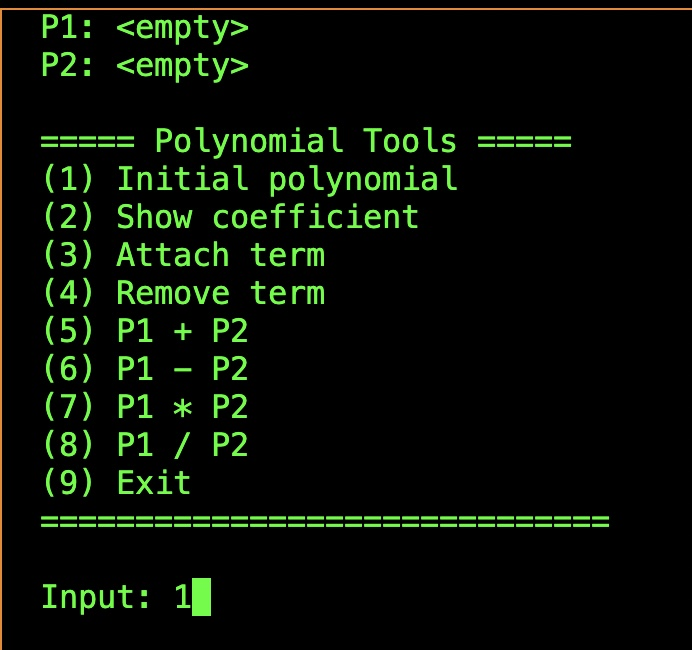
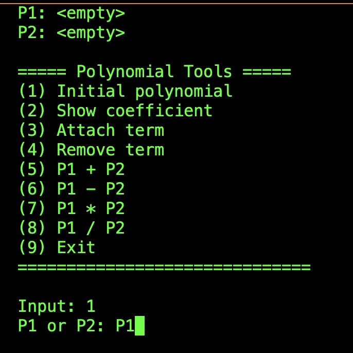
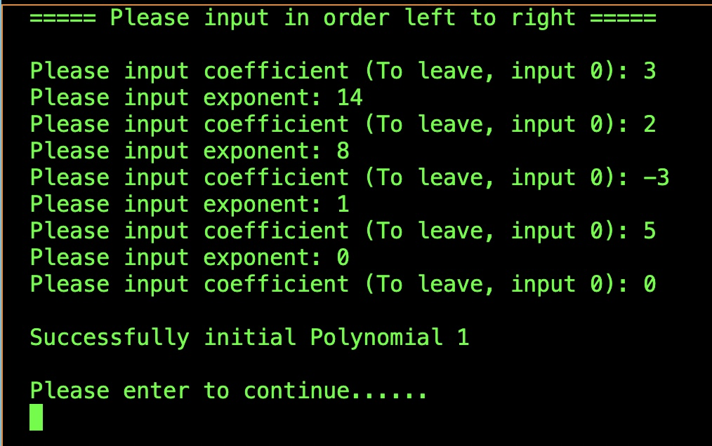
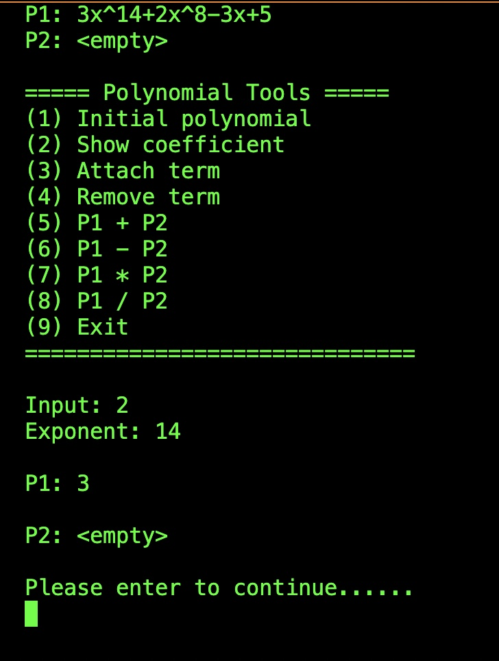
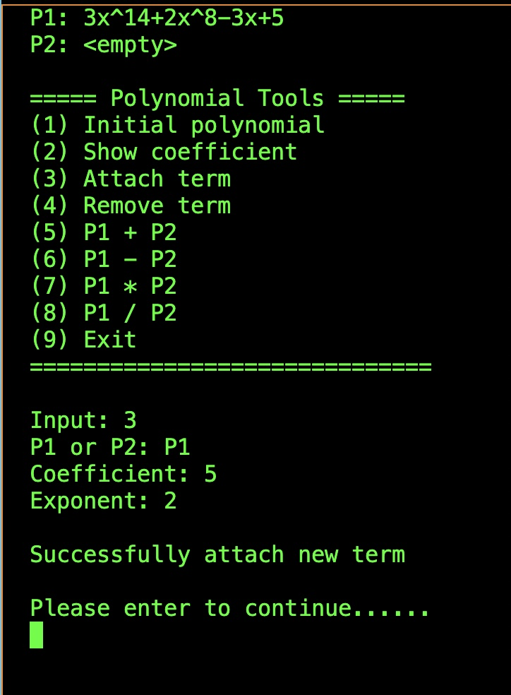
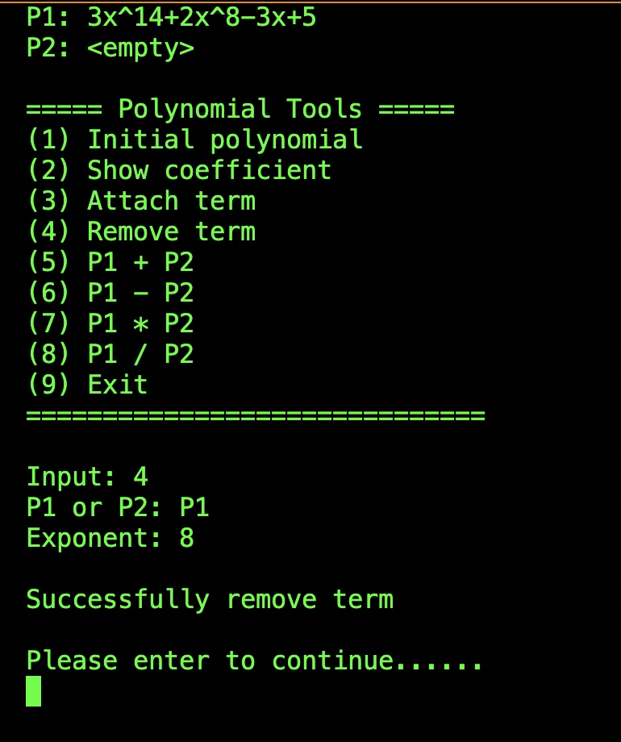
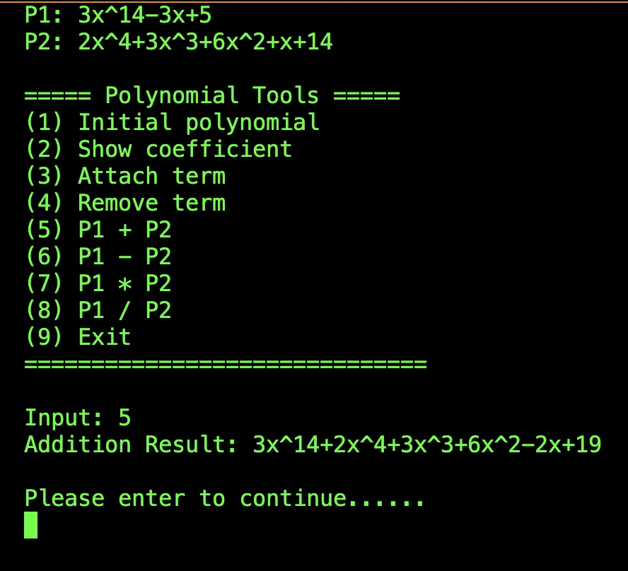

> **Student ID: 41047035S**  
> **Student Name: 林昕鋭**  
> **Teacher Name: 柯佳伶**  
> **Finish Date: 2022/10/30**

# Polynominal Tools

To build it, please run:
```
make
```

To run the program after building:
```
./main
```

## How to use it?

### The Starting menu


There are nine options you can choose. Please inp`ut a number to operate. All of them just conclude P1 and P2 two polynomials. It shows "\<enpty\>" above interface before initaling.

### Initial polynomial



Choose "P1" or "P2" that you want to initial, 



Then input coefficent and exponent. Term must be order by left to right while inputing. If finish or leave, input 0 to exit.

### Show coefficient


Input specify exponent, it will show coefficent.

### Attach term


Choose P1 or P2. Then input coefficient and exponent to attach new term.

### Remove term



Choose P1 or P2. Then input exponent to remove term.

### Polynomial operate



Choose the operate that you want, it will show the result.


> note: All of the input value be a int type, and the output is so on. 

## Procedure info

> All of the functions define in matrix.h file

```c
// Polynomial struct with circular linked list
typedef struct _sPolynomial Polynomial;
struct _sPolynomial
{
    int32_t coef;
    int32_t exp;
    Polynomial *link;
};

// Show main menu
int32_t menu();

// Create a polynomial by given coefficent and exponent
Polynomial* init(Polynomial *p);

// Show polynomial info, it can add prefix string to performance. 
// O(n)
void info(Polynomial *p,char* prefix_str);

// Retrun coefficent
// O(n)
int32_t get_coef(Polynomial *p,int32_t exp); 

// Return the polynomial after attaching new term
// O(n)
Polynomial *attach_term(Polynomial *p,int32_t coef,int32_t exp);

// Return the polynomial after removing term.
// O(n)
Polynomial *remove_term(Polynomial *p,int32_t exp);

// Return addtion result
// O(n+m)
Polynomial *add(Polynomial *p1,Polynomial *p2);

// Return subtraction result
// O(n)
Polynomial *sub(Polynomial *p1,Polynomial *p2);

// Return multiplication result
// O(n*m)
Polynomial *multiply(Polynomial *p1,Polynomial *p2);

// Return division result
Polynomial *divide(Polynomial *p1,Polynomial *p2);
