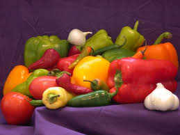
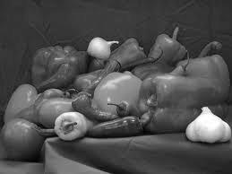
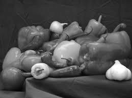
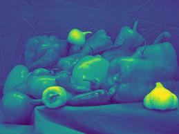

  
  
  


# Homework 1 (Due: 3/7)
1. Input a color image C(R,G,B).
2. Output the color image C.
3. Transform the color image C into a grayscale image I by I = (R+G+B) / 3.
4. Show the grayscale image I.

## Method

### Input
1. Sample Image

    

### Output

1. RGB Image
    
    

2. Grayscale Image
    
    

3. Grayscale Image by Matlab method
    
    


4. Grayscale without cmap Image
    
    

## Source Code

```python3
import numpy as np
import matplotlib.pyplot as plt

# Configure the image filepath
IMAGE_DIR = "./assets/"
SAMPLE_IMAGE = f"{IMAGE_DIR}sample.jpg"
RGB_IMAGE = f"{IMAGE_DIR}rgb.jpg"
GRAY_IMAGE = f"{IMAGE_DIR}gray.jpg"
MATLAB_GRAY_IMAGE = f"{IMAGE_DIR}matlab_gray.jpg"
GRAY_WITHOUTCMAP_IMAGE = f"{IMAGE_DIR}gray_without_cmap.jpg"

# Read the original RGB image
rgb_img = plt.imread(SAMPLE_IMAGE)

# Convert the RGB image to grayscale
gray_img = np.dot(rgb_img[..., :3], [0.3, 0.3, 0.3])

# Convert the RGB image to grayscale by Matlab method
matlab_gray_img = np.dot(rgb_img[..., :3], [0.2989, 0.5870, 0.1140])

# Save image
plt.imsave(RGB_IMAGE, rgb_img)

# Save image with cmap
plt.imsave(GRAY_IMAGE, gray_img, cmap="gray")

# Save image with cmap
plt.imsave(MATLAB_GRAY_IMAGE, matlab_gray_img, cmap="gray")

# Save image without cmap
plt.imsave(GRAY_WITHOUTCMAP_IMAGE, gray_img)
```

## Comment
我使用matplotlib來做簡單的read與write圖片，在處理方面用numpy做RGB2Grayscale，上網查了一下發現做
$$ Y = R * 0.2989 + G * 0.5870 + B * 0.1140 $$ 
計算權重是基於加權平均的方式，matlab轉化灰階就是按照以上處理的方式，還有其他方式也有像是我發現改變coeffcient的話會讓圖片稍微變化，並且如果沒設定cmap的話圖片會變得很酷。
