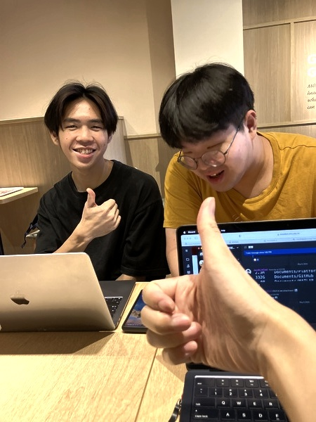

# Homework 10 (Due: 5/23)
   
  

## Assignment Statement

</img>

## Method

### Input
1. RGB Sample Image

    </img>


### Output
1. Output R'G'B' color image

    </img>

## Source Code
```python3
import numpy as np
import cv2

# Paths for the image files
SAMPLE_IMG = "./assets/input/sample.jpg"
OUTPUT_IMG = "./assets/output/output.jpg"

def rgb_to_hsi(image):
    # Normalize the RGB values to the range 0-1
    image = image.astype('float32') / 255.0
    R, G, B = cv2.split(image)  # Split the image into R, G, and B components
    H = np.zeros_like(R)  # Initialize H (Hue) channel
    S = np.zeros_like(R)  # Initialize S (Saturation) channel
    I = (R + G + B) / 3.0  # Calculate I (Intensity) channel
    
    num = 0.5 * ((R - G) + (R - B))
    den = np.sqrt((R - G)**2 + (R - B) * (G - B))
    theta = np.arccos(num / (den + 1e-6))  # Calculate theta for Hue calculation
    
    # Calculate H based on the condition of B > G
    H[B > G] = 2 * np.pi - theta[B > G]
    H[G >= B] = theta[G >= B]
    H = H / (2 * np.pi)  # Normalize H to the range 0-1
    
    min_RGB = np.minimum(np.minimum(R, G), B)
    S[I != 0] = 1 - 3 * min_RGB[I != 0] / (R[I != 0] + G[I != 0] + B[I != 0])  # Calculate Saturation
    
    return H, S, I

def hsi_to_rgb(H, S, I):
    R = np.zeros_like(H)  # Initialize R channel
    G = np.zeros_like(H)  # Initialize G channel
    B = np.zeros_like(H)  # Initialize B channel
    
    H = H * 2 * np.pi  # Convert H from 0-1 range to 0-2π range
    for i in range(H.shape[0]):
        for j in range(H.shape[1]):
            h = H[i, j]
            s = S[i, j]
            in_ = I[i, j]
            if h < 2 * np.pi / 3:
                B[i, j] = in_ * (1 - s)
                R[i, j] = in_ * (1 + s * np.cos(h) / np.cos(np.pi / 3 - h))
                G[i, j] = 3 * in_ - (R[i, j] + B[i, j])
            elif h < 4 * np.pi / 3:
                h = h - 2 * np.pi / 3
                R[i, j] = in_ * (1 - s)
                G[i, j] = in_ * (1 + s * np.cos(h) / np.cos(np.pi / 3 - h))
                B[i, j] = 3 * in_ - (R[i, j] + G[i, j])
            else:
                h = h - 4 * np.pi / 3
                G[i, j] = in_ * (1 - s)
                B[i, j] = in_ * (1 + s * np.cos(h) / np.cos(np.pi / 3 - h))
                R[i, j] = 3 * in_ - (G[i, j] + B[i, j])
    
    # Scale the R, G, B values back to the range 0-255 and convert to uint8
    R = np.clip(R * 255.0, 0, 255).astype('uint8')
    G = np.clip(G * 255.0, 0, 255).astype('uint8')
    B = np.clip(B * 255.0, 0, 255).astype('uint8')
    
    return cv2.merge([R, G, B])

def histogram_equalization(image):
    hist, bins = np.histogram(image.flatten(), 256, [0, 256])  # Compute the histogram
    cdf = hist.cumsum()  # Compute the cumulative distribution function (CDF)
    cdf_normalized = cdf * hist.max() / cdf.max()  # Normalize the CDF
    
    cdf_m = np.ma.masked_equal(cdf, 0)  # Mask the CDF where it is zero
    cdf_m = (cdf_m - cdf_m.min()) * 255 / (cdf_m.max() - cdf_m.min())  # Equalize the histogram
    cdf = np.ma.filled(cdf_m, 0).astype('uint8')  # Fill the masked values with 0
    
    return cdf[image]

def main():
    # Load the image
    image = cv2.imread(SAMPLE_IMG)

    # Convert RGB to HSI
    H, S, I = rgb_to_hsi(image)

    # Apply histogram equalization to the intensity component
    I_eq = histogram_equalization((I * 255).astype('uint8'))

    # Convert HSI back to RGB
    output_image = hsi_to_rgb(H, S, I_eq / 255.0)

    # Save the output image
    cv2.imwrite(OUTPUT_IMG, output_image)

if __name__ == '__main__':
    main()
```

## Comment
在這次的影像處理作業中，我學會了如何將 RGB 圖像轉換為 HSI 色彩空間，並對強度成分進行直方圖均衡化以提升影像對比度，在過程中，首先需要將 RGB 值正規化至 0 到 1 的範圍，然後進行色彩空間的轉換，對強度成分應用直方圖均衡化後，再轉換回RGB色彩空間，通過這次作業，我更了解了色彩空間轉換的原理以及直方圖均衡化對影像對比度提升的效果，此外使用OpenCV 庫使得這些操作更加方便快捷，這次作業不僅強化了我對影像處理理論的理解，也提升了我實作的能力。