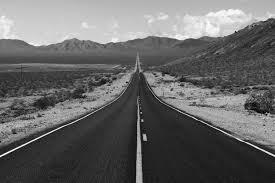

# Homework 2 (Due: 3/14)
  
  


## Assignment Statement

</img>
</img>

## Method

### Input
1. Grayscale Image I

    

### Output

(A)
1. Image I

    

2. Image I'

    

(B)
1. Image I'

    

## Source Code

```python3
import numpy as np
from PIL import Image

# Configure the image filepath
SAMPLE_img = "./assets/input/I.jpg"
GRAYSCALE_I = "./assets/output/I.jpg"
A_GRAYSCALE_I2 = "./assets/output/A-I2.jpg"
B_GRAYSCALE_I2 = "./assets/output/B-I2.jpg"


# Inital input sample image and get its height, width
sample_img = np.array(Image.open(SAMPLE_img))[..., 0]
sample_img_h, sample_img_w = sample_img.shape[:2]

def QuestionA():
    # Configure dithering matrix
    d_table = np.array([
        [0, 128, 32, 160],
        [192, 64, 224, 96],
        [48, 176, 16, 144],
        [240, 112, 208, 80]
    ])
    d_table_h, d_table_w = d_table.shape

    # Inital the blank matrix
    sample_img_blank = np.zeros(
        ((divmod(sample_img_h, d_table_h)[0]+1) * d_table_h, (divmod(sample_img_w, d_table_w)[0]+1) * d_table_w),
        dtype="uint8"
    )

    # Halftoning process
    sample_img_blank[:sample_img_h, :sample_img_w] = sample_img.copy()
    d_table_img = np.tile(d_table, (sample_img_blank.shape[0]//d_table_h, sample_img_blank.shape[1]//d_table_w))

    # Threshold process
    I2_img = (sample_img_blank >= d_table_img)[:sample_img_h, :sample_img_w]

    # Save image by numpy and PIL
    I_img = Image.fromarray(sample_img)
    I2_img = Image.fromarray(I2_img)
    I_img.save(GRAYSCALE_I)
    I2_img.save(A_GRAYSCALE_I2)

def QuestionB():
    # Configure dithering matrix
    d_table = np.array([
        [0, 56],
        [84, 28]
    ])
    d_table_h, d_table_w = d_table.shape

    # Inital the blank matrix
    sample_img_blank = np.zeros(
        ((divmod(sample_img_h, d_table_h)[0]+1) * d_table_h, (divmod(sample_img_w, d_table_w)[0]+1) * d_table_w),
        dtype="uint8"
    )
    
    # Halftoning process and Configure Q matrix
    sample_img_blank[:sample_img_h, :sample_img_w] = sample_img.copy()
    q_table_img = sample_img_blank / 85
    d_table_img = np.tile(d_table, (sample_img_blank.shape[0]//d_table_h, sample_img_blank.shape[1]//d_table_w))

    # Threshold process
    I2_img = (q_table_img + (sample_img_blank - 85 * q_table_img >= d_table_img))[:sample_img_h, :sample_img_w]

    # Scale to 0 ~ 255
    I2_img = (I2_img * 255).astype(np.uint8)

    # Save image by numpy and PIL
    I2_img = Image.fromarray(I2_img)
    I2_img.save(B_GRAYSCALE_I2)


if __name__ == "__main__":
    QuestionA()
    QuestionB()
```

## Comment
這次作業比起上次花了比較多的時間來寫，在讀入圖片我這次改用pillow module來實作，因為在最後輸出圖片時我是以np.array輸出圖片，查到用pillow的Image.fromArray method可以輸出正確的圖片，另外這次學習了dithering與Halftoning的處理方式呈現了不同的圖片效果，並學會如何調整閾值和矩陣，以獲得不同的視覺效果。