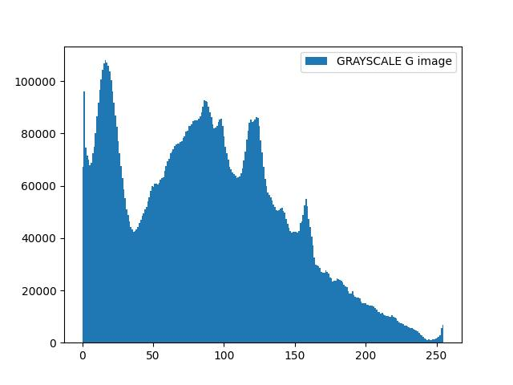

# Homework 3 (Due: 3/21)
  
  


## Assignment Statement

</img>

## Method

### Input
1. Color Image C
    
    </img>

### Output

1. Convert it into a gray image G 
    - Gray image G   
    </img>
    - Plot  
    </img>


2. Apply HE to G to get G’
    - HE image G’  
    </img>
    
    - Plot  
    </img>

3. For each pixel of C, modify its color (r,g,b)   
by (r’,g’,b’) = (r,g,b) XG’ / G
    - Using OpenCV  
    </img>

    - Caculate directly  
    </img>

## Source Code
```python3
import cv2
import numpy as np
import matplotlib.pyplot as plt

# Configure the image filepath
SAMPLE_img = "./assets/input/C.jpg"
GRAYSCALE_G = "./assets/output/G.jpg"
GRAYSCALE_G_PLOT = "./assets/output/G-plot.jpg"
HE_G2 = "./assets/output/G2.jpg"
HE_G2_PLOT = "./assets/output/G2-plot.jpg"
OUTPUT_C1 = "./assets/output/C1.jpg"
OUTPUT_C2 = "./assets/output/C2.jpg"

def modify(img, g2_img, g_img, is_type2=False):
    b, g, r = cv2.split(img)

    if is_type2:
        # Equation to modify color intensity
        r_adjusted = r * (g2_img / g_img)
        g_adjusted = g * (g2_img / g_img)
        b_adjusted = b * (g2_img / g_img)
    else:
        # Using OpenCV's functions for element-wise multiplication and division
        r_adjusted = cv2.multiply(r, cv2.divide(g2_img, g_img))
        g_adjusted = cv2.multiply(g, cv2.divide(g2_img, g_img))
        b_adjusted = cv2.multiply(b, cv2.divide(g2_img, g_img))

    # Merge the adjusted color channels to form the modified image
    modify_img = cv2.merge([b_adjusted, g_adjusted, r_adjusted])
    return modify_img

def histogram_equalization(img):
    # Calculate the histogram and cumulative distribution function (CDF)
    histogram, bins = np.histogram(img.flatten(), 256, [0, 255])
    cdf = histogram.cumsum()
    cdf_normalized = cdf / cdf[-1]

    # Apply histogram equalization
    return (cdf_normalized[img] * 255).astype(np.uint8)

def main():
    
    # Read sample RGB image
    img = cv2.imread(SAMPLE_img)

    # Grayscale processing
    gray_img = cv2.cvtColor(img, cv2.COLOR_BGR2GRAY)
    cv2.imwrite(GRAYSCALE_G, gray_img)

    # Plot and save histogram for grayscale image
    plt.hist(gray_img.ravel(), 256, [0, 255], label="GRAYSCALE G image")plt.hist(gray_img.ravel(), 256, [0, 255], label="GRAYSCALE G image")plt.hist(gray_img.ravel(), 256, [0, 255], label="GRAYSCALE G image")plt.hist(gray_img.ravel(), 256, [0, 255], label="GRAYSCALE G image")
    plt.legend()
    plt.savefig(GRAYSCALE_G_PLOT)
    plt.clf()

    # Histogram equalization processing
    equalize_img = histogram_equalization(gray_img)
    cv2.imwrite(HE_G2, equalize_img)

    # Plot and save histogram for histogram equalized image
    plt.hist(equalize_img.ravel(), 256, [0, 255], label="HE G' image")
    plt.legend()
    plt.savefig(HE_G2_PLOT)

    # Modify its color (r,g,b) by (r’,g’,b’) = (r,g,b) X G’ / G and save image
    modify1_img = modify(img, equalize_img, gray_img)
    modify2_img = modify(img, equalize_img, gray_img, is_type2=True)
    cv2.imwrite(OUTPUT_C1, modify1_img)
    cv2.imwrite(OUTPUT_C2, modify2_img)

if __name__ == "__main__":
    main()
```

## Comment
這次的作業花了較多的時間來實作，這次我改用opencv當作影像處理的主要module，因為opencv有比較多方便的api function可以call，在做Histogram Equalization處理時也知道了他是透過機率分佈函數的累積分布函數(CDF)，運用累積分布函數(CDF)對灰度值進行調整以實現對比度增強,把原始圖像的灰度直方圖從比較集中的某個灰度區間變成在全部灰度範圍內的均勻分佈，通過拉伸影像的像素強度分佈範圍來增強圖像對比度，適用於過曝或背光的圖片，那從範例輸出的plot圖可以看到圖片的數據分佈圖，之後將產生出來的 HE 圖片去針對原本rgb圖片做modify的公式計算，可以得到最後的範例輸出圖片，比原本的rgb輸入圖片還要亮了一些，比較酷的情況是，發現用numpy原生的乘除法與opencv的乘除法圖片相比，會稍微有些不一樣，查了一下發現跟數值型態有些關係，這次也學到了很多。