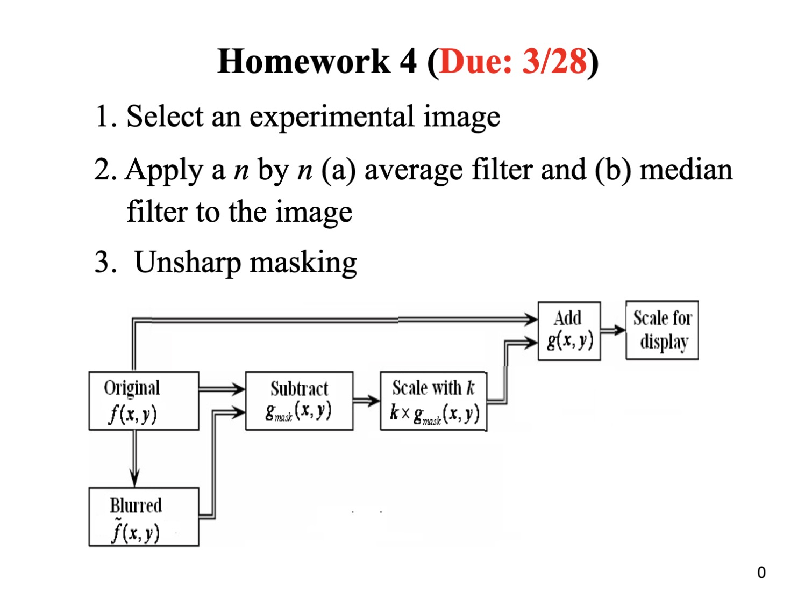
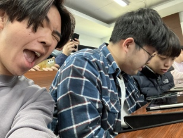
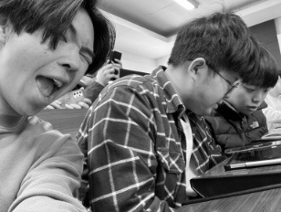
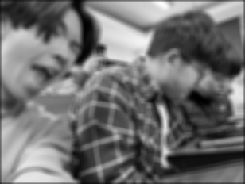
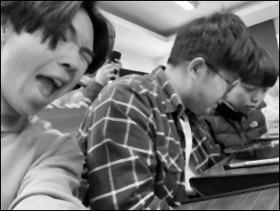
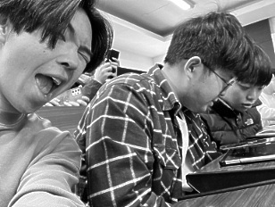

# Homework 4 (Due: 3/28)
  
  

## Assignment Statement

</img>

## Method

### Input
- Experimental Image
    
    </img>

### Output
- Grayscale

    </img>

- Apply by 7x7 average filter

    </img>

- Apply by median filter

    </img>

- Unsharp masking (blur_size=(5,5), k=1.5):

    </img>


## Source Code
```python3
import cv2
import numpy as np
import matplotlib.pyplot as plt

# Configure the image filepath
EXP_IMG = "./assets/input/experimental.jpg"
GRAY_IMG = "./assets/output/gray.jpg"
AVERAGE_IMG = "./assets/output/average.jpg"
MEDIAN_IMG = "./assets/output/median.jpg"
UNSHARP_IMG = "./assets/output/unsharp.jpg"

def average_filter(img, size):
    kernel = np.ones((size, size), np.float32) / (size**2)
    height, width = img.shape[:2]
    avg_filtered_img = np.zeros_like(img)
    
    # Padding the input image
    padding_size = size // 2
    padded_img = cv2.copyMakeBorder(img, padding_size, padding_size, padding_size, padding_size, cv2.BORDER_CONSTANT, value=0)
    
    # Applying the filter
    for i in range(padding_size, height + padding_size):
        for j in range(padding_size, width + padding_size):
            avg_filtered_img[i - padding_size, j - padding_size] = np.sum(padded_img[i-padding_size:i+padding_size+1, j-padding_size:j+padding_size+1] * kernel)
    
    return avg_filtered_img.astype(np.uint8)

def median_filter(img):
    height, width = img.shape[:2]
    median_filtered_img = np.zeros_like(img)
    
    # Iterate over each pixel in the image
    for i in range(1, height-1):
        for j in range(1, width-1):

            # Calculate the median value of the 3x3 neighborhood around the pixel
            median_filtered_img[i,j] = np.median(img[i-1:i+2, j-1:j+2])
    
    return median_filtered_img.astype(np.uint8)


def unsharp_masking(img, blur_size=(5,5), k=1.5):
    """
    Apply unsharp masking to a grayscale image.

    Parameters:
    - img: a grayscale image as a numpy array
    - blur_size: the size of the Gaussian kernel
    - sigmaX: Gaussian kernel standard deviation in X direction
    - k: the scaling factor for the unsharp mask

    Returns:
    - sharpened_image: the sharpened image as a numpy array
    """

    # Step 1: Blur the image
    blurred_image = cv2.GaussianBlur(img, blur_size, 0)

    # Step 2: Subtract the blurred image from the original to get the mask
    mask = cv2.subtract(img, blurred_image)

    # Step 3: Scale the mask
    scaled_mask = cv2.multiply(mask, np.array([k]))

    # Step 4: Add the scaled mask to the original image to sharpen it
    sharpened_image = cv2.add(img, scaled_mask)

    # Step 5: Scale the result for display (ensure pixel values are in 0-255)
    sharpened_image = np.clip(sharpened_image, 0, 255)

    return sharpened_image.astype(np.uint8)

def main():

    # Read experimental image
    img = cv2.imread(EXP_IMG)

    # Grayscale img
    img = cv2.cvtColor(img, cv2.COLOR_BGR2GRAY)
    cv2.imwrite(GRAY_IMG, img)
    
    # Apply average filter
    avg_filtered_img = average_filter(img, 7)
    cv2.imwrite(AVERAGE_IMG, avg_filtered_img)

    # Apply median filter
    median_filtered_img = median_filter(img)
    cv2.imwrite(MEDIAN_IMG, median_filtered_img)

    # Apply unsharp mask
    unsharp_masked_img = unsharp_masking(img)
    cv2.imwrite(UNSHARP_IMG, unsharp_masked_img)

if __name__ == "__main__":
    main()
```

## Comment
這次學習如何對影像進行filter處理和unsharp。透過使用average filter和median filter，可以有效地去除影像中的噪聲，使影像變得更加清晰。透過 average filter計算像素周圍鄰域的計算來平滑影像，而median filter則透過算圖片範圍像素的中位數。然後 unsharp masking 可以增強影像中的邊緣和細節。在這個過程中先對影像進行高斯模糊，然後計算原始影像與模糊影像之間的差異，得到一個 mask。最後將掩蔽影像與原始影像相加，剔除銳化後的影像。這次我學會瞭解使用opencv與numpy，包括 filter還有 unsharp masking 的一些應用。