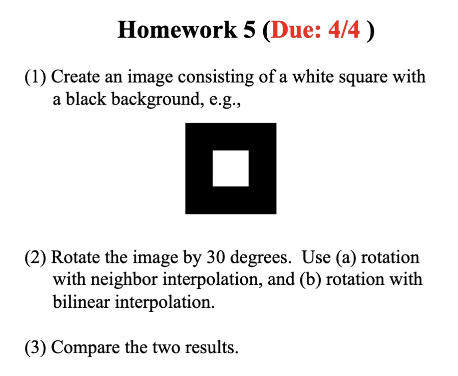
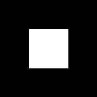
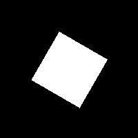

# Homework 5 (Due: 4/4)
   
  

## Assignment Statement

</img>

## Method

### Input
- Created image consisting of:
    - 80 x 80 size white square
    - 200 x 200 size black background
    
    </img>

### Output
- Rotate the image by 30 degrees

    </img>

    > size 200 x 200

-  Rotation with Neares Neighbor Interpolation
    
    </img>

    > 2 factors, size 400 x 400

- Rotation with Bilinear Interpolation

    </img>

    > 2 factors, size 400 x 400

## Source Code
```python3
import cv2
import numpy as np

# Paths for the image files
SAMPLE_CREATED_IMG = "./assets/input/sample.jpg"
ROTATE_IMG = "./assets/output/rotate.jpg"
NEIGHBOR_INTERPOLATION_IMG = "./assets/output/neighbor_interpolation.jpg"
BILINEAR_INTERPOLATION_IMG = "./assets/output/bilinear_interpolation.jpg"

def create_sample_image(inner_square_size, outer_square_size):
    """
    This function creates an image with a white square centered on a black background.
    :param inner_square_size: Size of the white square (foreground)
    :param outer_square_size: Size of the black square (background)
    :return: Image with black background and centered white square
    """

    # Create a black square
    img = np.zeros((outer_square_size, outer_square_size, 3), dtype=np.uint8)

    # Calculate the top-left corner of the white square to position it in the center
    start_point = (outer_square_size - inner_square_size) // 2

    # Draw the white square inside the black square
    cv2.rectangle(img, (start_point, start_point), (start_point + inner_square_size, start_point + inner_square_size), (255, 255, 255), -1)

    return img


def rotate(img, angle):
    """
    Rotate the image by a given angle without using cv2.getRotationMatrix2D or cv2.warpAffine.

    :param image: The input image to be rotated.
    :param angle: The rotation angle in degrees.
    :return: The rotated image.
    """
    # Convert the angle from degrees to radians
    theta = np.radians(angle)
    
    # Define the rotation matrix
    cos = np.cos(theta)
    sin = np.sin(theta)
    rotation_matrix = np.array([[cos, -sin], [sin, cos]])
    
    # Find the size of the rotate image
    height, width = img.shape[:2]

    # Create a rotate image filled with zeros (black)
    rotate_img = np.zeros((height, width, img.shape[2]), dtype=np.uint8)
    
    # Define the translation to keep the image centered
    tx = width // 2
    ty = height // 2

    # Iterate over every pixel in the rotate image
    for i in range(height):
        for j in range(width):

            # Find the original pixel coordinates
            x = cos * (j - tx) + sin * (i - ty) + tx
            y = -sin * (j - tx) + cos * (i - ty) + ty

            # Check if the original pixel coordinates are within the image boundaries

            if x >= 0 and x < width and y >= 0 and y < height:

                # Find the nearest neighbor
                x1 = int(x)
                y1 = int(y)

                # Set the pixel value to the original pixel value
                rotate_img[i, j] = img[y1, x1]

    return rotate_img

def nearest_neighbor_interpolation(img, scale):
    """
    Scales an image using nearest neighbor interpolation.
    :param img: The image to scale
    :return: Scaled image with nearest neighbor interpolation
    """
    # Get original dimensions and calculate new dimensions
    (h, w) = img.shape[:2]
    new_h = int(h * scale)
    new_w = int(w * scale)
    neighbor_img = np.zeros((new_h, new_w, 3), np.uint8)

    # Scale the image using nearest neighbor interpolation
    for i in range(new_h):
        for j in range(new_w):
            # Find the nearest neighbor
            x = int(i / scale)
            y = int(j / scale)
            neighbor_img[i, j] = img[x, y]

    return neighbor_img

def bilinear_interpolation(img, scale):
    """
    Scales an image using bilinear interpolation.
    :param img: The image to scale
    :return: Scaled image with bilinear interpolation
    """
    # Get original dimensions and calculate new dimensions
    (h, w) = img.shape[:2]
    new_h = int(h * scale)
    new_w = int(w * scale)
    bilinear_img = np.zeros((new_h, new_w, 3), np.uint8)

    # Scale the image using bilinear interpolation
    for i in range(new_h):
        for j in range(new_w):
            # Interpolate the pixel value
            x = i / scale
            y = j / scale
            x1 = int(x)
            y1 = int(y)
            x2 = x1 + 1
            y2 = y1 + 1

            # Clamp the coordinates to the image boundaries
            if x2 >= h:
                x2 = h - 1
            if y2 >= w:
                y2 = w - 1

            # Compute the interpolated value
            bilinear_img[i, j] = img[x1, y1] * (x2 - x) * (y2 - y) + img[x1, y2] * (x2 - x) * (y - y1) + img[x2, y1] * (x - x1) * (y2 - y) + img[x2, y2] * (x - x1) * (y - y1)

    return bilinear_img

def main():

    # Create an image consisting of a 
    # 80 x 80 white square with a 
    # 200 x 200 black background
    img = create_sample_image(80, 200)
    cv2.imwrite(SAMPLE_CREATED_IMG, img)

    # Rotate img by 30 degrees
    rotate_img = rotate(img, 30)
    cv2.imwrite(ROTATE_IMG, rotate_img)

    # Nearest neighbor interpolation by a factor of 2
    neighbor_img = nearest_neighbor_interpolation(rotate_img, 2)
    cv2.imwrite(NEIGHBOR_INTERPOLATION_IMG, neighbor_img)

    # Bilinear interpolation by a factor of 2
    bilinear_img = bilinear_interpolation(rotate_img, 2)
    cv2.imwrite(BILINEAR_INTERPOLATION_IMG, bilinear_img)

if __name__ == "__main__":
    main()
```

## Comment
這次功課學到了影像處理的基礎技術，主要是圖片旋轉和插值方法，通過自己手刻 rotation matrix 去做到圖片旋轉，學到了coodinate transformation 的概念，以及如何用 nearest neighbor和 bilinear interpolation 去做到影像的放大縮小，這次的作業讓我對影像處理有了更深的了解，也學到了一些基礎的影像處理技巧，這些技巧在未來應該會有機會用到，所以這次的作業對我來說是一個很好的學習機會。