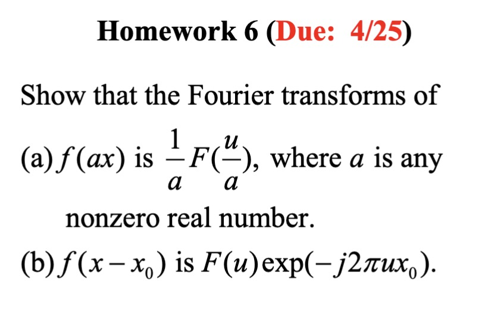

# Homework 6 (Due: 4/25)
   
  

## Assignment Statement

</img>

## Answer
#### (a)
證明如下:
$$\int_{-\infty}^{\infty} f(ax) \exp(-j 2 \pi ux) \, dx$$

$$\text{Let } y = ax, \, dy = a \, dx$$

$$=\int_{-\infty}^{\infty} f(y) \exp(-j 2 \pi uy / a) \frac{1}{a} \, dy$$

$$=\frac{1}{a} \int_{-\infty}^{\infty} f(y) \exp(-j 2 \pi \frac{u}{a} y) \, dy$$

$$=\frac{1}{a} F\left(\frac{u}{a}\right)$$

#### (a) bonus 

已知傅立葉變換的逆變換定義為:

$$f(x) = \int_{-\infty}^{+\infty} F(u)e^{j2\pi ux}\,du$$

將 $F(u)e^{-j2πux_0}$ 代入上述積分:

$$f(x) = \int_{-\infty}^{+\infty} F(u) e^{-j2\pi ux_0} e^{j2\pi ux}\,du$$

合併指數函數中的 $u$ 項:
$$f(x) = \int_{-\infty}^{+\infty} F(u) e^{j2\pi u(x-x_0)}\,du$$

因為 $F(u)$ 是 $f(x)$ 的傅立葉變換，因此得到 $f(x-x_0)$，並且為非零實數:

$$f(x) = f(x-x_0)$$

#### (b)
證明如下:

$$\int_{-\infty}^{\infty} f(x - x_0) e^{-j2\pi ux} \, dx$$

$$= e^{-j2\pi ux_0} \int_{-\infty}^{\infty} f(x - x_0) \cdot e^{-j2\pi u(x - x_0)} \, dx$$

$$\text{Let } y = x - x_0, \, dy = dx$$

$$= \frac{1}{2\pi} e^{-j2\pi ux_0} \int_{-\infty}^{\infty} f(y) e^{-j2\pi uy} \, dy$$

$$= \frac{1}{2\pi} e^{-j2\pi ux_0} F(u)$$

#### (b) bonus
已知傅立葉變換的逆變換定義為:

$$f(x) = \int_{-\infty}^{+\infty} F(u)e^{j2\pi ux}\,du$$

考慮函數 $f(ax)$:

$$f(ax) = \int_{-\infty}^{+\infty} F(u)e^{j2\pi u(ax)}\,du$$

進行變量替換，令 $v = u/a$，則 $du = adv$:

$$f(ax) = \int_{-\infty}^{+\infty} F(av)e^{j2\pi avx}\,a\,dv$$

提出常數 $a$:

$$f(ax) = \int_{-\infty}^{+\infty} aF(av)e^{j2\pi avx}\,dv$$

這裡 $aF(av)$ 可以視為 $f(ax)$ 的傅立葉變換:

$$\mathcal{F}\{f(ax)\} = aF(av)$$

因此得證:

$$f(ax) = \int_{-\infty}^{+\infty} \frac{1}{a}F\left(\frac{v}{a}\right)e^{j2\pi vx}\,dv$$