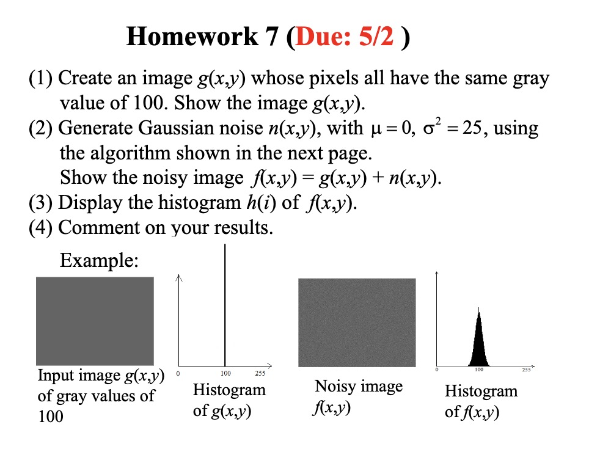
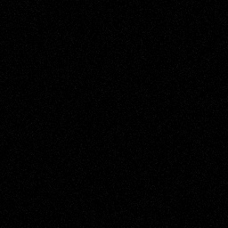
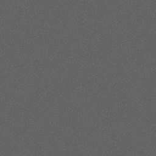
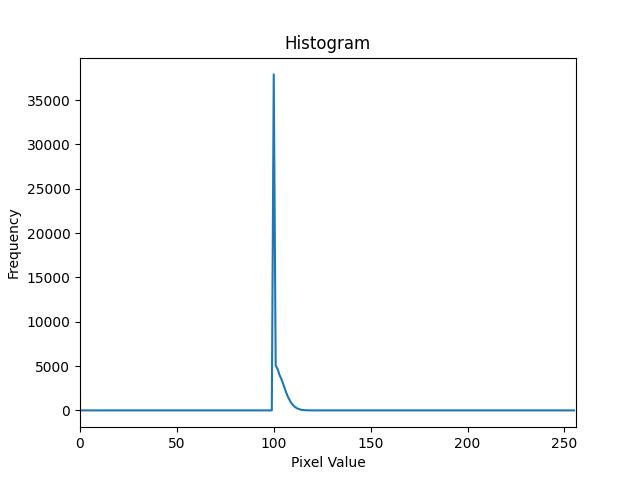

# Homework 7 (Due: 5/2)
   
  

## Assignment Statement

</img>

## Method

### Input
-  Create an image g(x,y):
    - whose pixels all have the same gray value of 100:
    
    </img>

### Output
- Noisy image n(x,y)

    </img>

- Noisy image f(x,y)
    
    </img>

- Histogram image h(i) of f(x,y).

    </img>

## Source Code
```python3
import cv2
import numpy as np
import matplotlib.pyplot as plt

# Paths for the image files
G_IMG = "./assets/input/g.jpg"
N_IMG = "./assets/output/n.jpg"
F_IMG = "./assets/output/f.jpg"
H_IMG = "./assets/output/h.jpg"

def create_gray_image(size: tuple, gray_value: int) -> np.array:
    """
    Create a gray image with specified size and gray value.

    Parameters:
    size (tuple): The dimensions of the image (height, width).
    gray_value (int): The gray value for all pixels in the image.

    Returns:
    np.array: The created gray image.
    """
    return np.full(size, gray_value, dtype=np.uint8)

def generate_gaussian_noise(image_size: tuple, mu: float, sigma_square: float) -> np.array:
    """
    Generate Gaussian noise with zero mean and a given standard deviation.

    Parameters:
    image_size (tuple): The size of the noise image (height, width).
    mu (float): The mean of the Gaussian distribution.
    sigma (float): The standard deviation of the Gaussian distribution.

    Returns:
    np.array: The generated Gaussian noise image.
    """
    height, width = image_size
    gaussian_noise = np.zeros((height, width), dtype=np.float32)
    sigma = np.sqrt(sigma_square)
    
    # Iterate over each pair of horizontally neighboring pixels
    for i in range(height):
        for j in range(0, width, 2):
            # Generate a pair of uniform random numbers
            r, phi = np.random.uniform(0, 1, 2)
            # Calculate z1 and z2 using the Box-Muller transform
            z1 = sigma * np.cos(2 * np.pi * phi) * np.sqrt(-2 * np.log(r))
            z2 = sigma * np.sin(2 * np.pi * phi) * np.sqrt(-2 * np.log(r))
            
            # Assign the generated values to the pixels
            gaussian_noise[i, j] = z1 + mu
            if j + 1 < width:
                gaussian_noise[i, j + 1] = z2 + mu
    
    # Clip the values to the gray-level range and round them
    gaussian_noise = np.clip(gaussian_noise, 0, 255)
    
    return gaussian_noise.astype(np.uint8)

def add_gaussian_noise(image: np.array, noise: np.array) -> np.array:
    """
    Add Gaussian noise to an image.

    Parameters:
    image (np.array): The original image to which noise will be added.
    noise (np.array): The Gaussian noise to add to the image.

    Returns:
    np.array: The noisy image.
    """
    # The original image and noise must be the same size
    assert image.shape == noise.shape
    
    # Add the noise to the original image
    noisy_image = image + noise
    
    # Clip the values to be in the range [0, 255] and convert to uint8
    noisy_image = np.clip(noisy_image, 0, 255).astype(np.uint8)
    
    return noisy_image

def plot_histogram(image: np.array, save_path: str) -> None:
    """
    Plot the histogram of an image.

    Parameters:
    image (np.array): The image to calculate the histogram for.
    title (str): The title of the histogram plot.

    Returns:
    np.array: The histogram data.
    """
    histogram, bins = np.histogram(image.flatten(), 256, [0, 256])
    
    plt.figure()
    plt.title("Histogram")
    plt.xlabel("Pixel Value")
    plt.ylabel("Frequency")
    plt.plot(histogram)  # plot the histogram
    plt.xlim([0, 256])  # set x-axis limits

    plt.savefig(save_path)   
    
def main():
    # Create a gray image with size (256, 256) and gray value 100
    g_img = create_gray_image(
        size=(256, 256),
        gray_value=100
    )
    cv2.imwrite(G_IMG, g_img)

    # Generate the Gaussian noise
    n_img = generate_gaussian_noise(
        image_size=(256, 256),
        mu=0,
        sigma_square=25
    )
    cv2.imwrite(N_IMG, n_img)

    # Add the Gaussian noise to the original gray image
    f_img = add_gaussian_noise(
        image=g_img,
        noise=n_img
    )
    cv2.imwrite(F_IMG, f_img)

    # Plot an save the histogram of f(x,y) image
    histogram = plot_histogram(f_img, H_IMG)

if __name__ == "__main__":
    main()
```

## Comment
這次作業做出了影像處理中生成特定灰階值影像、添加高斯噪聲、以及繪製直方圖的功能，透過 `create_gray_image` 函式能創造出一個全灰的影像，而 `generate_gaussian_noise` 則能在此基礎上添加以0為平均值的高斯噪聲，模擬真實世界中的隨機噪聲，`plot_histogram` 函式則能瞭解噪聲影像中像素值的分佈情況。這次不僅理解數字影像的組成，而且還實踐了影像噪聲處理的重要技巧，這對於後續的影像處理與分析非常重要，這次作業對於學習影像處理的基礎知識，尤其是對於學習圖像噪聲和直方圖的概念非常有用，對於深化理解影像處理的原理與應用有著不可或缺的作用。