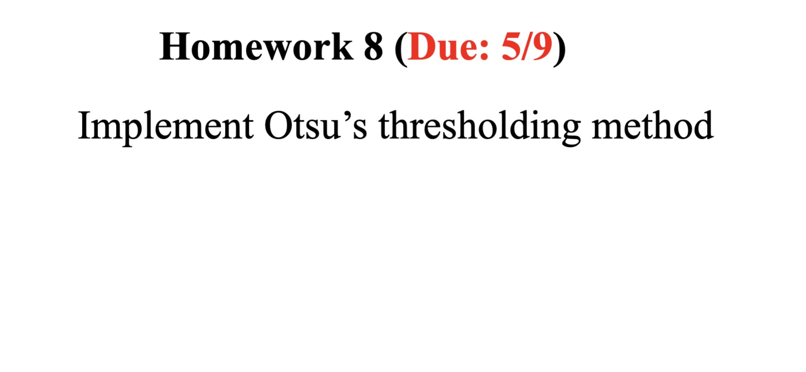
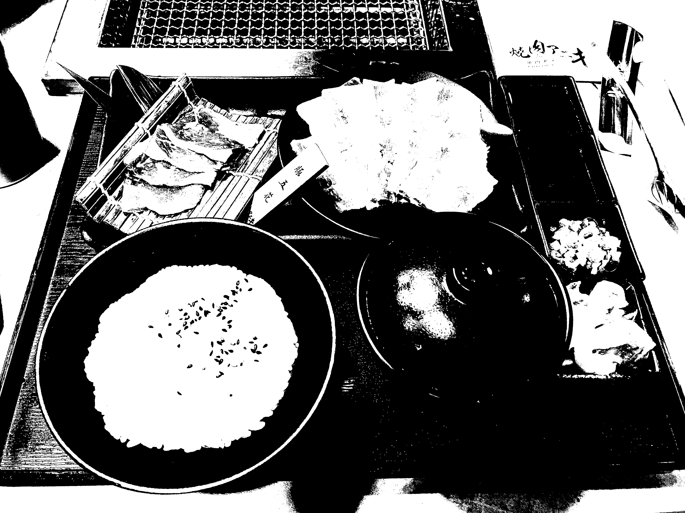

# Homework 8 (Due: 5/9)
   
  

## Assignment Statement

</img>

## Method

### Input
1. Sample Image

    </img>


### Output
1. Otsu Image
    
    </img>

## Source Code
```python3
import cv2
import numpy as np

# Paths for the image files
SAMPLE_IMG = "./assets/input/sample.jpg"
OTSU_IMG = "./assets/output/otsu.jpg"
    
def otsu(img: np.ndarray) -> np.ndarray:
    # Calculate the histogram of the image
    histogram, bin_edges = np.histogram(img, bins=256, range=(0, 256))
    
    # Calculate the total number of pixels and the sum of all pixel values
    total_pixels = img.size
    total_sum = np.sum(bin_edges[:-1] * histogram)
    
    # Initialize variables
    current_max_variance = 0
    threshold = 0
    weight_background = 0
    sum_background = 0
    
    for i in range(256):
        # Update the number and sum of pixels in the background (class C0)
        weight_background += histogram[i]
        if weight_background == 0:
            continue
        
        # Calculate the number and sum of pixels in the foreground (class C1)
        weight_foreground = total_pixels - weight_background
        if weight_foreground == 0:
            break
        
        sum_background += i * histogram[i]
        mean_background = sum_background / weight_background
        mean_foreground = (total_sum - sum_background) / weight_foreground
        
        # Calculate the between-class variance
        variance_between = weight_background * weight_foreground * (mean_background - mean_foreground) ** 2
        
        # Update the threshold if a new maximum variance is found
        if variance_between > current_max_variance:
            current_max_variance = variance_between
            threshold = i
    
    # Apply the threshold to create a binary image
    otsu_img = (img > threshold).astype(np.uint8) * 255
    return otsu_img


def main():
    # Load the image in grayscale
    sample_img = cv2.imread(SAMPLE_IMG, cv2.IMREAD_GRAYSCALE)

    # Apply the Otsu thresholding method
    otsu_img = otsu(sample_img)

    # Save the binary image
    cv2.imwrite(OTSU_IMG, otsu_img) 

if __name__ == "__main__":
    main()
```

## Comment
在這次的作業中，我從頭實作了 Otsu 的閾值方法，這是一種廣泛使用於影像處理領域的自動二值化技術，通過計算圖像的灰度直方圖並找到最大類間方差的閾值，我們能夠有效地將圖像分割成前景和背景。這種方法特別有用於需要自動化處理大量圖像的應用中，雖然整個過程涉及較多的計算，但結果證明，它能夠提供非常清晰和精確的分割效果，透過實際的程式碼實作，我加深了對 Otsu 方法的理解，並體驗到了理論知識轉化為實際應用的過程。