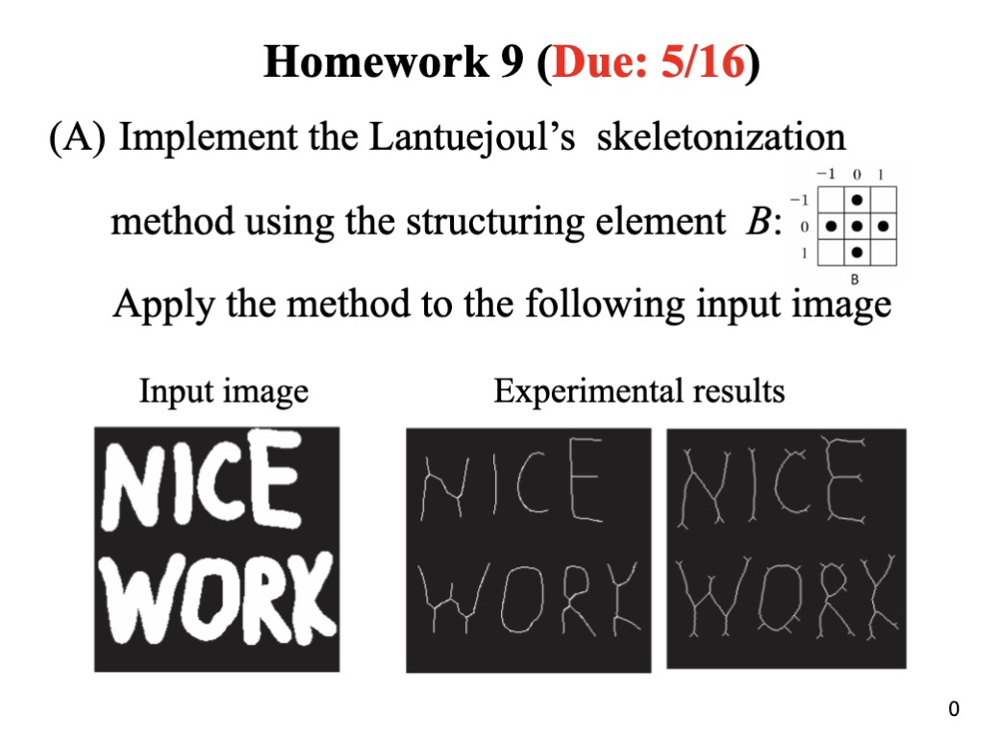
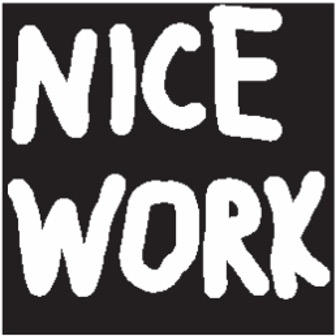
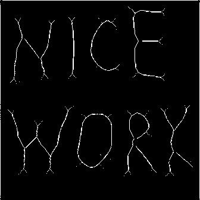
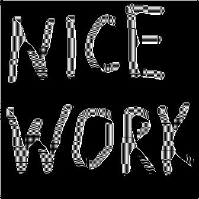

# Homework 9 (Due: 5/16)
   
  

## Assignment Statement

</img>

## Method

### Input
1. Sample Image

    </img>


### Output
1. Experimental results with kernel 3x3 Image
    
    </img>

2. Experimental results with kernel 4x4 Image

    </img>

## Source Code
```python3
import cv2
import numpy as np

# Paths for the image files
SAMPLE_IMG = "./assets/input/sample.jpg"
RESULT_3X3 = "./assets/output/result-3x3.jpg"
RESULT_4X4 = "./assets/output/result-4x4.jpg"

def skeletonize(img: np.ndarray, kernel_size: tuple) -> np.ndarray:

    # Lantuéjoul's method suggests a cross-like structuring element
    kernel = cv2.getStructuringElement(cv2.MORPH_CROSS, kernel_size)

    size = np.size(img)
    skeleton = np.zeros(img.shape, np.uint8)
    
    while True:
        
        # Erosion
        eroded = cv2.erode(img, kernel)
        # Opening
        opening = cv2.morphologyEx(eroded, cv2.MORPH_OPEN, kernel)
        # Subtraction
        tmp = cv2.subtract(eroded, opening)
        # Union of skeletons
        skeleton = cv2.bitwise_or(skeleton, tmp)
        # Update img for next iteration
        img = eroded.copy()
        
        # If no more changes, break the loop
        if cv2.countNonZero(img) == 0:
            break

    return skeleton


def main():

    # Load the image in grayscale
    img = cv2.imread(SAMPLE_IMG, 0)
    threshold_img = cv2.threshold(img, 127, 255, cv2.THRESH_BINARY)[1]

    # Apply the skeletonization method
    skeleton_3x3 = skeletonize(threshold_img, (3, 3))
    skeleton_4x4 = skeletonize(threshold_img, (4, 4))

    # Save the results    
    cv2.imwrite(RESULT_3X3, skeleton_3x3)
    cv2.imwrite(RESULT_4X4, skeleton_4x4)

if __name__ == "__main__":
    main()
```

## Comment
這次作業實現了如何利用 Lantuéjoul 的骨架化方法來處理圖像，透過改變結構元素的大小來觀察對骨架結果的影響，程式碼中定義了兩種不同的核心大小（3x3 和 4x4），以此來比較在不同結構元素下的處理效果，此方法涉及重複的侵蝕與開啟操作，直到圖像不再變化為止，從而得到最終的骨架化輸出，這次不僅知道了圖像處理中骨架化的實用性，同時對於影像形態學操作領域有更加認識的了解，這種技術在醫學影像、字符識別等領域中具有廣泛的應用前景。