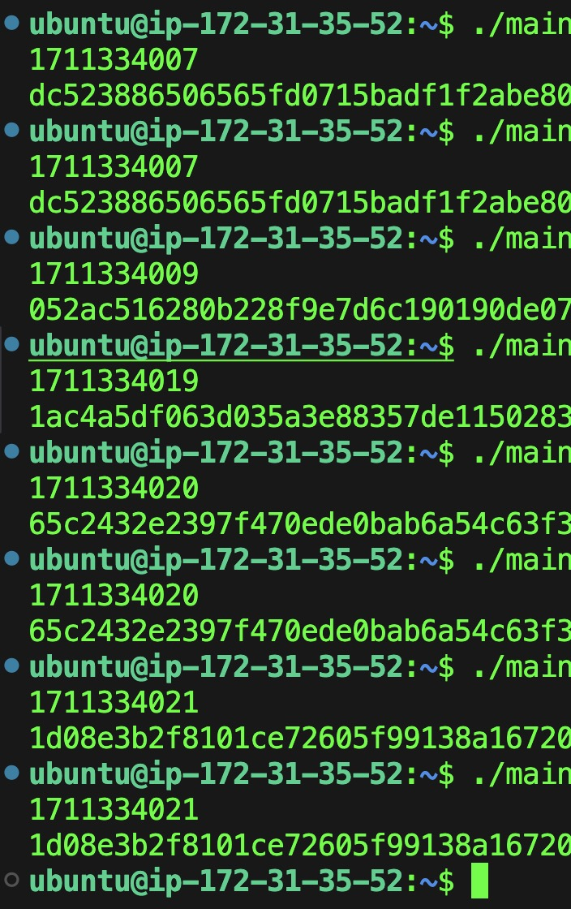
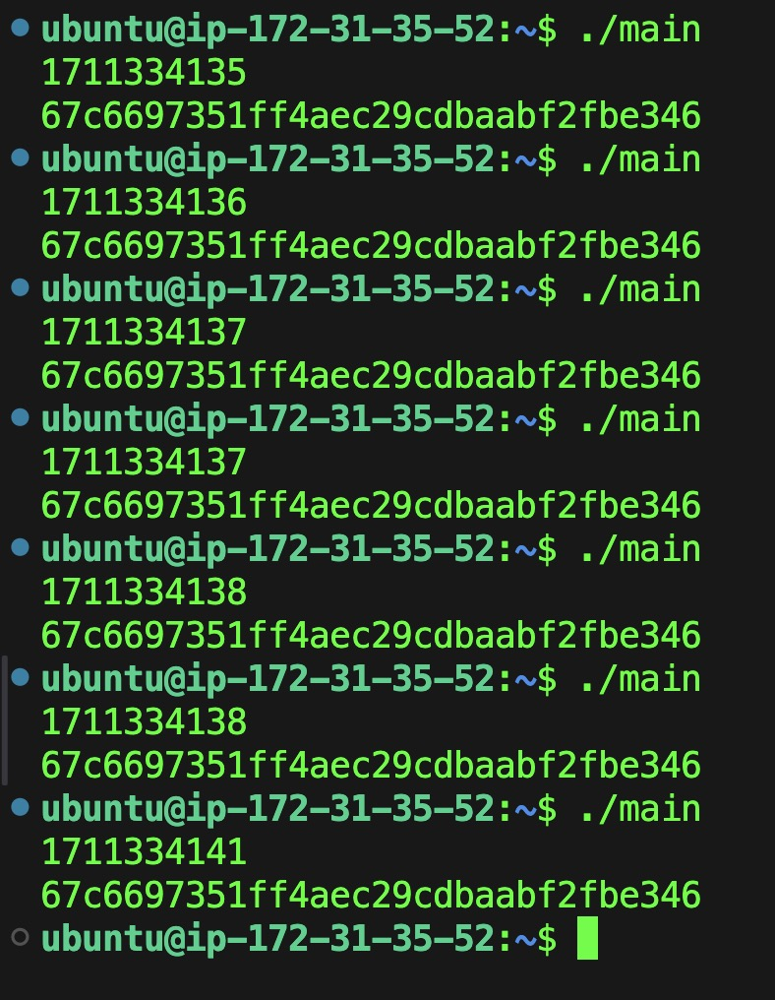
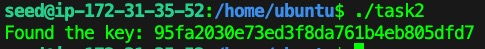
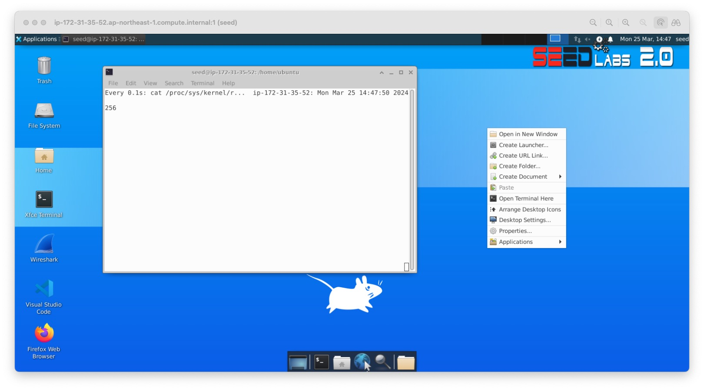
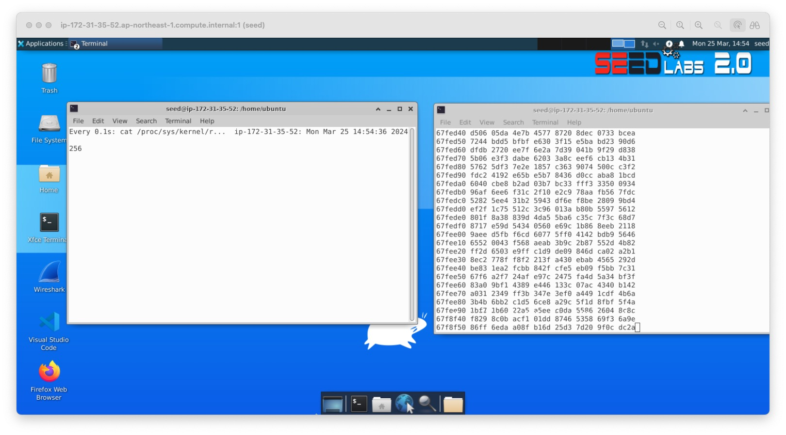
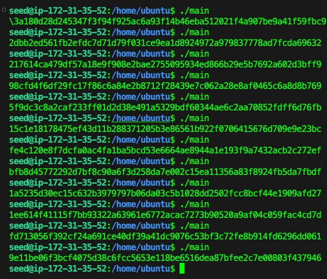
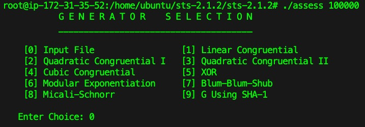
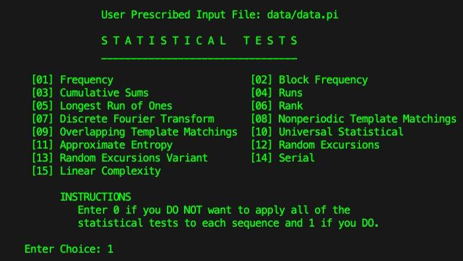
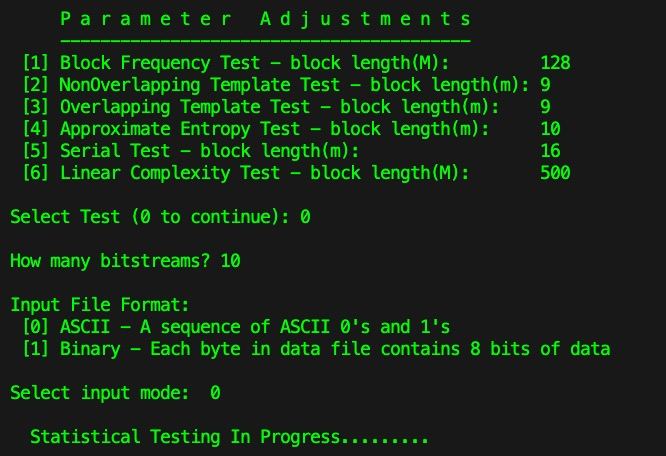
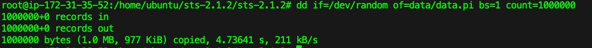

  
  

## 1.1 Joint entropy
1. $H(X,Y) = H(Y) + H(X|Y)$  

    已知：

    $$H(X,Y)=-\Sigma{_ {x\in{X}}}\Sigma{_ {y\in{Y}}}p(x,y)\log{p(x,y)}$$
    $$H(Y)=-\Sigma{_ {y\in{Y}}}p(y)\log{p(y)}$$
    $$H(X|Y)=-\Sigma{_ {x\in{X}}}\Sigma{_ {y\in{Y}}}p(y)p(x|y)\log{p(x|y)}$$
    $$=-\Sigma{_ {x\in{X}}}\Sigma{_ {y\in{Y}}}p(x,y)\log{p(x|y)}$$

    將式子拆解後：

    $$H(Y)+H(X∣Y)$$
    $$=-\Sigma{_ {y\in{Y}}}p(y)\log{p(y)}-\Sigma{_ {x\in{X}}}\Sigma{_ {y\in{Y}}}p(x,y)\log{p(x|y)}$$
    $$=-\Sigma{_ {x\in{X}}}\Sigma{_ {y\in{Y}}}p(x,y)(\log{p(y)+\log{p(x|y)}})$$
    $$=-\Sigma{_ {x\in{X}}}\Sigma{_ {y\in{Y}}}p(x,y)\log{(p(y)*p(x|y))}$$
    $$=-\Sigma{_ {x\in{X}}}\Sigma{_ {y\in{Y}}}p(x,y)\log{p(x,y)}$$
    $$=H(X,Y)$$

    以此得證。

2. $H(X,Y) \leq H(X) + H(Y)$  

    已知：

    $$H(X,Y)=-\Sigma{_ {x\in{X}}}\Sigma{_ {y\in{Y}}}p(x,y)\log{p(x,y)}$$

    $$H(X)=-\Sigma{_ {x\in{X}}}p(x)\log{p(x)}$$

    $$H(Y)=-\Sigma{_ {y\in{Y}}}p(y)\log{p(y)}$$

    為了證明，利用對數不等式指出對於任何兩個非負數 $a$ 和 $b$ 有：

    $$a\log{\frac{a}{b} \geq a-b}$$

    當 $a=b$ 時，等號成立。  

    應用這個不等式於 $H(X,Y)$ 中的每個項，可以得到：
    $$p(x,y)\log{\frac{1}{p(x,y)}} \leq p(x,y)\log{\frac{1}{p(x,y)}}$$
    
    因為 $p(x,y) \leq p(x)(y)$，上式是正確的，等號當 $X$ 和 $Y$ 是獨立的時候成立。

    如果對所有的 $x$ 和 $y$ 值求和，可以得到：
    
    $$-\Sigma{_ {x\in{X}}}\Sigma{_ {y\in{Y}}}p(x,y)\log{p(x,y)} \leq -\Sigma{_ {x\in{X}}}\Sigma{_ {y\in{Y}}}p(x,y)\log{[p(x)p(y)]}$$

    其中右邊式子可以分解為：
    
    $$-\Sigma{_ {x\in{X}}}\Sigma{_ {y\in{Y}}}p(x,y)\log{p(x)} - \Sigma{_ {x\in{X}}}\Sigma{_ {y\in{Y}}}p(x,y)\log{p(y)}$$

    因為：
    $$\Sigma{_ {y\in{Y}}}p(x,y)=p(x)$$
    $$\Sigma{_ {x\in{X}}}p(x,y)=p(y)$$

    以上式子可以簡化為：
    $$-\Sigma{_ {x\in{X}}}p(x)\log{p(x)} -\Sigma{_ {y\in{Y}}}p(y)\log{p(y)}$$

    以此得證，等號成立的條件是 $X$ 和 $Y$ 是獨立的。

## 1.2 Encryption Chain
完善保密性(perfectly secure)可以定義為：

$$Pr[M=m∣C=c]=Pr[M=m]$$

給定 $\mathcal{E}$ 是完善保密性的，有以下：

1. 對於任何明文 $m$ 和任何密鑰 $k_2$ ，給定 $E(k_2,m)$ ，不會泄露關於 $m$ 的任何明文，因為 $\mathcal{E}$ 是完善保密性的。
2. 使用 $k_1$ 和 $k_2$ 作為複合密鑰對 $E(k_2,m)$ 進行加密得到 $E'((k_1,k_2),m)$ ，因為 $\mathcal{E}$ 是完善保密性的， $k_1$ 的選擇對攻擊者來說是獨立的，不能增加對 $m$ 的任何明文。
3. 因此， $E'((k_1,k_2),m)$ 作為 $m$ 的加密不會泄露 $m$ 的明文。

為了證明 $Pr[M=m∣E'((k_1,k_2),m)=c']=Pr[M=m]$ 對所有 $m$ 和 $c'$ 成立：

因為 $E(k_2,m)$ 是完善保密性，所以：

$$Pr[M=m∣E(k_2,m)=c]=Pr[M=m]$$

又因為 $E(k_1, E(k_2,m))$ 也是完善保密性，所以：

$$Pr[E(k_2,m)=c|E(k_1, E(k_2,m))=c']=Pr[E(k_2,m))=c]$$

結合上述兩個式子，可以看到給定 $E'((k_1,k_2),m)=c'$ 不會泄露任何有關 $m$ 的明文，因此：

$$Pr[M=m∣E'((k_1,k_2),m)=c']=Pr[M=m]$$

因此，如果 $\mathcal{E}$ 是完善保密性的，則 $\mathcal{E}'$ 也會是完善保密性的。

## 1.3 Semantic Security
- $E_1(k,m) := 0||E(k,m)$
    - 在 $E_1(k,m)$ 前加上一個0。這個改變不會影響到 $E$ 的安全性，因為它只是添加一個固定的位置在密文前面，這樣不會對攻擊者提供任何有關 $m$ 的額外明文，因此 $E_1$ 是語義安全(Semantic Security)的。

- $E_2(k,m) := E(k,m)||Parity(m)$
    - 加密結果 $E(k,m)$ 的後面附加了 $m$ 的奇偶校驗位(Parity)。這樣做就會泄露明文的一些資訊(奇偶性)，使得 $E_2$ 不再是語義安全的。攻擊者可以通過查看密文的最後一位來獲得 $m$ 的奇偶校驗位的明文。

- $E_3(k,m) := reverse(E(k,m))$ 
    - 將 $E(k,m)$ 的結果進行反轉，如果原本 $E$ 是語義安全的，那反轉其輸出不會影響安全性，因為攻擊者無法從反轉的密文中得知任何關於原始密文或明文的資訊。因此 $E_3$ 是語義安全的。

- $E_4(k,m) := E(k,reverse(m))$
    - 對明文 $m$ 進行反轉然後加密，不會改變 $E$ 的安全性質，因為不管 $m$ 的順序如何， $E$ 都是語義安全的，反轉明文只是一種明文的重新排列，不會給攻擊者提供任何額外的關於原始明文的資訊，所以 $E_4$ 語義安全的。

## 1.4 Malleability
> by hw0104.py

key: 49913BF9711C1E74510611018BE35110495CCAA7

## 1.5 Slide Attack
滑動攻擊（Slide Attack）是一種針對產品密碼（即迭代密碼）的通用已知（或有時選擇）明文攻擊方法。此攻擊的關鍵在於，當一個迭代過程展示出某種程度的自相似性時，無論密碼的回合數是多少，這種攻擊都可能有效。滑動攻擊不像差分攻擊或線性攻擊那樣專注於密碼加密引擎的傳播特性，而是探索密碼自身的自相似性，這是一個完全不同的方面。

滑動攻擊的原理是將一個密碼的加密過程與另一個密碼的加密過程相互“滑動”，使兩個過程相差一個回合。如果密碼的所有回合所使用的變換都是相同的，那麼可以通過對已知的密文進行分析，找到一個被稱為“滑動對”的明文與密文對。這種滑動對的特點是它們的一部分明文和密文在經過密碼的相同變換後是一致的。找到滑動對後，攻擊者可以使用這些對來試圖恢復出部分或全部的密鑰。

例如，在對Feistel密碼進行滑動攻擊時，如果攻擊者能夠找到一對明文 $P_i$ 和 $P_j$ ，使得經過加密後的密文 $C_i$ 和 $C_j$ 滿足某些特定條件，則可以假設 $P_i$ 和 $C_j$ 之間的關係由相同的密鑰生成，從而透露了密鑰資訊。
 
滑動攻擊利用了密碼設計中的自相似性，以及某些情況下密鑰排程（key schedule）的弱點，特別是當密鑰排程導致了一個週期性的子密鑰序列時。它能夠對抗那些即使有很多回合也仍然依賴於密碼自身結構的簡單性的密碼系統。然而這種攻擊可以通過在迭代過程中添加迭代計數器或固定隨機常量來預防。對於更複雜的變體，其分析和防禦都更加困難。

## 1.6 Programming: Never Use One Time Pad Twice
> By hw0106.py

#### Decrypted Challenge Message String:
```
/'' o/lyld.es G&% p-a<odi"+, 1:<n'2 2<me;&me<i=hrow6l h " w--;+ 1?y 1an"&tt#+e7k7n{
```

#### Decrypted Challenge Message Hex
```
2f272720
6f2f6c79
6c642e65
73204726
2520702d
613c6f64
69222b2c
20313a3c
6e273220
323c6d65
3b266d65
3c693d68
726f7736
6c206820
2220772d
2d3b2b20
313f0479
2031616e
22267474
232b6537
6b376e7b
```

## 1.7 Lab: Pseudo Random Number Generator

#### Task 1: Generate Encryption Key in a Wrong Way
> by hw0107/task1.c

- 原始的結果

    
    
    可以看到，每次執行程式時，產生的密鑰會隨著時間秒數而改變。

- 將 `srand (time(NULL));` 註解掉後的結果

    

    可以看到，當 `srand (time(NULL));` 被註解掉後，每次執行程式時，得到的結果都是一樣的。

`srand()` 和 `time()` 函數在程式碼的目的就是， `srand()` 函數是用來設置 `rand()` 函數的種子，所謂的種子就是一個起始值，用來生成一組隨機數。如果種子相同，那麼 `rand()` 函數生成的隨機數也是相同的。`time()` 函數是用來取得目前的時間。因此，當 `srand (time(NULL));` 被註解掉後，`rand()` 函數的種子就會使用系統預設的種子，種子就不會改變，所以每次執行程式時，得到的結果都是一樣的。

#### Task 2: Guessing the Key
> by hw0107/task2.c

key: 95fa2030e73ed3f8da761b4eb805dfd7



- 執行 `date -d "2018-04-17 23:08:49" +%s` 可以得到 1524006529 的 timestamp， 又因為檔案是兩個小時前加密的，所以利用 for 迴圈從 1524006529 開始往前推兩個小時，以時間為種子，並且用 AES 枚舉加密，直到找到正確的 key 為止。

- 注意每次執行 AES_cbc_encrypt 時，IV 都會被更新一次，所以迴圈一次都要初始化一次 IV。

#### Task 3: Measure the Entropy of Kernel


```bash
/proc/sys/kernel/random/entropy_avail # 256
```

在之後的 linux 5.10.119 的版本中，以上指令輸出的數值會一直是 256，這是 linux kernel 更新後所作出的改動，因為在之前的版本中，這個數值會隨著時間而改變，這樣會造成一些問題，所以在新的版本中，這個數值會一直是 256。

#### Task 4: Get Pseudo Random Numbers from `/dev/random`

- 因為版本，所以執行 `cat /dev/random | hexdump` 後，再開一個terminal執行 `watch -n .1 cat /proc/sys/kernel/random/entropy_avail` 來觀察 entropy，數值依然是 256。


- 如果降低版本後，執行 `cat /dev/random | hexdump` 後，再開一個terminal執行 `watch -n .1 cat /proc/sys/kernel/random/entropy_avail` 來觀察 entropy，可以看到 entropy 的數值會逐漸下降，當 entropy 的數值低於一個閥值時，`cat /dev/random | hexdump` 會停止輸出，因為 `/dev/random` 會等待 entropy 的數值回復到閥值以上才會繼續輸出。

- Question: If a server uses `/dev/random` to generate the random session key with a client. Please describe how you can launch a Denial-Of-Service (DOS) attack on such a server?
    - Answer: 對於需要為 client 產生密鑰的 server，如果使用 `/dev/random` 來產生隨機數，那麼當 server 產生密鑰時，如果 `/dev/random` 的 entropy 不足，那麼 server 就會等待直到 entropy 足夠，這樣就會造成 server 的延遲，如果攻擊者能夠在 server 產生密鑰時不斷地向 server 發送請求，那麼 server 就會一直處於等待的狀態，這樣就會造成 server 的 DOS 攻擊。

#### Task 5: Get Random Numbers from `/dev/urandom`

> by hw0107/task5.c

執行以下指令後：
```bash
head -c 1M /dev/urandom > output.bin
ent output.bin
```

獲得以下輸出資訊：
```
Entropy = 7.999812 bits per byte.

Optimum compression would reduce the size
of this 1048576 byte file by 0 percent.

Chi square distribution for 1048576 samples is 273.52, and randomly
would exceed this value 20.31 percent of the times.

Arithmetic mean value of data bytes is 127.5150 (127.5 = random).
Monte Carlo value for Pi is 3.138645701 (error 0.09 percent).
Serial correlation coefficient is 0.000286 (totally uncorrelated = 0.0).
```
多次執行 `./hw0107/task5` 後，可以看到數值一直都在變化：



## 1.8 Lab: Test Suite for Random Numbers
#### 安裝 NIST Statistical Test Suite
```bash
wget https://csrc.nist.gov/CSRC/media/Projects/Random-Bit-Generation/documents/sts-2_1_2.zip
unzip sts-2_1_2.zip
cd sts-2.1.2/sts-2.1.2
make
```

#### 使用 NIST Statistical Test Suite 測試隨機數
跑以下指令：

```bash
./assess 100000
```

- 第一步
    
    

- 第二步
    
    
- 第三步

    

之後跑完會生成報表出來，可以看到測試結果。
> hw0108/report.txt

#### 測試 standard C random(), /dev/random and /dev/urandom.

跑以下指令：
```
dd if=/dev/random of=<random_file> bs=1 count=1000000
```

可以看到測試結果：


