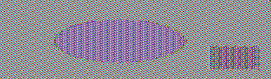

## 1.1 Triple Encryption
攻擊者尋找單一金鑰 $k'$ 來等效於三個金鑰 $k_1, k_2, k_3$ 的情況下，使得:

$$Enc(k_3,Enc(k_2,Enc(k_1,x))) = Enc(k',x)$$

對於任意給定的明文 $x$ 和密文 $y$ 與金鑰 $k$ ，使得 $Enc(k,x)=y$ ，攻擊者可以透過暴力破解的方式來找到 $k'$ ，使用 DES 加密，對於任意 $x$ 與 $y$ 會有複雜度是 $2^{56}$ 。

對於三重加密也就是(Triple DES)的情況，如果有三個獨立的金鑰 $k_1, k_2, k_3$，金鑰空間會是:

$$2^{56} \times 2^{56} \times 2^{56} = 2^{168}$$

而其他像是兩把金鑰不同 (2TDEA) 或是三個金鑰均相等 (One DES)，複雜度會比較低，分別是 $2^{112}$ 與 $2^{56}$ 。

因為 $k'$ 模擬出所有可能的 $k_1, k_2, k_3$ 組合的加密結果是需要在 $2^{168}$ 進行搜索，所以模擬的機率仍然是微乎其微的(negligible)。

## 1.2 Hybrid Chosen-Plaintext-Attack Construction
混合密碼系統 $(E,D)$ 通過結合兩個加密系統形成，如以下流程:

1. 透過 $E$ 加密後隨機選擇一個從 $k_0$ 到 $K_0$ 的金鑰集合中，利用 $k$ 和 $k_0$ 透過 $E_1$ 來加密得到 $c_1$，再利用 $k_0$ 透過 $E_0$ 加密明文 $m$ 得到 $c_0$ ，最後輸出  $(c_0, c_1)$ 。

2. 解密流程 $D$ 用 $k$ 和 $c_1$ 來解密透過 $D_1$ 得到 $k_0$，然後用 $c_0$ 和 $k_0$ 透過 $D_0$ 來解密得到明文 $m$ ，最後輸出 $m$ 。

根據 $E_0$ 和 $E_1$ 進行證明，因為 $E_0$ 是語意安全的，所以對於任意的 $c_0$ ，攻擊者無法得知明文 $m$ 的任何資訊。

而 $E_1$ 是 CPA 安全的，所以即使攻擊者可以透過選擇明文攻擊 (Chosen-Plaintext-Attack) 來得到相應的密文 $c_1$ ，也無法得知 $k_0$ 的任何資訊，因此也就無法推算出 $c_0$ 中所包含的 $m$。

根據以上兩個 $E_0$ 和 $E_1$，即使攻擊者對 $c_1$ 進行選擇明文攻擊 (Chosen-Plaintext-Attack)，也無法得知 $c_0$ 中的明文 $m$ ，因為 $c_0$ 的加密過程獨立於 $c_1$ ，可以推出即使 $c_1$ 被破解，攻擊者也無法破解 $c_0$ ​以獲取 $m$ ，因此攻擊者無法有效分辨出兩個加密結果 $E(k,m_1)$ 和 $E(k,m_2)$ ，也就證明了 $E$ 是 CPA 安全的。

$E_1$ 保護 $k_0$ 的安全性，即使它是隨機選擇的
$E_0$ 保護了明文 $m$ 的安全性，即使 $k_0$ 是已知的。

得出:混合密碼系統 $(E,D)$ 是 CPA 安全的。

## 1.3 The malleability of CBC mode

利用 CBC 加密模式的易變性 (malleability)，流程如下:

1. 假設 $c$ 由多個密文塊 $c[0], c[1], ..., c[l]$ 組成，其中 $c[0]$ 是與初始向量 IV 進行 XOR 運算後加密得到的第一個密文塊。

2. 要修改第一個明文塊 $m[0]$ ，只需要修改與之相對應的密文塊 $c[0]$ ，根據 CBC 模式的解密過程，解密 $c[0]$ 得到的結果會與 IV 進行 XOR 運算以得到 $m[0]$ 。

3. 將 $c[0]$ 與 $\Delta$ 進行 XOR 運算，得到一個新的密文塊 $c'[0] = c[0] \oplus \Delta$ ，當解密過程中用 $c'[0]$ 代替 $c[0]$ 時，解密得到的結果會先與 IV 進行 XOR 運算，再與 $\Delta$ 進行 XOR 運算，從而實現將 $m[0]$ 中的指定位元翻轉。

4. 將修改後的密文塊 $c'[0]$ 與原始密文中剩餘的塊一起組合，形成新的密文 $c'$ 。由於只修改了 $c[0]$ ，其他密文塊保持不變，因此解密 $c'$ 時除了第一塊明文會有所改變外，其他明文塊 $m'[i] = m[i]$ (對於 $i = 1, ..., l$ ) 不會受到影響。

CBC 模式的易變性使得攻擊者可以修改密文中的某些位元，從而影響解密後的明文，這種攻擊方式被稱為密文塊翻轉攻擊 (Ciphertext Block Flipping Attack)，攻擊者可以利用這種方式來修改密文中的某些位元，從而影響解密後的明文，進而達到破壞加密系統的目的。

## 1.4 Modular Multiplicative Inverse
> by hw0204.py

1. 400 mod 997

    式子為以下:
    $$400 \times x \equiv 1 \pmod{997}$$

    因為 997 是質數，可以使用 Fermat's Little Theorem (費馬小定理) 來計算:

    $$x = 400^{997-2} \pmod{997}$$
    
    因此得出:
    $$x = 167$$

2. 472 mod 16651

    式子為以下:
    $$472 \times x \equiv 1 \pmod{16651}$$

    因為 16651 是質數，可以使用 Fermat's Little Theorem (費馬小定理) 來計算:

    $$x = 472^{16651-2} \pmod{16651}$$
    
    因此得出:
    $$x = 8643$$

## 1.5 Euler’s Theorem and RSA
在 RSA 加密演算法中，選取兩個大的質數 $p$ 和 $q$ ，計算 $N = pq$ ，並找到一個與 $\varphi(N)$ (歐拉函數) 互質的整數 $e$ ，計算出解密金鑰 $d$ 使得:

$$ed \equiv 1 \pmod{\varphi(N)}$$

$m$ 加密後的密文 $c$ 計算為:

$$c = m^e \pmod{N}$$

解密過程為:

$$m = c^d \pmod{N}$$

因為 $ed \equiv 1 \pmod{\varphi(N)}$ ，可以寫成 $ed = 1 + k\varphi(N)$ ，對於某個整數 $k$ ，如果 $m$ 和 $N$ 互質，那利用歐拉定理可以得出:

$$m^{\varphi(N)} \equiv 1 \pmod{N}$$

因此:

$$c^d = m^{ed} = m^{1+k\varphi(N)} = m (m^{\varphi(N)})^k \equiv m \times 1^k = m \pmod{N}$$

然而如果 $m$ 和 $N$ 不互質，也就是 $gcd(m, N) \neq 1$ 就不能用歐拉定理，因為歐拉函數的基本假設是 $a$ 和 $n$ 互質，在這種情況不能保證 $m^{\varphi(N)} \equiv 1 \pmod{N}$ ，可能無法得到 $m \equiv c^d \pmod{N}$ 。

可是 RSA 演算法即使 $m$ 和 $N$ 不互質也可以 work。因為 RSA 實際上依賴卡邁克爾定理 (Carmichael's theorem)，也就是:
- 如果 $N$ 是兩個不同質數的乘積，那麼對於所有的整數 $m$ :

$$m^{ed} \equiv m \pmod{N}$$ 

    如果 $ed \equiv 1 \pmod{\lambda(N)}$ ，其中 $\lambda(N)$ 是卡邁克爾函數，卡邁克爾函數在 RSA 的情況下是 $lcm(p-1, q-1)$ ，小於等於 $\varphi(N)$ ，也因此卡邁克爾定理可以得出更好的結果。

在RSA的運作中，$m$ 被加密和解密的過程實際上是在模 $N$ 的乘法群上運作，這個群的所有元素都可以表示為一個整數的次方，因為 $m$ 是群的一個元素，$m$ 的次方運算與群的運算是封閉的，並且 $d$ 的選擇保證了 $m^{ed} \equiv m \pmod{N}$ 對所有 $m$ 成立，所以即使 $m$ 和 $N$ 不互質，RSA 的逆置換 (reverse permutation) 仍然可以 work，因為 RSA 演算法的基底不只是依賴於歐拉定理，而是依賴於模 $N$ 的乘法群的結構，以及 $ed$ 與 $\lambda(N)$ 或 $\varphi(N)$ 的關係。

## 1.6 Pseudo Prime
偽質數 (pseudo primes) 在某些數學測試中表現得像一個質數，像是費馬小定理說到對於任何質數 $p$ 和任何不是 $p$ 的倍數的整數 $a$ ，下式成立:

$$a^{p-1} \equiv 1 \pmod{p}$$

偽質數可以透過以上測試，使得被認為這是個質數。

在 RSA 演算法中，雖然理論證明假設 $p$ 和 $q$ 是質數，但在實際應用中使用偽質數而不是真正的質數通常不會導致演算法失效，因為 RSA 的安全性和正確性依賴於以下兩個條件:

1. N = pq 是難分解的數字，即使 $p$ 和 $q$ 是偽質數，只要還是足夠難分解，RSA 就還是能夠保持安全性

2. 必須找到一個與 $\varphi(N)$ (歐拉函數) 互質的整數 $e$ 和一個 $d$ ，使得 $ed \equiv 1 \pmod{\varphi(N)}$ ， $\varphi(N)$ 在質數的情況下等於  $p-1$ 和 $q-1$ 的乘積，而在偽質數的情況下可以等於所有不同質因子減一的乘積。

為了保證 RSA 演算法在 $p$ 和 $q$ 是偽質數時是正確的，需要偽質數能夠滿足一定的條件，比如通過費馬測試或是其他偽質數測試，這樣即使不是真正的質數，RSA 的加密和解密過程還是可以正確運算，因為這些過程只依賴上面提到的那兩個條件，而不是 $p$ 和 $q$ 自身必須是質數。

假設 $p$ 和 $q$ 是強偽質數，也就是在某些質數性測試下表現的像質數，那這些偽質數的特性還是可以保證:

- $ed \equiv 1 \pmod{\varphi(N)}$ 的存在，因為 $e$ 和 $\varphi(N)$ 可以選擇為互質的
- 加密函數 $c = m^e \pmod{N}$ 和解密函數 $m = c^d \pmod{N}$ 的正確性

因此即使在 $p$ 和 $q$ 是偽質數的情況下，只要是足夠大且難分解的偽質數，RSA算法還是可以正確運算。
<!-- 實際上，在很多實際應用中，偽質數因為其效率而被廣泛使用，而且當它們選擇得當時，不會對RSA算法的安全性或正確性構成風險。 -->

## 1.7 Elliptic Curve over $\mathbb{Z}_p$ 
根據 $P$ 和 $Q$ 是否相同來計算斜率 $\lambda$ :

- 如果 $P \neq Q$ ，斜率 $\lambda$ 是通過 $P$ 兩點畫直線得到的，根據公式可以知道，分母 $x_q-x_p$ 必須在模 $p$ 的情況下有模逆元，也就是 $x_q-x_p$ 和 $p$ 互質才能計算出 $\lambda$ 的值。

- 如果 $P=Q$ ，斜率 $\lambda$ 是通過 $P$ 點的切線得到的，根據公式可以知道，分母 $2y_p$ 必須在模 $p$ 的情況下有模逆元，也就是 $2y_p$ 和 $p$ 互質才能計算出 $\lambda$ 的值。

有了 $\lambda$ 的值後，可以計算出 $R$ 的 $x_R$ 和 $y_R$ 坐標，依照給出的公式可以得到 $R=P+Q$ 的結果。

加法過程是在模 $p$ 的情況下進行的，也就是說所有計算都是在有限域 $\mathbb{Z}_p$ 中進行，其中 $p$ 是一個質數，在橢圓曲線上進行加法運算時，如果直線與曲線的交點不止一個，就得取其中一個作為結果的相反數，這加法定義讓橢圓曲線上的點形成阿貝爾群 (Abelian group)。

## 1.8 Lab: Secret-Key Encryption

#### Task 1: Frequency Analysis
- 步驟一
    > by hw0208/sample.py

    透過步驟一所提供的 `sample.py`，可以得出以下隨機英文排序金鑰:

    ```
    trzhnifglpdkbmajwuqexvcsoy
    ```
    

- 步驟二
    生成一個 `article.txt` 的檔案(內容隨意)，並透過以下指令將文章轉換成小寫後並且只保留英文單字:
    ```
    tr [:upper:] [:lower:] < article.txt > lowercase.txt
    tr -cd ’[a-z][\n][:space:]’ < lowercase.txt > plaintext.txt
    ```

    > 存放在 hw0208/task1/plaintext.txt

- 步驟三
    透過以下指令將 `plaintext.txt` 的內容利用步驟一生成的金鑰進行加密:

    ```
    tr 'abcdefghijklmnopqrstuvwxyz' 'trzhnifglpdkbmajwuqexvcsoy' < plaintext.txt > ciphertext.txt
    ```

    > 存放在 hw0208/task1/ciphertext.txt

透過執行 `freq.py` 讀取 `ciphertext.txt` 檔案內容並且進行頻率分析，得出以下結果:
> by hw0208/freq.py

```
-------------------------------------
1-gram (top 20):
n: 48
e: 28
q: 27
a: 25
l: 24
m: 21
t: 20
k: 18
j: 15
z: 15
u: 15
g: 14
h: 12
c: 10
x: 9
b: 9
r: 5
i: 4
f: 4
v: 3
-------------------------------------
2-gram (top 20):
gn: 12
eg: 11
el: 6
lm: 6
cn: 6
nu: 6
nq: 6
am: 5
tk: 5
kk: 5
ql: 4
zt: 4
tm: 4
mh: 4
rn: 4
nn: 4
nj: 3
ne: 3
xq: 3
lz: 3
-------------------------------------
3-gram (top 20):
egn: 10
ela: 3
lam: 3
tmh: 3
qjt: 3
jtz: 3
tzn: 3
znq: 3
lmf: 3
qlb: 2
lbj: 2
bjk: 2
jkl: 2
kli: 2
tel: 2
elz: 2
nue: 2
tkk: 2
ztq: 2
tqn: 2
```

從以上頻率可以得出金鑰排序為:
```
# neqalmtkjzughcxbrifv + psodyw (剩餘的字母)
neqalmtkjzughcxbrifvpsodyw
```
再根據這個[網站](https://en.wikipedia.org/wiki/Frequency_analysis)查看字母的最常出現頻率，根據圖片可以看到:


因此可以得出一個排序:
```
etaoinrshdclmpufgwybkjvxqz
```

將以上金鑰與密文透過以下指令進行解密:
```
tr 'neqalmtkjzughcxbrifvpsodyw' 'etaoinrshdclmpufgwybkjvxqz' < ciphertext.txt > out.txt
```

得到以下解密後的內容與對比:

plaintext.txt:
```
step  let us do some simplification to the original article we convert all upper cases to lower cases
and then removed all the punctuations and numbers we do keep the spaces between words so you can
still see the boundaries of the words in the ciphertext in real encryption using monoalphabetic cipher
spaces will be removed we keep the spaces to simplify the task we did this using the following
command
```

out.txt:
```
ateh  set ua mo aofe aifhsiwidrtion to tle ociyinrs rctidse pe donbect rss uhhec draea to sopec draea
rnm tlen cefobem rss tle hundturtiona rnm nufgeca pe mo xeeh tle ahrdea getpeen pocma ao vou drn
atiss aee tle gounmrciea ow tle pocma in tle dihlectejt in cers endcvhtion uainy fonorshlrgetid dihlec
ahrdea piss ge cefobem pe xeeh tle ahrdea to aifhsiwv tle trax pe mim tlia uainy tle wossopiny
doffrnm
```

#### Task 2: Encryption using Different Ciphers and Modes

在以下每個資料夾都生成一個 `plain.txt` 的檔案(內容隨意)

- AES-128-CBC
    進入 `hw0208/task2/AES-128-CBC` 資料夾後，透過以下指令將 `plain.txt` 的內容透過 AES-128-CBC 進行加密:
    
    ```
    openssl enc -aes-128-cbc -e -in plain.txt -out cipher.bin -K 00112233445566778889aabbccddeeff -iv 0102030405060708
    ```

    再透過以下指令將 `cipher.bin` 的內容透過 AES-128-CBC 進行解密:
    
    ```
    openssl enc -aes-128-cbc -d -in cipher.bin -out out.txt -K 00112233445566778889aabbccddeeff -iv 0102030405060708
    ```

    結果如下:

    plain.txt:
    ```
    Encryption using Different Ciphers and Modes
    ```

    cipher.bin:
    ```
    �^����}V�ix'��Oy�0�#.����������9���5�����b`
    ```

    out.txt:
    ```
    Encryption using Different Ciphers and Modes
    ```

- AES-128-ECB
    進入 `hw0208/task2/AES-128-ECB` 資料夾後，透過以下指令將 `plain.txt` 的內容透過 AES-128-ECB 進行加密:
    
    ```
    openssl enc -aes-128-ecb -e -in plain.txt -out cipher.bin -K 00112233445566778889aabbccddeeff
    ```

    再透過以下指令將 `cipher.bin` 的內容透過 AES-128-ECB 進行解密:
    
    ```
    openssl enc -aes-128-ecb -d -in cipher.bin -out out.txt -K 00112233445566778889aabbccddeeff
    ```

    結果如下:

    plain.txt:
    ```
    Encryption using Different Ciphers and Modes
    ```

    cipher.bin:
    ```
    H1�B����5'�A��F���o���4�טH�ф!u�H�[�K
    ```

    out.txt:
    ```
    Encryption using Different Ciphers and Modes
    ```

- AES-128-CFB
    進入 `hw0208/task2/AES-128-CFB` 資料夾後，透過以下指令將 `plain.txt` 的內容透過 AES-128-CFB 進行加密:
    
    ```
    openssl enc -aes-128-cfb -e -in plain.txt -out cipher.bin -K 00112233445566778889aabbccddeeff -iv 0102030405060708
    ```

    再透過以下指令將 `cipher.bin` 的內容透過 AES-128-CFB 進行解密:
    
    ```
    openssl enc -aes-128-cfb -d -in cipher.bin -out out.txt -K 00112233445566778889aabbccddeeff -iv 0102030405060708
    ```

    結果如下:

    plain.txt:
    ```
    Encryption using Different Ciphers and Modes
    ```

    cipher.bin:
    ```
    ���W�O�hy2
    �c��&.‚\c)Q�o��D#�T�di�
    ```

    out.txt:
    ```
    Encryption using Different Ciphers and Modes
    ```

- BF-CBC
    進入 `hw0208/task2/BF-CBC` 資料夾後，透過以下指令將 `plain.txt` 的內容透過 BF-CBC 進行加密:
    
    ```
    openssl enc -bf-cbc -e -in plain.txt -out cipher.bin -K 00112233445566778889aabbccddeeff -iv 0102030405060708
    ```

    再透過以下指令將 `cipher.bin` 的內容透過 BF-CBC 進行解密:
    
    ```
    openssl enc -bf-cbc -d -in cipher.bin -out out.txt -K 00112233445566778889aabbccddeeff -iv 0102030405060708
    ```

    結果如下:

    plain.txt:
    ```
    Encryption using Different Ciphers and Modes
    ```

    cipher.bin:
    ```
    ��3����`�
    t�k+ݐ��U�.%�
    �uC���&�/�.�B턗A�
    ```

    out.txt:
    ```
    Encryption using Different Ciphers and Modes
    ```

從以上結果可以看到，透過不同的加密方式進行加密後，再透過相同的金鑰和 IV 進行解密，可以得到原本的明文。


#### Task 3: Encryption Mode – ECB vs. CBC

- AES-128-ECB
    進入 `hw0208/task3/AES-128-ECB` 資料夾後，透過以下指令將 `pic_original.bmp` 的內容透過 AES-128-ECB 進行加密:

    ```
    openssl enc  -aes-128-ecb  -e -in pic_original.bmp -out p2.bmp -K 00112233445566778889aabbccddeeff
    ```

    透過以下指令進行 header 和 body 的分離，並且將 header 和 body 重新組合:

    ```
    head -c 54 pic_original.bmp > header
    tail -c +55 p2.bmp > body
    cat header body > new.bmp
    ```

    結果如下:

    pic_original.bmp:
    

    new.bmp:
    

- AES-128-CBC
    進入 `hw0208/task3/AES-128-CBC` 資料夾後，透過以下指令將 `pic_original.bmp` 的內容透過 AES-128-CBC 進行加密:

    ```
    openssl enc  -aes-128-cbc  -e -in pic_original.bmp -out p2.bmp -K 00112233445566778889aabbccddeeff -iv 0102030405060708
    ```

    透過以下指令進行 header 和 body 的分離，並且將 header 和 body 重新組合:
    
    ```
    head -c 54 pic_original.bmp > header
    tail -c +55 p2.bmp > body
    cat header body > new.bmp
    ```

    結果如下:

    pic_original.bmp:
    

    new.bmp:
    

從以上結果可以看到，透過 ECB 和 CBC 進行加密後，再透過相同的金鑰和 IV 進行解密，可以得到原本的圖片。但是透過 ECB 進行加密後的圖片可以看到明顯的 pattern，而 CBC 進行加密後的圖片則沒有這樣的 pattern，因此 ECB 是不安全的，而 CBC 是安全的。

#### Task 4: Padding
透過以下指令生成 `f1.txt` `f2.txt` `f3.txt` 的檔案(分別為 5, 10, 16 bytes):

```
echo -n "12345" > f1.txt
echo -n "1234567890" > f2.txt
echo -n "123456789ABCDEF0" > f3.txt
```

ECB 與 CBC 模式因加密時的區塊大小需為 16 bytes，若不足此大小則會進行填充，而 CFB 與 OFB 模式則不需填充，因為使用 CFB 或 OFB 進行加密時，密文與明文大小相同

選擇 ECB, CBC, CFB, OFB 其中一個進行加密 (這裡選擇CBC) 和用 `-nopad` 進行解密:

```
openssl enc -aes-128-cbc -e -in f1.txt -out f1_c.txt -K 00112233445566778889aabbccddeeff -iv 0102030405060708
openssl enc -aes-128-cbc -d -nopad -in f1_c.txt -out f1_d.txt -K 00112233445566778889aabbccddeeff -iv 0102030405060708

openssl enc -aes-128-cbc -e -in f2.txt -out f2_c.txt -K 00112233445566778889aabbccddeeff -iv 0102030405060708
openssl enc -aes-128-cbc -d -nopad -in f2_c.txt -out f2_d.txt -K 00112233445566778889aabbccddeeff -iv 0102030405060708

openssl enc -aes-128-cbc -e -in f3.txt -out f3_c.txt -K 00112233445566778889aabbccddeeff -iv 0102030405060708
openssl enc -aes-128-cbc -d -nopad -in f3_c.txt -out f3_d.txt -K 00112233445566778889aabbccddeeff -iv 0102030405060708
```

利用 `hexdump` 指令觀察各個檔案 padding 情況，

```
hexdump -C f1_d.txt
hexdump -C f2_d.txt
hexdump -C f3_d.txt
```

結果如下:


#### Task 5: Error Propagation – Corrupted Cipher Text

1. 生成一個超過 1000 bytes 的檔案 `big.txt`

    透過以下指令生成檔案:
    ```
    python3 -c "print('hello'*200)" > big.txt
    ```

    利用 `ls -l` 指令查看檔案大小:

    

2. 利用 AES-128 cipher 進行加密
    - ECB
        透過以下指令進行加密:
        ```
        openssl enc -aes-128-ecb -e -in big.txt -out big_ecb.bin -K 00112233445566778889aabbccddeeff
        ```
    - CBC
        透過以下指令進行加密:
        ```
        openssl enc -aes-128-cbc -e -in big.txt -out big_cbc.bin -K 00112233445566778889aabbccddeeff -iv 0102030405060708
        ```
    - CFB
        透過以下指令進行加密:
        ```
        openssl enc -aes-128-cfb -e -in big.txt -out big_cfb.bin -K 00112233445566778889aabbccddeeff -iv 0102030405060708
        ```
    - OFB
        透過以下指令進行加密:
        ```
        openssl enc -aes-128-ofb -e -in big.txt -out big_ofb.bin -K 00112233445566778889aabbccddeeff -iv 0102030405060708
        ```
- 利用指令故意損壞修改所有加密檔案中第 55 個 byte 的 一個 bit 值
    ```
    dd if=big_ecb.bin of=big_ecb_corrupted.bin bs=1 count=54
    printf "\xDD" >> big_ecb_corrupted.bin
    dd if=big_ecb.bin of=big_ecb_corrupted.bin bs=1 skip=55 seek=55

    dd if=big_cbc.bin of=big_cbc_corrupted.bin bs=1 count=54
    printf "\xDD" >> big_cbc_corrupted.bin
    dd if=big_cbc.bin of=big_cbc_corrupted.bin bs=1 skip=55 seek=55

    dd if=big_cfb.bin of=big_cfb_corrupted.bin bs=1 count=54
    printf "\xDD" >> big_cfb_corrupted.bin
    dd if=big_cfb.bin of=big_cfb_corrupted.bin bs=1 skip=55 seek=55

    dd if=big_ofb.bin of=big_ofb_corrupted.bin bs=1 count=54
    printf "\xDD" >> big_ofb_corrupted.bin
    dd if=big_ofb.bin of=big_ofb_corrupted.bin bs=1 skip=55 seek=55
    ```

- 將損壞的檔案進行解密
    透過以下指令對所有損壞檔案進行解密:
    ```
    openssl enc -aes-128-ecb -d -in big_ecb_corrupted.bin -out big_ecb_corrupted.txt -K 00112233445566778889aabbccddeeff

    openssl enc -aes-128-cbc -d -in big_cbc_corrupted.bin -out big_cbc_corrupted.txt -K 00112233445566778889aabbccddeeff -iv 0102030405060708

    openssl enc -aes-128-cfb -d -in big_cfb_corrupted.bin -out big_cfb_corrupted.txt -K 00112233445566778889aabbccddeeff -iv 0102030405060708

    openssl enc -aes-128-ofb -d -in big_ofb_corrupted.bin -out big_ofb_corrupted.txt -K 00112233445566778889aabbccddeeff -iv 0102030405060708
    ```

- 用 hex 檢視器比較原始檔案和解密後的檔案
    - ECB
        
    
    - CBC
        

    - CFB
        

    - OFB
        

從上述結果可以看到，以下的錯誤情況:
- ECB: 有 16 個 bytes 都出現錯誤
- CBC: 有 16 個 bytes 都出現錯誤
- CFB: 有 16 個 bytes 都出現錯誤
- OFB: 只有 1 個 byte 出現錯誤

因此可以得出以下結論: ECB, CBC, CFB 都是錯誤傳播的，因為錯誤會影響整個區塊，而 OFB 不是錯誤傳播的，因為錯誤只會影響一個 

#### Task 6: Initial Vector (IV) and Common Mistakes

- Task 6.1. IV Experiment

    生成一個 `file.txt` 的檔案(內容為 hello)，並透過以下指令加密生成兩個檔案，分別使用不同的 IV 進行:
    ```
    echo -n "hello" > file.txt
    openssl enc -aes-128-cbc -e -in ./file.txt -out ./file-iv1.txt -K 123456 -iv 111111
    openssl enc -aes-128-cbc -e -in ./file.txt -out ./file-iv2.txt -K 123456 -iv 222222
    ```

    使用同樣的 IV 進行加密生成一個檔案:
    ```
    openssl enc -aes-128-cbc -e -in ./file.txt -out ./f-iv1-same.txt -K 123456 -iv 111111
    ```

    查看檔案比對結果:
    

    從以上結果可以發現，在 key 相同的情況下，相同的 IV 會導致加密結果相同，因此 IV 必須是唯一 (unique) 的，否則會導致相同的 IV 加密後的結果相同。

- Task 6.2. Common Mistake: Use the Same IV
    > by hw0208/task6/task6_2.py

    - 輸入的變數
        Plaintext (P1):
        ```
        This is a known message!
        ```

        Ciphertext (C1):
        ```
        a469b1c502c1cab966965e50425438e1bb1b5f9037a4c159
        ```

        Ciphertext (C2):
        ```
        bf73bcd3509299d566c35b5d450337e1bb175f903fafc159
        ```

    - 結果如下:
    
        Plaintext (P2):
        ```
        Order: Launch a missile!
        ```

        Plaintext (P2) Hex:
        ```
        4f726465723a204c61756e63682061206d697373696c6521
        ```

        


- Task 6.3. Common Mistake: Use a Predictable IV

以下分別是 Yes 和 No 的 16 bytes:
```
5965730D0D0D0D0D0D0D0D0D0D0D0D0D
4E6F0E0E0E0E0E0E0E0E0E0E0E0E0E0E
```

以下為實驗結果:


#### Task 7: Programming using the Crypto Library
> by hw0208/task7/main.py

- 輸入的變數
    Plaintext (total 21 characters):
    ```
    This is a top secret.
    ```

    Ciphertext (in hex format):
    ```
    764aa26b55a4da654df6b19e4bce00f4ed05e09346fb0e762583cb7da2ac93a2
    ```

    IV (in hex format):
    ```
    aabbccddeeff0099887766554433221
    ```

找到 key 為:
``` 
Syracuse
```


程式碼的流程為:
1. 讀取 `words.txt` 檔案中的所有字詞
2. 對每個字詞進行 padding，並且透過 CBC 模式進行加密
3. 對比加密後的結果與 ciphertext 是否相同，如果相同則找到 key

## 1.9 Lab: Padding Oracle Attack

#### Task 1: Getting Familiar with Padding

生成一個 `p.txt` 的檔案(內容為 12345)
```
echo -n "12345" > p.txt
```

透過以下指令將 `p.txt` 的內容透過 AES-128-CBC 進行加密，並且輸入密碼為 `0000`:
```
openssl enc -aes-128-cbc -e -in p.txt -out c.txt
```

透過以下指令將 `c.txt` 的內容透過 AES-128-CBC 進行解密，並且輸入密碼為 `0000`:
```
openssl enc -aes-128-cbc -d -nopad -in c.txt -out p_new.txt
```

查看 `p_new.txt` 的內容:
```
xxd p_new.txt
```

結果如下:
```
00000000: 3132 3334 350b 0b0b 0b0b 0b0b 0b0b 0b0b  12345...........
```

#### Task 2: Padding Oracle Attack (Level 1)

#### Task 3: Padding Oracle Attack (Level 2)
