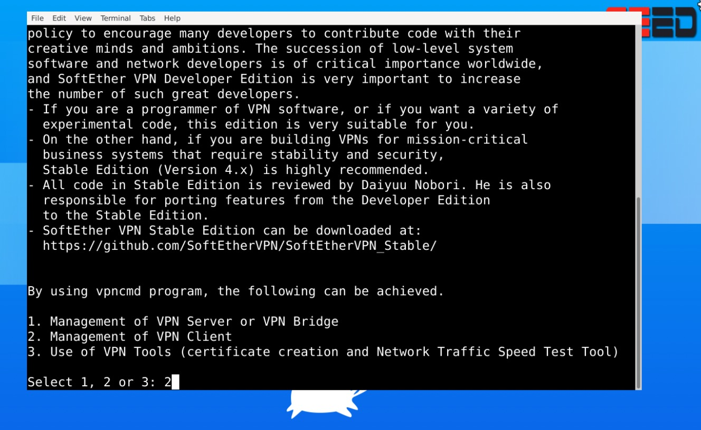
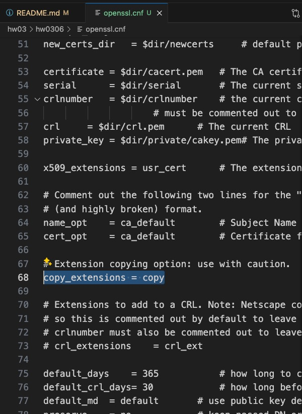

## 3.1 Equivalent Assumption

- #### Given $g^{\alpha}$, $g^{\beta}$, compute $g^{\alpha \beta}$

    因為 $G$ 群是循環的，可以將 $g^{\alpha}$ 和 $g^{\beta}$ 看作 $g$ 的冪次，根據群的性質:

    $$g^{\alpha} \times g^{\beta} = g^{\alpha + \beta}$$

    這裡需要計算的是 $g^{\alpha \beta}$ ，所以計算 $\alpha \times \beta$，然後取模 $q$ (因為群的階是 $q$ )，計算 $g^{(\alpha \times \beta) \mod q}$ 可以在多項式時間內完成 (deterministic poly-time equivalent)，因為 $\alpha$ 和 $\beta$ 的值都是小於 $q$ 的。

- #### Given $g^{\alpha}$, compute $g^{\alpha^2}$

    應用群的冪次運算規則，計算 $\alpha^2$ 再取模 $q$，然後計算:

    $$g^{(\alpha^2 \mod q)}$$

    因為指數運算和模運算都可以在多項式時間內完成，這個問題也可以在多項式時間內解開 (deterministic poly-time equivalent)。

- #### Given $g^{\alpha}$ and $\alpha \neq 0$, compute $g^{1/\alpha}$

    需要找到 $a$ 的模 $q$ 逆元，也就是某個數 $\beta$ 使得:

    $$\alpha \beta \equiv 1 \pmod{q}$$

    因為 $q$ 是質數，使用擴展歐幾里得算法可以在多項式時間 (poly-time) 內找到 $\beta$，然後計算 $g^{\beta}$ 即可。

- #### Given $g^{\alpha}$, $g^{\beta}$ with $\beta \neq 0$, compute $g^{\alpha/\beta}$

    解開 $\beta \neq 0$ 時的 $\beta$ 的模 $q$ 逆元 $c$，使得:

    $$\beta c \equiv 1 \pmod{q}$$

    計算 $\alpha \times c \mod q$ 後，再計算:

    $$g^{(\alpha \times c \mod q)}$$

    使用擴展歐幾里得算法找逆元和後續的乘法、模運算都是 deterministic poly-time equivalent。

## 3.2 Implicit certificate

#### 1. The equivalence of Alice’s private and public keys. That is, prove $Q_A = \alpha G$.

Alice 的私鑰和公鑰計算方式:

- 私鑰: $a = e' \alpha + s$
- 公鑰: $Q_A = e' \gamma' + Q_{CA}$

$e'$ 是從證書 $Cert$ 重新計算的 hash 值， $\gamma'$ 是從 $Cert$ 解碼得到， $s$ 和 $\gamma$ 是由 CA 計算。

根據 CA 的計算過程有 $\gamma = \alpha G + kG$ 且 $s = ek + c$ 。因此:

$$Q_A = e' \gamma' + Q_{CA} = e' (\alpha G + kG) + cG$$

可以重新寫成:

$$Q_A = (e' \alpha + e' k)G + cG = (e' \alpha + s - c)G + cG = (e' \alpha + s)G = \alpha G$$

這裡使用 $e' = e$ 的事實，因為 $e$ 和 $e'$ 都是對同一證書 $Cert$ 的 hash 值。

因此得出 Alice 的公鑰 $Q_A = \alpha G$ ，其中 $a$ 是她的私鑰。

#### 2. Please show that given CA’s public key $Q_{CA}$, without the CA secret key $c$, it is computationally infeasible to generate a valid certificate. The certificate is valid if $Q_A = \alpha G$.

有效的證書代表每個人都可以從 $Cert$ 和 $Q_{CA}$ 計算出 $Q_A$ 使得:

$$Q_A = \alpha G$$

$\alpha$ 是根據 $Cert$ 和 $s$ 計算出來的私鑰，並且 $s$ 是 $ek + c$ 。

因為 $e$ 和 $k$ 是隨機選擇的，並且 $c$ 是保密的，沒有 $c$ 的知識，外部攻擊者無法計算出正確的 $s$ 。

如果攻擊者不知道 $c$ ， 攻擊者需要解開以下等式找到 $s$:

$$s = ek + c$$

但因為 $e$ 和 $k$ 是隨機的並且 $c$ 未知，這式子有多個可能的解，而且沒有足夠的資訊確定哪個是正確的。

因此使 $Q_A = \alpha G$ 成立的 $Cert$ 和 $s$ 組合在計算上是不行的。

得出: 除非知道 $c$ ，否則無法生成有效的證書。

## 3.3 SoftEther

SoftEther VPN 是一款免費的、開源的多協議 VPN 軟體，可以遵循以下包括從 GitHub 下載、安裝到設定 VPN 伺服器和客戶端的一步步步驟 (此教學以 Linux 為例):

#### 步驟一: 下載 SoftEther VPN

##### 在 GitHub 上 Releases 頁面下載:
1. 首先進入 SoftEther 的 GitHub 頁面:[SoftEther VPN on GitHub](https://github.com/SoftEtherVPN/SoftEtherVPN)
2. 滑到頁面下方，找到「Releases」。
3. 選擇作業系統的版本下載。SoftEther 支援 Windows, Linux, macOS 等多個平台。

    

##### 使用 Git Clone 下載:
1. 在終端機執行以下指令:
   ```bash
   git clone https://github.com/SoftEtherVPN/SoftEtherVPN
   ```
   
   

#### 步驟二: 安裝 SoftEther VPN

##### 在 Linux 上安裝:

在 Linux 上安裝 SoftEther VPN 需要先安裝一些依賴函式庫，可以使用以下指令安裝:

```bash
apt update
apt install cmake
apt install pkg-config
apt install libsodium-dev
apt install libncurses5-dev libncursesw5-dev
apt install libssl-dev
apt install libreadline-dev
```

1. 解壓縮下載的檔案。
2. 通過終端進行安裝。首先切換到解壓縮後的目錄，例如:
   ```bash
   cd SoftEtherVPN
   ```
3. 執行以下指令進行編譯和安裝:
   ```bash
    cd SoftEtherVPN
    git submodule init && git submodule update
    ./configure
    make -C build
    make -C build install
   ```

### 步驟三: 確認 SoftEther VPN 的狀態
1. 可以使用以下指令:
   ```bash
   vpncmd
   ```

2. 選擇 3. Use of VPN Tools:

    

3. 使用以下指令，可以看到 All pass
    ```bash
    check
    ```
    
    

    
    

### 步驟四:設定 SoftEther VPN Server

1. 啟動 SoftEther VPN Server，可以用以下指令:
   ```bash
   vpnserver start
   ```

   

   如果要停止伺服器，可以使用以下指令:
   ```bash
    vpnserver stop
    ```
   
2. VPN 伺服器設定可以使用以下指令:
   ```bash
   vpncmd
   ```

3. 可以選擇 1. Management of VPN Server or VPN Bridge:

    


4. 連續按兩次 Enter 鍵，直到出現以下畫面:

    

5. 設定 VPN Server 的密碼，輸入密碼並確認:

   ```bash
   ServerPasswordSet
   ```

    

6. 設定 SoftEther VPN Server 的 Hub，輸入密碼並確認:，可以使用以下指令:

   ```bash
   HubCreate TestHub
   ```

    

7. 進入 Hub，可以使用以下指令:

   ```bash
   Hub TestHub
   ```

    

8. 創建一個新的用戶:

   ```bash
   UserCreate username
   ```

    

9. 啟用虛擬 NAT 和 DHCP 功能:

   ```bash
   SecureNatEnable
   DhcpSet /start:192.168.30.10 /end:192.168.30.200 /mask:255.255.255.0 /expire:7200 /gw:192.168.30.1 /dns:192.168.30.1 /dns2:none /domain:none
   ```

    

10. 確認伺服器狀態:
    ```bash
    ServerStatus
    ```

    

    

### 步驟五:設定 SoftEther VPN Client 並連接到 Server

1. 啟動 SoftEther VPN Client，可以用以下指令:
   ```bash
   vpnclient start
   ```

   

   如果要停止客戶端，可以使用以下指令:
   ```bash
    vpnclient stop
    ```
   
2. VPN 伺服器設定可以使用以下指令:
   ```bash
   vpncmd
   ```

3. 可以選擇 2. Management of VPN Client:

    

4. 按一次 Enter 鍵，直到出現以下畫面:

    

5. 創建一個新的 NIC 並且 創建一個連接設定:

   ```bash
   NicCreate nicname
   AccountCreate username /SERVER:127.0.0.1:443 /HUB:TestHub /USERNAME:username /NICNAME:nicname
   ```

    


6. 啟動 VPN 連接:

   ```bash
   AccountConnect username
   ```

    

7. 確認連接狀態:
    ```bash
    AccountStatusGet username
    ```

    

### 結論
SoftEther VPN 的功能很多，支援各種高級設定和調整，如果遇到問題可以參考官方文件或社區論壇尋找答案。

### 參考資料
- [SoftEther VPN on GitHub](https://github.com/SoftEtherVPN/SoftEtherVPN)
- [SoftEther UNIX Tutorial](https://github.com/SoftEtherVPN/SoftEtherVPN/blob/master/src/BUILD_UNIX.md)

## 3.4 Random Number Generator in Linux Kernel

在 Linux 作業系統中，`/dev/random` 和 `/dev/urandom` 的行為最近的近年進行調整，讓兩者在多數情況下變得幾乎相同，這變更主要是它們如何處理熵（隨機性來源）的細節。

在之前 `/dev/random` 可能會在熵耗盡時阻塞輸出，而 `/dev/urandom` 則不會阻塞，即使熵耗盡也會繼續提供數據，讓 `/dev/urandom` 在多個情況下都常用到，特別是在需要大量隨機數據的情況。

但最近的 Linux kernel 更新中，這兩者行為被設計為更相同。現在不管是 `/dev/random` 或是 `/dev/urandom`，它們都連接到同個內部的隨機數生成器（Linux Random Number Generator, LRNG）並共享相同的輸入熵池。這樣會在大多情況下，不管讀取兩者之一所得到的隨機性應該會是相同的，此外最新的設計也讓它們共享輸出熵池。

這樣主要是為了簡化系統行為，減少開發者在選擇使用 `/dev/random` 還是 `/dev/urandom` 時的困惑，確保在熵充足的情況下，不管選擇哪個 random，程式都能獲得更好的隨機數據，因此現在選擇使用 `/dev/urandom`是更佳的，就算在安全性要求極高的程式中也是。

#### 額外參考資料
- ​[Unix & Linux Stack Exchange](https://unix.stackexchange.com/questions/324209/when-to-use-dev-random-vs-dev-urandom)
- [Information Security Stack Exchange](https://security.stackexchange.com/questions/229966/does-rngd-r-path-to-file-inject-into-dev-urandom-in-addition-to-dev-random)

## 3.5 Lab: MD5 Collision Attack Lab
alias md5collgen 指令:
```bash
alias md5collgen='/path/to/md5collgen'
```

#### Task 1: Generating Two Different Files with the Same MD5 Hash

用 `md5collgen` 生成兩個不同的文件，但是 MD5 hash 值相同:
```bash
md5collgen -p prefix.txt -o out1.bin out2.bin
diff out1.bin out2.bin
md5sum out1.bin; md5sum out2.bin
```


- Question 1. If the length of your prefix file is not multiple of 64, what is going to happen?

    使用 `truncate` 指令將 `q1.txt` 的長度截斷為 10 bytes，然後使用 `md5collgen` 生成兩個文件:

    ```bash
    truncate -s 10 q1.txt
    md5collgen -p q1.txt -o q1-1.bin q1-2.bin
    ```

    比對 `q1-1.bin` 和 `q1-2.bin` 的差異，可以看到兩個文件的不足 64 bytes 的部分都以 0x00 填充，因為 MD5 hash 是 64 bytes 的 block hash，所以不足 64 bytes 的部分會被填充為 0x00，結果如下:
    
    

- Question 2. Create a prefix file with exactly 64 bytes, and run the collision tool again, and see what happens.

    使用 `dd` 指令生成 64 bytes 的文件 `q2.txt`，然後使用 `md5collgen` 生成兩個文件:

    ```bash
    dd if=/dev/urandom of=q2.txt bs=64 count=1
    md5collgen -p q2.txt -o q2-1.bin q2-2.bin
    ```

    比對 `q2-1.bin` 和 `q2-2.bin` 的差異，可以看到兩個文件的 MD5 hash 值相同，結果如下:

    


- Question 3. Are the data (128 bytes) generated by md5collgen completely different for the two output files? Please identify all the bytes that are different.

    比對 `out1.bin` 和 `out2.bin` 的差異，不是所有 128 bytes 的數據都相同，並且在多次執行 `md5collgen` 後，生成的文件的差異部分也不同，如下標記的部分是不同的:

    

#### Task 2: Understanding MD5’s Property

先使用 `md5collgen` 生成兩個文件:
```bash
md5collgen -p file1.txt -o file1-1.bin file1-2.bin
```

然後將以下數據合併到 `file3-1.bin` 和 `file3-2.bin`:
```bash
cat file1-1.bin file2.txt > file3-1.bin
cat file1-2.bin file2.txt > file3-2.bin
```

比對以下文件的 MD5 hash 值，可以看到 `file1-1.bin` 和 `file1-2.bin` 的 MD5 hash 值相同，而 `file3-1.bin` 和 `file3-2.bin` 的 MD5 hash 值也相同:
```bash
md5sum file1-1.bin; md5sum file1-2.bin; md5sum file3-1.bin; md5sum file3-2.bin;
```


#### Task 3: Generating Two Executable Files with the Same MD5 Hash

使用 `gcc` 編譯 `task3.c`:
```bash
gcc task3.c -o a.out
```

查看 `a.out` 的 bytes，可以看到 prefix 是在 `0x1010` 的位置:


取 `0x1010` 64 (0x40) bytes 的數據 `0x1050`，十進制為 4176，

```bash
head -c 4176 a.out > prefix.out
md5collgen -p prefix.out -o prefix1.out prefix2.out
```

將 4176 + 128 + 1 bytes 的數據生成到 `suffix.bin`:

```bash
tail -c +4305 a.out > suffix.out
```

合併以下檔案分別生成 `s1.out` 和 `s2.out`，然後設置執行權限:
```bash
cat prefix1.out suffix.out > s1.out
cat prefix2.out suffix.out > s2.out
chmod +x s1.out s2.out
```

追加 `suffix.out` 到 `prefix1.out` 和 `prefix2.out`，然後設置執行權限:
```bash
cat suffix.out >> prefix1.out
cat suffix.out >> prefix2.out
chmod +x prefix1.out prefix2.out
```

執行 `s1.out` 和 `s2.out`:
```bash
./s1.out
./s2.out
```


比對 `s1.out` 和 `s2.out` 的 MD5 hash 值，可以看到兩個文件的 MD5 hash 還是有所不同:
```bash
echo $(./s1.out) | md5sum;echo $(./s2.out) | md5sum
```


比對 `s1` 和 `s2` 的 MD5 hash 值，可以看到兩個文件的 MD5 hash 值相同:
```bash
md5sum s1.out; md5sum s2.out
```


#### Task 4: Making the Two Programs Behave Differently

使用 `gcc` 編譯 `task4.c`:
```bash
gcc task4.c -o a.out
```

查看 `a.out` 的 bytes 的 prefix，可以看到 A array 是在 `0x1010` 的位置，十進位 4112:


4112 + 48 = 4160 bytes (整除 64) 的數據生成到 `prefix.out`:

```bash
head -c 4160 a.out > prefix.out
md5collgen -p prefix.out -o prefix1.out prefix2.out
```
查看 `a.out` 的 bytes 的 suffix，可以看到是在 `0x11A0` 的位置，加一十進位後為 4513:


取 `4513` bytes 的數據生成到 `suffix.out`:
```bash
tail -c +4513 a.out > suffix.out
```

將 48 + 128 = 176 bytes 的數據生成到 `middle.out`:
```bash
tail -c 176 prefix1.out > middle.out
```

X array 是在 `0x1010` 的位置，Y array 是在 `0x10C0` 的位置，:


0x10C0 - 0x1010 = 176 bytes 的數據，離 200 差 24 bytes，並且 200 - 176 = 24 bytes 的數據生成到 `m24.bin`

```bash
python3 -c "print('\x00'*40)" > tmp
head -c 24 tmp > m24.bin
rm tmp
```

合併以下檔案分別生成 `s1.out` 和 `s2.out`，然後設置執行權限:
```bash
cat prefix1.out m24.bin middle.out m24.bin suffix.out > s1.out
cat prefix2.out m24.bin middle.out m24.bin suffix.out > s2.out
chmod +x s1.out s2.out
```

查看 `s1.out` 和 `s2.out` 的運行結果是不同的:
```bash
./s1.out; ./s2.out;
```


但是比對 `s1.out` 和 `s2.out` 的 MD5 hash 值，可以看到兩個文件的 MD5 hash 值相同:
```bash
md5sum s1.out; md5sum s2.out;
```


## 3.6 Lab: PKI Lab

#### 將 Container 啟動:
```bash
cd LabSetup
dcoker-compose build
docker-compose up
```

#### Task 1: Becoming a Certificate Authority (CA)
 
DNS 設定增加 /etc/hosts 文件內容:

```bash
10.9.0.80 www.bank32.com
10.9.0.80 www.smith2020.com
```

創建一個新的 CA 並生成 CA 的私鑰和證書:
```bash
mkdir demoCA
mkdir demoCA/certsare
mkdir demoCA/crl
mkdir demoCA/newcerts
touch demoCA/index.txt
echo 1000 > demoCA/serial
cp /usr/lib/ssl/openssl.cnf .
openssl req -x509 -newkey rsa:4096 -sha256 -days 3650 -keyout ca.key -out ca.crt
```

你可以依照以下圖片的方式填寫資訊(密碼:`0000`):


查看 CA 的證書:
```bash
openssl x509 -in ca.crt -text -noout
```

示意圖如下:


查看 CA 的私鑰:
```bash
openssl rsa -in ca.key -text -noout
```

示意圖如下(密碼:`0000`):


#### Task 2: Generating a Certificate Request for Your Web Server

生成一個新的私鑰和證書請求，並且在證書請求中添加主機名稱:
```bash
openssl req -newkey rsa:2048 -sha256 -keyout server.key -out server.csr -subj "/CN=www.bank32.com/O=Bank32 Inc./C=US" -passout pass:dees -addext "subjectAltName = DNS:www.bank32.com, DNS:www.bank32A.com, DNS:www.bank32B.com"
```

查看證書請求:
```bash
openssl req -in server.csr -text -noout 
```

示意圖如下:


#### Task 3: Generating a Certificate for your server

生成一個新的證書，並且使用 CA 的私鑰簽名:
```bash
openssl ca -config openssl.cnf -policy policy_anything -md sha256 -days 3650 -in server.csr -out server.crt -batch -cert ca.crt -keyfile ca.key
```


把證書的 `copy_extensions` 註解拿掉:



查看證書:
```bash
openssl x509 -in server.crt -text -noout
```

示意圖如下:


#### Task 4: Deploying Certificate in an Apache-Based HTTPS Website

查看 Container 的 ID:
```bash
docker ps -a
```

進入 Container:
```bash
docker exec -it <container_id> /bin/bash
```

進入 Container 後，啟動 Apache 服務:
```bash
service apache2 start
```

#### Task 5: Launching a Man-In-The-Middle Attack

#### Task 6: Launching a Man-In-The-Middle Attack with a Compromised CA
