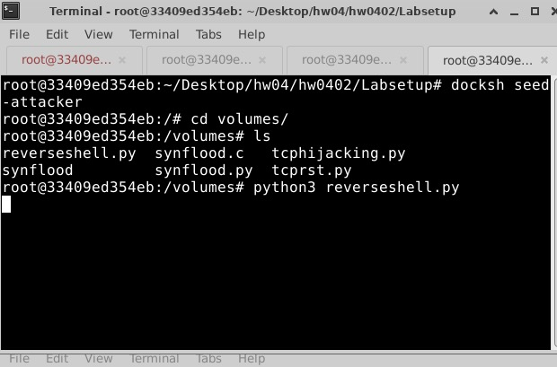

## 4.1 Teamviewer

TeamViewer 是基於遠端桌面系統的一款遠程控制軟體，用戶可以最常用 TeamViewer 在不同的電腦做出遠端控制另一台電腦的功能，以下是遠端桌面系統的一些特點的流程:


(圖片來源: https://www.tcrc.edu.tw/TANET2013/paper/B45-1276-1.pdf)

而 TeamViewer 能夠做到遠端控制的原理是透過 NAT (Network Address Translation) 穿越技術，NAT 是一種網絡地址轉換技術，它將內部網絡的私有 IP 地址轉換為公共 IP 地址，從而實現內部網絡設備與外部網絡的通信，主要依賴於以下幾個技術原理:

### 中央伺服器握手協議

當兩台設備開始建立連接時，會先通過 TeamViewer 的中央伺服器進行握手，這個握手過程包括公鑰交換和確認連接的安全性，然後兩台設備會通過 P2P 連接，使用 UDP 協議進行通信，這過程會穿過 NAT 和防火牆。

### UDP hole punching (UDP 打洞)

TeamViewer 利用 UDP 打洞技術做到 NAT 穿透，依雙方設備同時向對方發送 UDP 數據包，在 NAT 防火牆上打開臨時通道，使雙方能夠直接通信。

### Virtual Router Redundancy Protocol (VRRP, 虛擬路由器冗餘協議)

在無法直接建立 P2P 連接的情況下，TeamViewer 會透過其冗餘的路由網絡進行數據中繼，路由伺服器分佈在全球各地能夠確保就算在複雜網絡環境下，數據傳輸維持安全與穩定。

### 參考資料
- https://www.tcrc.edu.tw/TANET2013/paper/B45-1276-1.pdf
- https://community.teamviewer.com/English/discussion/113498/traceroute-of-teamviewer-connection
- https://superuser.com/questions/661749/how-exactly-does-a-remote-program-like-team-viewer-work
- https://security.stackexchange.com/questions/14280/how-does-team-viewer-establish-a-remote-desktop-connection

## 4.2 Lab: TCP Attacks Lab

### Task 1: SYN Flooding Attack

#### Task 1.1: Launching the Attack Using Python

使用 `dockps` 查看所有正在運行的容器:


使用 `docksh` 各別開 terminal 進入容器 :


在 `victim` 容器中執行以下指令:

```bash
sysctl net.ipv4.tcp_max_syn_backlog
```


在 `victim` 容器中執行以下指令查看目前 TCP 連線狀態:

```bash
$ netstat -nat
```


在 `attacker` 容器中執行 `synflood.py` 進行 SYN Flood 攻擊後，再次查看 `victim` 容器中 TCP 連線狀態:


> by `./Labsetup/volumes/synflood.py`

在 `victim` 容器中執行以下指令查看 SYN_RECV 狀態的連線數量:

```
netstat -nat | grep SYN_RECV | wc -l
ss -n state syn-recv sport = :23 | wc -l
```


在 `user1` 容器中執行以下指令進行 telnet 連線:

```bash
telnet 10.9.0.5
```

> 帳號: `seed` 密碼: `dees`


#### Task 1.2: Launch the Attack Using C

在 `victim` 容器中執行以下指令清除 TCP 連線狀態:

```bash
ip tcp_metrics flush
```

在 `attacker` 安裝 `gcc` 後編譯 `synflood.c`，執行 `synflood` 進行 SYN Flood 攻擊:

```bash
apt update
apt install -y gcc
gcc -o synflood synflood.c
./synflood 10.9.0.5 23
```


在 `victim` 容器中執行以下指令查看 TCP 連線狀態:

```bash
netstat -nat
```


在 `user1` 容器中進行 telnet 連線後卡住了:

```bash
telnet 10.9.0.5
```


#### Task 1.3: Enable the SYN Cookie Countermeasure

在 `victim` 容器中執行以下指令清除 TCP 連線狀態:

```bash
ip tcp_metrics flush
```

在 `victim` 容器中啟用 SYN Cookie 並查看目前設定:

```bash
sysctl -w net.ipv4.tcp_syncookies=1
```


在 `attacker` 容器中執行 `synflood` 進行 SYN Flood 攻擊:

```bash
./synflood 10.9.0.5 23
```

在 `victim` 容器中執行以下指令查看 TCP 連線狀態和 SYN_RECV 狀態的連線數量:

```
netstat -nat
netstat -nat | grep SYN_RECV | wc -l
ss -n state syn-recv sport = :23 | wc -l
```


在 `user1` 容器中進行 telnet 連線後，即使被 SYN Flood 攻擊仍然能夠連線:

```bash
telnet 10.9.0.5
```


### Task 2: TCP RST Attacks on telnet Connections

在 Host 執行 `ifconfig` 查看 bridge 網卡:


得到 bridge 網卡為 `br-27b5f07b4373`，寫進 `tcprst.py` 中

> by `./Labsetup/volumes/tcprst.py`

在 `attacker` 容器中執行 `tcprst.py` 進行 TCP RST 攻擊:

```bash
python3 tcprst.py
```

在 `user1` 容器中進行 telnet 連線後，連線被中斷了:

```bash
telnet 10.9.0.5
```


### Task 3: TCP Session Hijacking

在 `user1` 容器中進行 telnet 連線:

```bash
telnet 10.9.0.5
```

將 bridge 網卡 `br-27b5f07b4373`，寫進 `tcphijacking.py` 中

> by `./Labsetup/volumes/tcphijacking.py`

在連線途中，在 `attacker` 容器中執行 `tcphijacking.py` 進行 TCP Session Hijacking 攻擊:

```bash
python3 tcphijacking.py
```

可以看到 `user1` 容器中的 telnet 連線完全操作卡死了:


### Task 4: Creating Reverse Shell using TCP Session Hijacking

在 `attacker` 容器進行 Listen:

```bash
nc -lnv 9090
```

在 `user1` 容器中進行 telnet 連線:

```bash
telnet 10.9.0.5
```

將 bridge 網卡 `br-27b5f07b4373`，寫進 `reverseshell.py` 中

> by `./Labsetup/volumes/reverseshell.py`

在 `attacker` 容器中使用 `docksh` 開啟第二個 terminal 執行 `reverseshell.py` 進行 Reverse Shell 攻擊:

```bash
python3 reverseshell.py
```



在 `user1` 做任何輸入按鍵後， `attacker` 容器中原本的 terminal 有可能可以看到 Reverse Shell 成功建立:


有趣的是，當如果輸入的指令是空格的話，Shell 成功建立，當如果輸入其他指令的話，可能會攻擊失敗，因為原理是在攻擊上的指令增加 `user1` 的輸入操作，所以如果 `user1` 輸入非空格的話，可能會造成其他效果。

## 4.3 Lab: The Kaminsky Attack Lab

### Lab Environment Setup (Task 1)

### Task 2: Construct DNS request

### Task 3: Spoof DNS Replies

### Task 4: Launch the Kaminsky Attack

### Task 5: Result Verification

## 4.4 Lab: Webgoat