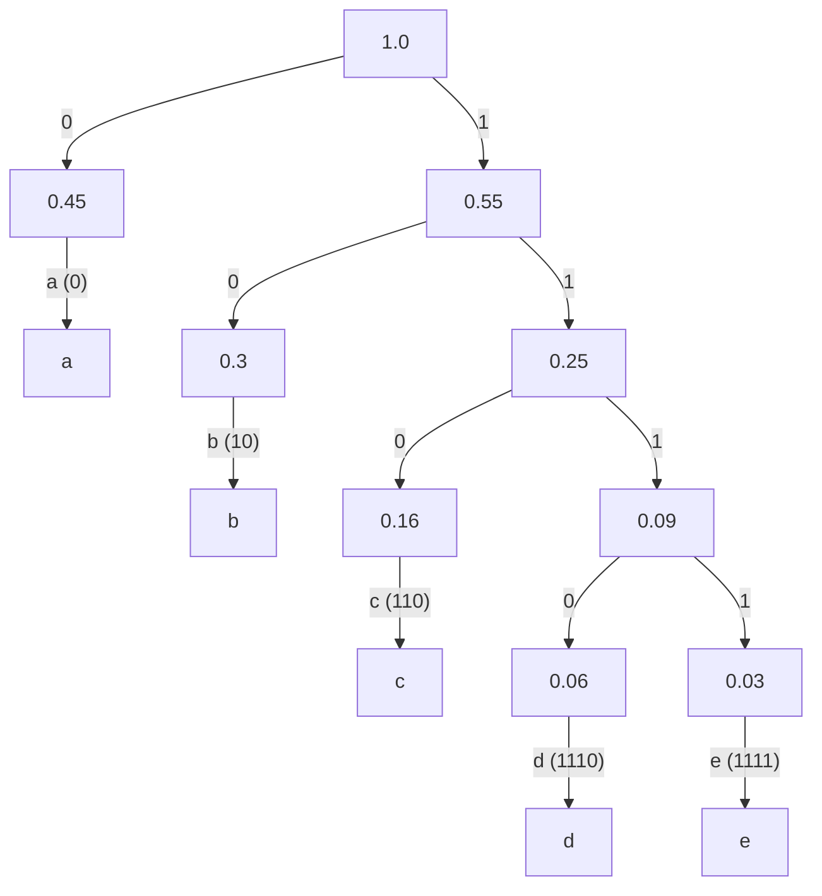

# Homework 3 (Due: 5/1 -> 5/8)

 

### 作業說明 ([0417-1-00:00](https://cool.ntu.edu.tw/courses/34012/modules/items/1515787))

#### 1. By main.py (page ) ()

#### 2. (page 204) ([0410-16:14](https://cool.ntu.edu.tw/courses/34012/modules/items/1509398))

- (1) Always real.
- (2) $ \Sigma |X[k]|^2 B_m[k]$ has much less probability to be 0.
- (3) The cutoff frequencies of windows match the characteristics of hearing.
- (4) DCT (Discrete Cosine Transform) is applied of the IFT (Inverse Fourier Transform).
    
#### 3. (page ) ()

#### 4. (page 239 ~ 241) ([0410-2-35:52](https://cool.ntu.edu.tw/courses/34012/modules/items/1509399))

##### (a)

根據聲音在空氣中的速度會隨著溫度變化:

$$v = 331 + 0.6 \times T$$

溫度 15 度時:

$$v = 331 + 0.6 \times 15 = 340(m/s)$$

找出特定音高的弦長公式:

$$L = \frac{v}{2f}$$

給定 Do 的頻率為 $250 Hz$ ，則 Do 的弦長 L 為:

$$L_{Do} = \frac{340}{2 \times 250} = 0.68m$$

##### (b)

La 與 Do 的差了 9 個半音，則:

$$f_{La} = f_{Do} \times 2^{\frac{9}{12}} \approx 250 \times 1.6817 \approx 420 Hz$$

則 La 的弦長為:

$$L_{La} = \frac{340}{2 \times 420} \approx 0.4048m$$

#### 5. (page 275) ([0417-3-01:12](https://cool.ntu.edu.tw/courses/34012/modules/items/1515790))

##### (a)

- (1) More concentration at the frequencies $f_o, 2f_o, 3f_o......$.
- (2) For each note, the frequency is fixed.
- (3) Fundamental frequenies are $f_o \times 2^{{\frac{k}{12}}}$.
- (4) Beats, intervals are $T \times 2^k , k = -1, 0, 1, 2, ......$.
- (5) Reapeated melody.

##### (b)

- (1) The color/intensity is fixed within a region.
- (2) Eage can be approximated by lines or arcs.

#### 6. (page 237) ([0410-2-10:00](https://cool.ntu.edu.tw/courses/34012/modules/items/1509399))

##### (a)

週期函數聲音信號的頻率計算公式，其中 $k$ 為角頻率:

$$f = \frac{k}{2 \pi}$$

(i) $-cos(1200 \pi t)$

$$f = \frac{1200 \pi}{2 \pi} = 600 Hz$$

(ii) $sin(5400 \pi t)$

$$f = \frac{5400 \pi}{2 \pi} = 2700 Hz$$

(iii) $cos(20000 \pi t)$

$$f = \frac{20000 \pi}{2 \pi} = 10000 Hz$$

因為在 annoyance curve 可以看到越大的頻率相對於能夠接受分貝數越低，也因此 the loudest sound is (iii) $cos(20000 \pi t)$

##### (b)

因爲人類耳朵最敏感的頻率約為 $3000 Hz$ ，也是 lower bound for hearing curve 的最低點，因此根據 (a)，可以得知 most suitable to sound is (ii) $sin(5400 \pi t)$

#### 7. (page ) ()
  
#### 8. (page 313 ~ 314) ([0417-2-35:14](https://cool.ntu.edu.tw/courses/34012/modules/items/1515788))

##### (a)

根據 Entropy 的定義可以得到以下的公式:
$$entropy = \sum_{j=1}^{J} P(S_j) \ln \frac{1}{P(S_j)}$$

$$entropy_x = 0.45 \times \ln \frac{1}{0.45} + 0.3 \times \ln \frac{1}{0.3} + 0.16 \times \ln \frac{1}{0.16} + 0.06 \times \ln \frac{1}{0.06} + 0.03 \times \ln \frac{1}{0.03}$$

$$entropy_x \approx 0.3593 + 0.3611 + 0.2932 + 0.1688 + 0.1051$$

$$entropy_x \approx 1.2875$$

##### (b)

##### (c)

$$\frac{entropy_x}{\ln 2} = \frac{1.2875}{\ln 2} \approx 1.85$$

#### 9. (Extra Question, number 0, 5) (page 237) ([0417-1-11:33](https://cool.ntu.edu.tw/courses/34012/modules/items/1515787))

人可以聽到的頻率範圍為 20 Hz ~ 20 kHz 是以 0 分貝為標準，也就是 20 微巴斯卡 (µPa) 的聲壓。